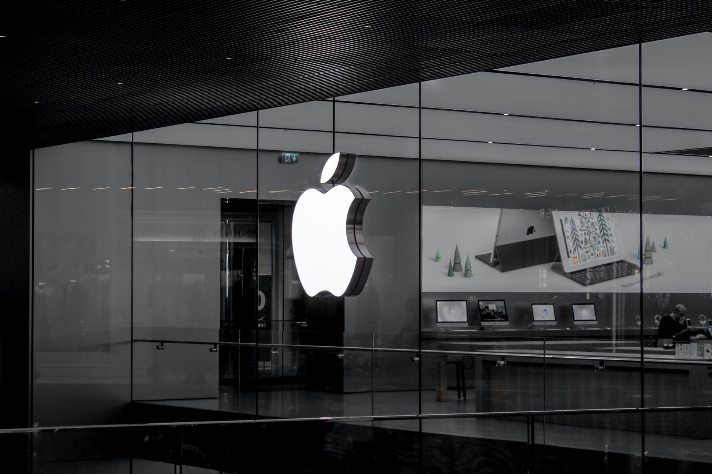

# iPhones & MacBooks are beautiful, powerful pieces of hardware

> That you can *rent* from Apple --- that's about it

## **Why did I specifically use the word 'rent'?**

Sorry for triggering any Apple fanbois: the only thing you ever **buy** from

Apple is their marketing. All Apple devices --- natively run their [proprietary](https://www.fsf.org/campaigns/apple) operating systems and are entirely owned by Apple.

They can shut down your device, track you using their own proprietary technology, using a mesh network ~~botnet~~ of other Apple

devices around you, all while sugarcoating it under the Apple brand.

iOS, iPadOS, WatchOS & MacOS. They make it very difficult, nearly impossible to sideload apps (iOS) and run your [own OS](/blog/digital-minimalism-on-my-phone-foss/) on the device you seemingly 'paid for'.

Apple doesn't natively make it easy for regular users to run custom operating systems on their [new ARM](https://www.theverge.com/2021/1/21/22242107/linux-apple-m1-mac-port-corellium-ubuntu-details) based MacBooks either.

Before you complain --- obviously no one is forcing you buy their stuff & it is under your own free will that you pay Apple to rent their products as long as Apple is happy you are given some features that they seem reasonable. You, agree to their ToS, EULA in order to use their OS. Yes, jailbreak exists but is easier than just sideloading -- F-Droid APKs on Android?

### Seen this ad: "Privacy? that's iPhone"

Apple is a marketing company. Steve Jobs was an excellent business man. Imagine

he never re-joined Apple, after he was kicked out of his own company. Things

would be so different now.

---

## What bothers me is how people voluntarily buy Apple products continue using their proprietary OSs, complain about it & repeat this cycle

At least 👏 acknowledge 👏 that 👏 there 👏 is 👏 a 👏 problem.

### *bUt aPpLE iS pRiVaTe, goOgLe trRaCks yOu*

Apple is not an advertising company: I'll give that to you. Google needs user-data to thrive. Apple has other sources of income. But that doesn't mean they *can't* or *won't spy-on you*. Look at Apple bowing-down to the Chinese Government in order to stay afloat & stay relevant in that market.

The problem lies when you blindly believe the company and rely on their every changing policies. Who is the real owner of your iPhone? is it you or Apple? Apple has

that secret source code which controls everything. You're just renting it from the

proprietor this case, Apple. On MacBooks you can improve your freedom and privacy by running free software (GNU/Linux) OSs and programs on your own. iOS / iPad OS is a completely [locked down ecosystem](https://tx.me/s/durov/122).

People should never buy iPhones and claim they own them, that's what I'm trying

to say. People complain about the AppStore and how they can't get xyz at a cheaper rate. That's what you literally agree to: when buying their marketing and ToS.

---

## Developers & Apps

I don't want to waste the time I spent learning Swift just to get kicked from

the AppStore because Apple was a bully. I wouldn't take this path.

> Apple once claimed to natively support WebApps running in HTML and web technologies side by side with the AppStore

Today Google and Samsung are collaborating in a project called: '[Fugu](https://www.chromium.org/teams/web-capabilities-fugu)'

which tries to achieve native-level performance and APIs to replace desktop apps with web based ones

that even work offline. I am supportive of this idea, for the sake of cross

device freedom and an easier workflow. But I'm concerned with Google's take

on the decision making. Currently no major player is building competing level

tech to take on Google. Mozilla also just announced they'd [drop PWA support

for the desktop](https://www.thurrott.com/cloud/web-browsers/mozilla-firefox/246716/firefox-85-is-here-but-mozilla-is-killing-pwa-features).

As a company I'd rather educate my customers / users on Apple's hostility and

closed ecosystem. Trust me, if you're from India, most small developers or even

government apps don't bother with the [3%](https://www.statista.com/statistics/262157/market-share-held-by-mobile-operating-systems-in-india/)

iOS marketshare in India. It's only in saturated markets like the --- US or UK

that native iOS apps like iMessage is a huge deal. I've never met a person in

India who tried to use SMS in 2021, let alone Apple's iMessage. We use

[WhatsApp](/blog/messengers/) and whatnot.

---

# Why I won't use Apple products

## 1. Blind trust

I don't know how trusting a proprietary OS will ever make it better and more

'secure' than an open sourced ecosystem. Sure, they might be designed to have

[certain sandboxing](https://madaidans-insecurities.github.io/security-privacy-advice.html#desktop-os),

on device encryption protocols, and other iOS exclusive stuff. But without

someone else to peer review you're blindly trusting them to keep their word.

This is a huge trust factor, when it comes to personal computers - they hold a

lot of sensitive data. One [0 day vulnerability](https://support.apple.com/en-us/HT212146)

at any point of time can render your device vulnerable, if your device isn't

updated. Apple can turn this off and on at any time they [please](https://nitter.net/Stevenpotato/status/1356953980174131200).

---

## 2. Auto-updates: the [universal backdoor](https://piped.kavin.rocks/watch?v=x8JuUW41pbQ)

Let's assume there isn't a backdoor or a vulnerability present on your device

right now. With auto-updates there's nothing stopping them from shipping a

vulnerability or extract your files & data with new code embedded into the OS

as a hidden service. The possibilities are endless. Once the damage is done,

there's no going back, on your side. Remember? you [are free to](https://www.apple.com/legal/sla/docs/iOS14_iPadOS14.pdf)

the [ToS](https://www.apple.com/legal/sla/docs/macOSBigSur.pdf) and you

probably will lose a court case against them.



---

## 3. Surrendering your [freedom](https://sneak.berlin/20201112/your-computer-isnt-yours/)

This is sort of building on the first point. Even if you get access to the

source code, the developer needs to guarantee your freedom to allow you to

freely read, distribute and basically have 'ownership' of your software after

you buy it from them.

Think of it like a [car](https://odysee.com/@Lunduke:e/ComputersAreBroken:7).

The car will stop working exactly after 5 years and force you to buy a new car.

After 4 years the engine will get locked down to 50KM/h unless you extend your

subscription.

On plain Android you get APKs and I suggest you should install the

[F-Droid](https://f-droid.org/) store. As an app developer I would go with the

PWA path or start my own F-Droid repository to host my apps. Plus, with Android

12, Google is making it easier for [3rd party app stores to integrate with the

OS](https://www.theverge.com/2020/9/28/21472139/google-android-12-app-store-installation-payment-fees).

I would never deploy my personal apps to the Google Play store. On the

GNU/Linux side I can do the same thing with [Flatpak](https://flatpak.org/)

repositories. It's a simple concept and it works if the marketing is done

right, something where Apple excels.



---

## 4. Irresponsible and unethical spending

The money I spend on Apple is again spent on making a more closed, and a

[hostile](https://en.wikipedia.org/wiki/Epic_Games_v._Apple) ecosystem, plus

making this - the 'status quo' for all Apple users. Let's agree, iPhones come

at a cost - hypothetically if everyone were rich and had $1000 to freely spend

on a gadget. I'd rather spend $1000 USD on a device that I can solely 'own' and

which contributes to a freedom respecting [ecosystem](https://puri.sm/about/manufacturing-and-sourcing/)

like the [Librem](https://puri.sm/products/) Laptops or ones from

[System76](https://system76.com/laptops) or whatever else which can run

[libre](/blog/how-i-do-my-computing/) operating systems.



---

## Apple is against your [right to repair](https://mspoweruser.com/apple-right-to-repair-iphone-12-camera/)

Your very right to own devices and lock up phones that are repaired outside of

Apple's service centers. I'd rather spend 1000USD on a home server / faster

long living tech like SSDs, upgrading batteries & repairs than buying a new

computer every few years. Spending more than 200 USD on a phone to me is weird.

I would rather spend 500USD on a ThinkPad with a good keyboard. Or on a

hypothetical and powerful Librem Phone which can fit in my pocket and can plug

into a monitor to serve as my native, desktop computer to replace that

ThinkPad.

---

## The obvious exception

Obviously, I am open to **review**, **hack on** and **experiment** with their

shiny new *proprietary ecosystems* --- should someone choose to lend me their

device. But I will never 'buy' an iPhone or MacBook just to rent it from Apple.

In the worst case I would accept a gifted / donated 2nd hand MacBook and run

GNU/Linux on it.

## This applies to all the ecosystems, like ChromeOS, Windows, Netflix, Amazon, [DRM](https://www.defectivebydesign.org/) & Google Play (Android)

But Apple's tight-knit ecosystem is the biggest, and they have good marketing.

Making people think they bought their iPhone & own it forever. Where in reality, you pay for the phone but you don't really own it's software.

---

UPD: Only *[libre-software](/blog/free-libre-software/)* can save you if you

want to continue to use Apple computers on your own terms. Signing a [letter](https://alirezahayati.com/2021/08/07/apple-is-going-to-put-a-back-door-in-your-private-life-and-the-answer-to-that-is-free-software/) begging them to stop mistreating (in this case spying) won't do any help.
