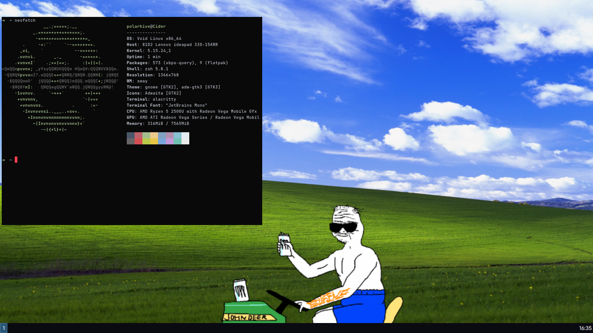
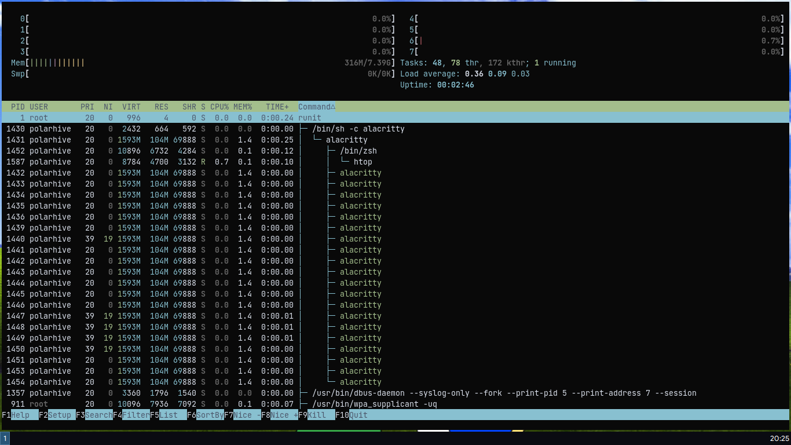

## From Arch to Void GNU/Linux

After months of running Arch. I have finally decided to distrohop again. This
time I'm trying `Void Linux` an interesting, indie-distro that my friend
recommended to try.

Unlike the majority of distros --- which blatantly skin Ubuntu / fork Debian.
Void is built independently, so it has it's own package manager. The
[XBPS](https://docs.voidlinux.org/) package ecosystem. The lack of
support for `systemd` rejoice systemd haters! Flatpak is supported, if needed.
Most free/libre software apps can be compiled from source, or have some form of
executable like appimages as a last resort.


<video width=100% controls> <source src="boot.mp4" type="video/mp4"></video>


## Without systemd: the time to boot has significantly reduced

I can boot under 3s with runit. Systemd takes an average of 14s to boot. Even
with an SSD! To be honest --- I didn't really care about the init system running
on my computer; at least till yesterday - when I was using Arch. I didn't have
any specific use of systemd - so runit easily replaces it for my everyday
usage.

## RAM usage has also gone down by a few hundred megabytes

Idles at around 300mb now. I don't have anything specific to Arch that I miss.
Probably the frequency of updates I get in a week. Other than that everything
is okay. Arch really didn't bother me, I didn't use the AUR much updates never
wrecked anything. The same old stack: Wayland, Pipewire all work fine. Setting
up / porting from one distro to another takes a bit of time. Artix, Devuan &
other systemd free distros might be worthy of my time in a VM some day. But
today I'm happy with void. Oh and probably no more *"i use arch btw"* from me
;)
