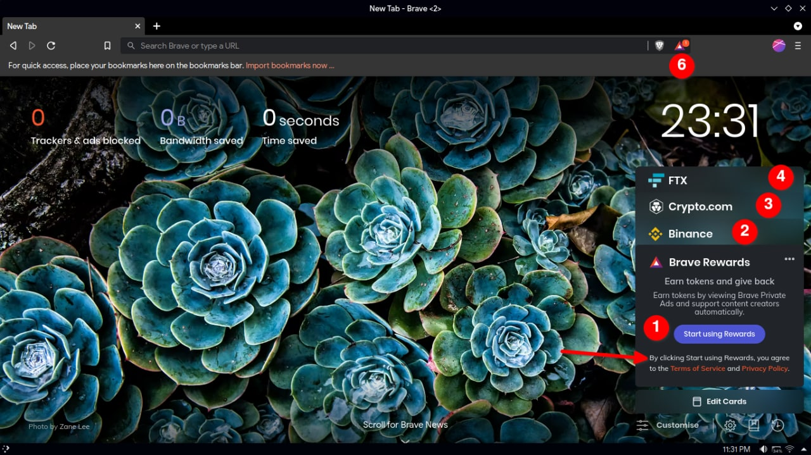
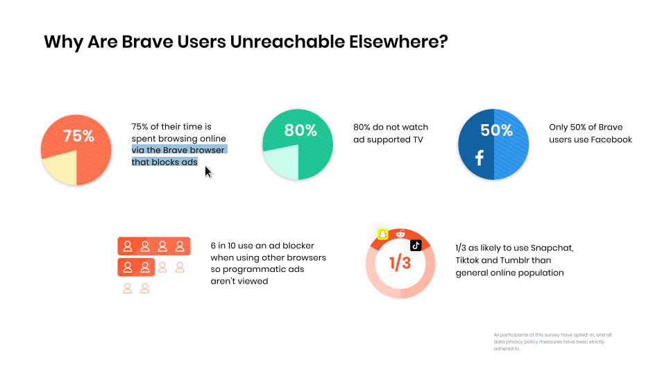
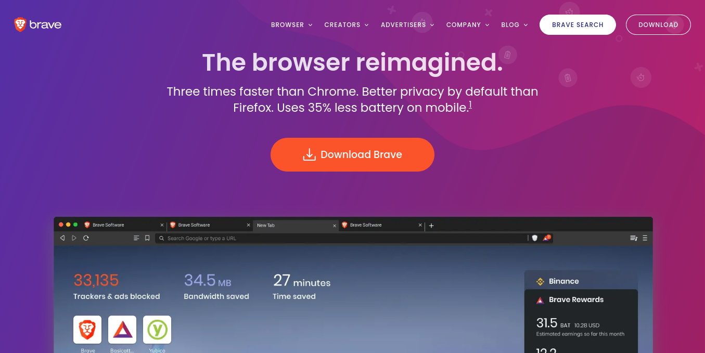
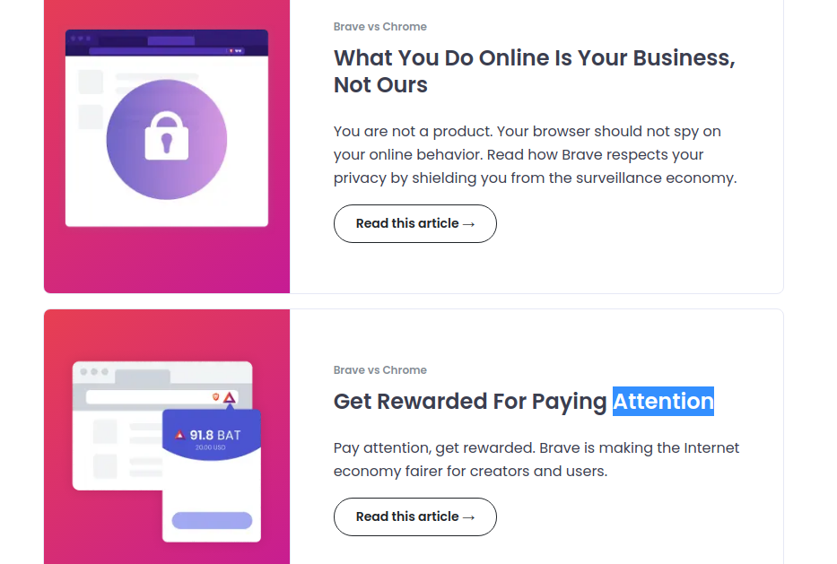
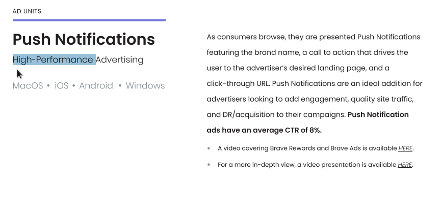

# Brave is a web browser based on the [Chromium](https://chromium.org) web-engine influenced by Google

The browser is surprisingly [free/libre](/blog/free-libre-software) software:
licensed under the [Mozilla Public license](https://github.com/brave/brave-browser/blob/master/LICENSE)
just like Firefox. Before you @ me, this is not like the many, many one-sided shit-posts
about Brave using the same recycled --- mountain load of [FUD](https://ebin.city/~werwolf/posts/brave-is-shit/) that goes
around when people talk about Brave. If you've been living under a rock: Brave Software (the company behind the
browser) takes the latest [Chromium](https://github.com/brave/brave-browser/wiki/Deviations-from-Chromium-features-we-disable-or-remove)
release, [patches](https://github.com/brave/brave-browser/wiki/Patching-Chromium) it, including some
[privacy-protections](https://github.com/brave/brave-browser/wiki/Fingerprinting-Protections) along with
a ton of web-3 integrations. Check their GitHub [wiki](https://github.com/brave/brave-browser/blob/master/README.md) they are
very open about it.

While it looks like they have good intentions behind the project, at the same time,
they've commited many oopsies: like embedding affiliate codes into URLs, to collecting
BAT donations on behalf of creators without their consent. Some people don't like Brave.

## It's the perfect drop-in replacement for: [Chrome](https://github.com/brave/brave-browser/wiki/Blocking-goals-and-policy)

Literally everything works, their team does all the heavy lifting, hot-fixing,
catching up with the latest chromium release, auto-updates, and neutering some
of Google's tracking. Brave blocks ads & 3rd party-cookies by default, unlike
Firefox. It's the perfect browser for someone who's using Chrome all the time
and doesn't have time to bother about configuring things manually with every
[new update](/vulpes).

---
## But beware, Brave is not a browser company

> *Brave is an 'advertising company'*

The browser is used as a gateway drug to push their BAT crypto-altcoin. Brave
Rewards is a way to earn BAT: by consuming ads pushed to you directly via the
Brave browser. By default they take: a 30% cut of the money earned by the ads.
They **whitelist** their [own
ads](https://github.com/brave/adblock-lists/blob/master/brave-unbreak.txt) in
the built-in Brave ad-blocker.

> *Ever since the first launch, the browser nudges you to sign up for their
> 'Rewards Program'*

Just look at the number of affiliate integrations, tooltips for BAT and other
annoying features on the homepage. The average user probably doesn't have time
to turn off all these features, so if you ever have to install Brave for
someone like your grandma, checkout my video on how to [disable all this
bloat](https://odysee.com/@polarhive:e/hardening-brave-browser:7).

## Why do Brave-rewards suck?

The user does not have any way of choosing how much to give the Brave team. I
can not choose 10% or 0% it is locked to 30%, they take a cut for every single
ad I see. Using Brave Rewards is obviously opt-in; but they 'want you to say
yes' and keep nagging you.

---




---
## But Brave fights against [Goolag](https://www.urbandictionary.com/define.php?term=Goolag)

Eh, kinda true: Brave is essentially blocking Google's ads and replacing it
with Brave-Rewards and their own integrated ad-platform. You're not really
fighting to make a better web for users: a web without ads and JS bloat!

> *Brave cares about advertisers, over users*

Brave, unlike Firefox blocks Google's, Facebook's and other major advertising
networks, this is a big brain move & allows them to promote their own BAT ads
without worrying about other competing ad-networks. I don't know if this is
ethical; but it's better than Firefox which just serves as a puppet for Google.

---
## An advertising company like Brave, showcases 2 different themes for their audience

When you have a paying customer (the advertiser) — making a privacy-first
browser isn't your main goal, it's a side effect of what they truly want to
achieve. i.e. push BAT to more users and block competing ad-networks.
(Google's/Facebook's/Microsoft's) Then sell your advertiser's ads on your own ad
network.

> *These [slides](https://brave.com/brave-ads/assets/Brave_Media_Kit.pdf) are
> from their website and just look at the contrast between the homepage for
> normal users and the ad-investors page 👀*

---
## So: Use Firefox?

Nope, same thing. Firefox isn't standing up for their users. Instead, Mozilla
is to leverage every bit of screen real estate to push sponsored content on the
homepage. Promoting Mozilla VPN, Pocket, sponsored pinned search sites
(Amazon), etc. They even tried to copy Brave's business model by [asking users
to subscribe](https://firstlook.firefox.com/betterweb/) to a service which
would pay website depending upon how much time you spent on it. Sounds like
Brave Rewards but without crypto.



# Firefox isn't brave enough

Mozilla's model is worse than Brave. By default Firefox does not block all ads
or have an agenda to build — 'real, competing products against Google'. If
you'd look closely they endorse and use Google's proprietary G-Suite tools to
build a 'free/open' web browser. Plus the $500mil search engine deal that keeps
them going.

There are ways of hardening Firefox using ``about:config`` or using a fork like
LibreWolf which does the job for you with each update - but that's only for
geeky users like us. Not for your grandma. I'd rather install Brave and harden
it with a few tweaks.

Mozilla is digging their own [grave](/blog/firefox). Brave at least blocks
Google's ads and uses Chromium against Google. I really thought Mozilla could
have a comeback but they had other plans, [Rust in Peace Servo](https://servo.org/).

> (*multiple-layers of bad puns today*) sorry 😂

---
# All 3 browser ecosystems suck

However you want to twist it, we don't have an indie,
[web-browser](https://lukesmith.xyz/articles/every-web-browser-absolutely-sucks)
that can perform well in the modern web. The 'next-big browser' should be made
by a dedicated team of hackers: *not a company trying to **pump up** their
crypto coin!*



All 3 major-browsers are 'owned' (influenced) by Google: rendering engine
(Chromium/Blink) / funding (Mozilla/Firefox)

If I would build one, I'll bundle uBlock Origin by default, no DRM, no
anti-features & keep it stupid and simple (KISS). This is weirdly: on my
[bucketlist](/bucketlist.txt), I currently don't have the resources but want to
build something like this in my lifetime. If you know of any similar projects
please try to [ping](https://polarhive.net/contact) me.

---
# > To wrap it up

Brave is FOSS, patched Chrome kept up-to-date for your convenience. It has
better privacy protections by default. All kinds of privacy/fingerprinting
protections are a side-effect of what Brave truly serves as — a gateway to
getting users hooked on BAT and the Brave ecosystem.

But as a project ahem (advertising-company) that doesn't dare to improve the
web (building an independent web-engine) Brave is not what it seems like and
shouldn't need to be praised. We have a long, long way before advertising
companies try to 'fix the internet'.

---
So what browser do I use: Tor Browser for **real privacy**, I have other
FOSS browsers like Brave/LibreWolf/Chromium for normal use. Follow the
principle of compartmentalization for each browser to better suit your needs
when Tor doesn't work.

