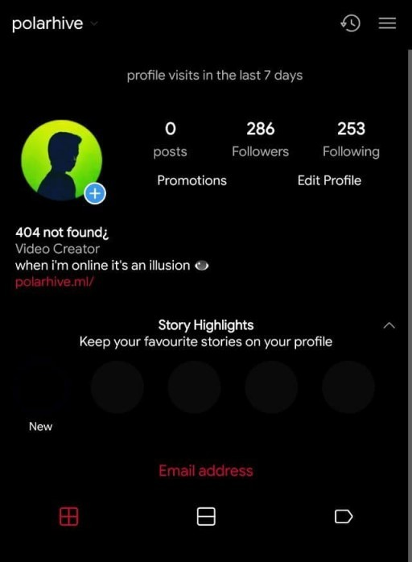

## Facebook is not going to [break up](https://www.theguardian.com/commentisfree/2020/dec/11/us-government-break-up-facebook-long-overdue) and re-sell WhatsApp & Instagram anytime soon

It's up to the user's to defend for themselves, you are at their mercy
when fighting for privacy on a platform that lives by selling your data.
Breaking up? - a silo like Facebook unfortunately [controls our social
relations](https://www.theverge.com/2018/4/28/17293056/facebook-deletefacebook-social-network-monopoly).
Facebook [hacks](https://www.newsweek.com/facebook-delete-facebook-technology-psychology-opinion-864780)
into our social life: emotions, the fun moments we share & with our
friends and family is associated with Facebook. It gets harder to leave
such a platform, where you'll miss out [FOMO] unless you get others to
join you to use alternate platforms.

That being said --- you've got to step-foot and take charge of your own
digital-life. If you don't, it'll only go downhill. The more you use
Facebook, the harder it gets to quit.

### Deep-rooted in our vocabulary

*If you're Indian: you've probably heard these things quite often and can relate to it*

- At a party?---"Cool, what's your Insta? I'll tag you"
- "What's your WhatsApp number?"---No one cares about phone numbers any more. Some people think: I possibly gave them the wrong number because they couldn't find my number on WhatsApp.
- "I'll add you to the school group"---by group they mean a WhatsApp group, where you need to signup for WhatsApp with a phone-number to read messages/updates, regular members are not allowed to post/reply to messages: only the admin can, because.. it's.. uh.. WhatsApp.
- Some [schools](https://fsf.org.in/news/proprietary-apps-in-schools/)
  force children to use [Facebook (WhatsApp)](https://fsf.org/facebook)
  and everyone just assumes you're in that school-group, where the
  teacher posts updates. Our generation has skipped email-chains and
  notice boards.

---
## Facebook's true customers

You'd be surprised to know that we aren't Facebook's true users.
Facebook like Google, is an advertising company. Have you ever met a
Facebook user who's paid for their account? That'd be bizarre.



### The advertiser is the true customer: whom they sell user-attention

How are they so good at it? It's because they collect an exorbitant
amount of user-data, including analytics, cursor movements, run social
experiments to improve their algortihms. Their real goal is to make you
spend more time watching ads on the platform, and improve ad-click
through rates!

---
## I'm Deleting my Facebook account today: including WhatsApp & Instagram -- the 2 apps owned by Facebook

Why?---Privacy matters, Facebook will always be an advertising company
who profits off our data. I want to use better platforms, not based off
of mining user-data for ads.

### To friends and family reading this article:

*"I do not consent to anyone sharing my photos, texts & data with
Facebook anymore. I am deleting my Facebook accounts including 'WhatsApp
and Instagram' Please purge our chats if you can or assume Facebook will
keep it forever. Treat all our previous-chats as 'public domain'. Read
more at: [polarhive.ml/fb](https://polarhive.net/fb) and where you can
find me"*

This was the message I sent out to friends and family a week before
deleting my accounts.

### Before I made the switch I'll admit I was addicted, juggling between Instagram and WhatsApp.

One reason: [DMs](/blog/how-i-got-my-username/) *the reason I tried
Instagram in the first place*, I didn't have a phone number and used it
as a replacement for WhatsApp. I could text anyone just by logging in on
my friend's phone in school and go home and continue the chat. 2018-19
was pretty cool!

> The *_cringy catchphrase the naive 13 year old me bought into --- 'Dude just download it, cuz everyone's using it'_*

---
## D-Day

5th of April. I type [deletefacebook.com](https://deletefacebook.com).

It leads me to the *'Delete my Facebook account'*, there was a lot of
tiny-font-text and other legal jargon that you'd have to read which
makes it hard to export your data. I also tried to cleanup some old
posts that I made just in case Facebook doesn't really purge my data.

Infact, you can not instantly delete your account. Pretty zucc wants to
lock me in for 30 more days. I made use of those 30 days: I posted
Instagram/WhatsApp Stories and setting up auto-reply in the WhatsApp
Business app with a link to this blog post: polarhive.ml/fb and a
goodbye message.

I uploaded a short-video on YouTube just for fun! to say that I'm no
longer zucc'd 🦎

---
## Find me on [better](https://fediverse.party/), [federated](https://switching.software/) social-networks

- Instagram -> [Pixelfed](https://polarhive.net/pixelfed)
- Twitter/Facebook -> [Mastodon](https://polarhive.net/mastodon)
- YouTube -> [PeerTube](https://polarhive.net/peertube) & [LBRY](https://polarhive.net/lbry)

---
UPD: Here's a [chronological](https://fosstodon.org/@deletefacebook) [timeline](https://tx.me/s/delete_facebook) of recent Facebook mishaps that I started logging after I deleted my Facebook account.
