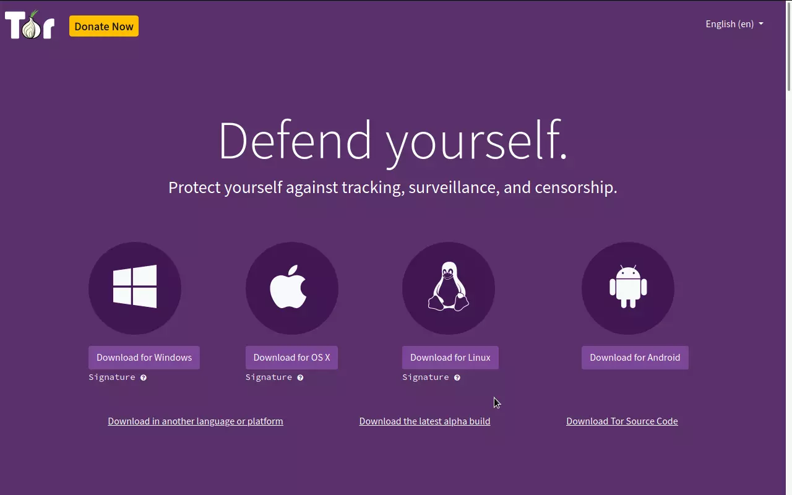

### **Unblock** domains, access websites **freely** & securely

Tor stands for ~ The Onion Router. I've often recommended people to use the Tor Browser when using the internet. I don't think pseudo-privacy-browsers like Brave or Firefox can ever match the protections offered by the Tor Project. First, it masks your true IP address. when expecting real privacy when browsing the web. This article is a quick how to guide on circumventing censorship online using the Tor Project.

---

## Step 1 : Figure if you can access the Tor Website

Visit [torproject.org/download](https://www.torproject.org/download) and it should look like this

Make sure you are not redirected to a spoofed website check for "https". If you're living in a totalitarian state like China, or if you feel suspicious.
If you're on Android you should consider downloading Tor as an apk from the Guardian Project F-Droid repository. Google Play - if you choose to use Google Services. If you're on an iPhone or iPad then use [Onion Browser](https://apps.apple.com/us/app/onion-browser/id519296448)

### If you are unable to connect to [https://www.torproject.org/download](https://www.torproject.org/download)

Get the Tor Browser from these mirrors instead.

1. [https://tor.eff.org/](https://tor.eff.org/)
2. [https://sourceforge.net/projects/tor-browser.mirror/files/](https://sourceforge.net/projects/tor-browser.mirror/files/)
3. [https://www.apkmirror.com/apk/the-tor-project/orbot-proxy-with-tor/orbot-proxy-with-tor-16-1-4-release/](https://www.apkmirror.com/apk/the-tor-project/orbot-proxy-with-tor/orbot-proxy-with-tor-16-1-4-release/)

Never use **random VPNs other than unblocking torproject.org**. After which, you remove the VPN.

---

## Step 2: Trust! but Verify

### *Skip this step if you're on iOS or Got it through Google Play*

Launch the Tor Browser executable you just downloaded, run through the setup, defaults should be fine. To be assured your downloaded a non tampered package visit [expyuzz4wqqyqhjn.onion](https://expyuzz4wqqyqhjn.onion/) in the Tor browser you first download the package, yes again over Tor.
Delete / Uninstall the old Tor and and run the Tor package you downloaded right now, if you feel extra sus.

## Step 3 : Run Tor & check onion sites

Head to [check.torproject.org](https://check.torproject.org) to check if the Tor Browser working as intended. Make sure you're not running the first copy of Tor we downloaded, we'll assume that it is compromised. 

*Never change any setting or install more add-ons. It neuters the advantages of Tor.*

---
That's about it. Don't abuse Tor for malicious purposes, or crime. Use it for upholding privacy and decentralizing the web.
