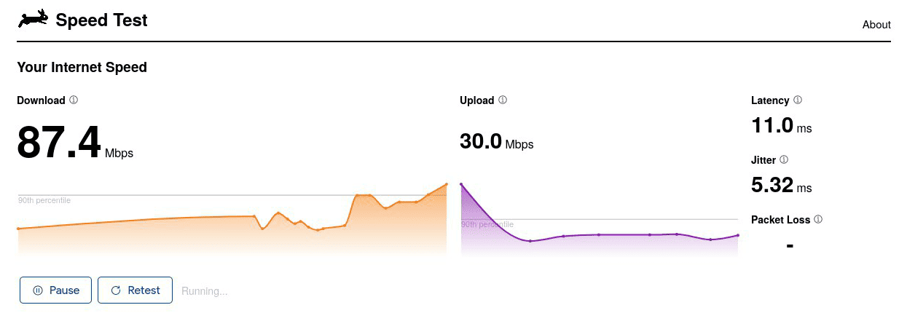

## University is starting: next week

I thought I'd write a helpful blog-post on how I've been prepping for
college, some sacrifices I've to make and the tech-stack that's changing.
Don't worry I'm still running arch btw :3


### Here's how the campus looks like

For the next 4 years or so --- I'll be spending my time pursuing a
Bachelor's degree in Computer Science at [PESU](https://pes.edu)
Bangalore. Checkout this mini `LaTeX` resume that I [compiled](/resume)
last-week.

I'm not having any expectations and can't really complain about college-life
and a lush green campus inside Bangalore these days. Let alone the traffic and
the never ending Metro construction work.

---
## Resources

Most people (parents) gift their kids a new phone / laptop as they begin this
new chapter in life. You most probably don't need one unless you're absolutely
are in need of one. By the time I graduate I would probably need a better
device anyway.

I'm a minimalist and I like having the best use of my resources. At most, I'd
need to worry about battery-life and take care of the wear-n'-tear of classroom
/ college life. I'll be living in the hostel for the first year. I know --- *it
doesn't look all that fancy compared to the: new medical-block or PESU's sister
RR-campus*.


#### Here's a list of devices I have at hand: In order of computation power

- My 4 year old laptop: `cider`
- My 6 year old phone: `vince`
- An `ARM64` linux webserver: `nimbu`
- A 1TB hard-disk for backups: `argentum` (yes I named this too)
- A dumb-watch: it tells the time `¯\_(ツ)_/⌚¯`

---
## Tools I use / have built

- Tailscale: Let's you `SSH` into any of your devices and also use them
  as exit nodes (like a traditional VPN). I use it to listen to music.
- Beeper: A hosted-matrix instance which has easy to use bridges for
  your proprietary chat-apps/networks. Think of it like Thunderbird: but for texting!
- newsboat: I haven't used regular YouTube in ages. My feed has grown
  past 400 URLs and I find it very useful quickly filtering content I need,
  and junking the rest. It also let's me archive/cache posts for later.
- Anki: Flashcard / memorization tool. I plan to use this to
  keep note and revise quickly before ISAs (exams). You'd have to keep
  reviewing your notes every 2-3 days and the fact that it's on both F-Droid
  and Flatpak is pretty cool.

### jukebox

I made [/jukebox](/jukebox): a bash script which lets me play my LastFM
recommendations on linux using mpd, yt-dlp and bash music recomendations on
linux and now, (any device) over tailscale.

I ssh into my VPS to listen to music over mpd/snapcast and listen to music on my
phone on commute and probably during during short-trips!

``` bash
jukebox -h
  -a: <artist name>
  -g: <genre name>
  -s: <song name>
  -u: <lastfm: username>
  -m: <lastfm: mix | recommended | library>
  -l: vosk: uses your mic to search songs
  -y: use ytmusic tags for songs
  -c: top charts in your region (setup your api_key)
```


---
## Firewall Woes

Like most colleges/unis in India: students don't get the freedom to use
the internet like regular people. (Unless you happen to live in a campus
like BITS :P where there's an active [P2P](https://old.reddit.com/r/BITSPilani/comments/154k0li/calling_all_juniors_time_to_resurrect_the_epic/) file-sharing culture.

> *Have a look at [r/BITSPilani's](https://old.reddit.com/r/BITSPilani/comments/xl8kx1/what_exactly_is_dc/) DC culture: 🏴‍☠️*
arr!! It's pretty rad.

Anyway, let's maintain good OPSec --- assume everything on campus is
logged & censored; even regular educational/professional sites like GitHub,
StackOverflow and probably ChatGPT are blocked. I've heard from seniors that
one time our college's own assignment portal was blocked on the campus network.

In general, most people stick to using their phone's internal WiFi hotspot or
wired tethering for power efficency.



#### P.S. If I'm lucky I get to enjoy 100 Mb/s of bandwidth during off-peak hours.

---
## Clubs

I've joined 2-3ish clubs officialy, so far. I have met some really smart people
in these tech/social circles. This is one of the major perks when you attend a
physical university. There are a lot of hackathons planed this year and I for
one am very excited to take part in them. Not all clubs on campus are active
and I barely know any of the non-tech ones.

The events that I've heard so far are very-well organized and are entierly
student oriented. I must say Bangalore has one of the best seniors that you
are probably gonna work with in the future!


## Crowd

You'd find a mix of Bangalore folks and non-BLR folks who are extremely
competetive in nature (based purely on merit). It's not your average lay-back
*chalta hai* college. At the same time most people are just being pushed by an
external-factor like placements (aka compensation). This is a major feat. of
city colleges situated in Bangalore: the silicon valley of India.

I think you should be able to place-yourself. On your own --- with the skills
you develop during your time on/off campus. I don't want to get mass-hired into
FAANG or a company that doesn't really match my goals. Who knows, I may even
pursue-research full time like an MS after giving it a shot during my time at
uni.

## Bootstrap

The first week of college is spread over 5 days of events held by each
department and is called bootstrap.


I've had the notion that my college and other city-colleges in Bangalore are
just filled with the same folks you've met at school all these years. I think
I've met a couple of dozen people: and infact more people from other states and
cities in India (because I stay in a hostel).

It feels great meeting 2-3 people with the same name but totally different
personalities. Having a diverse student-pool is what I'd wish for when I was
targeting [JEE](/blog/big-break) 2 years ago.

---


### He forgot that I even exist 💀

Diesel was crying the first day that I left. He literally thought that I got
kidnapped or something. Twelve hours later he probably forgot about me: he's
back to being the crazy, [dorky-dachshund](/diesel/dorky) boi he is ૮・ﻌ・ა

