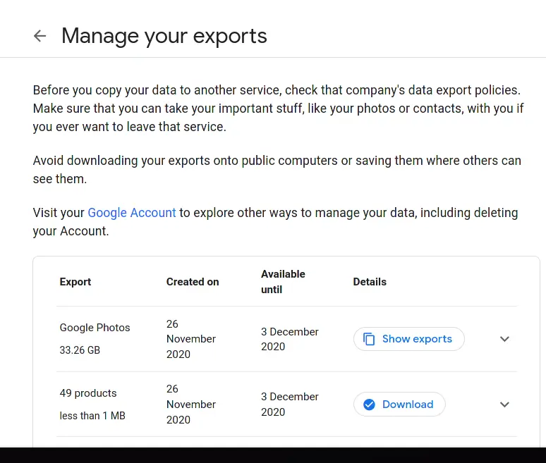
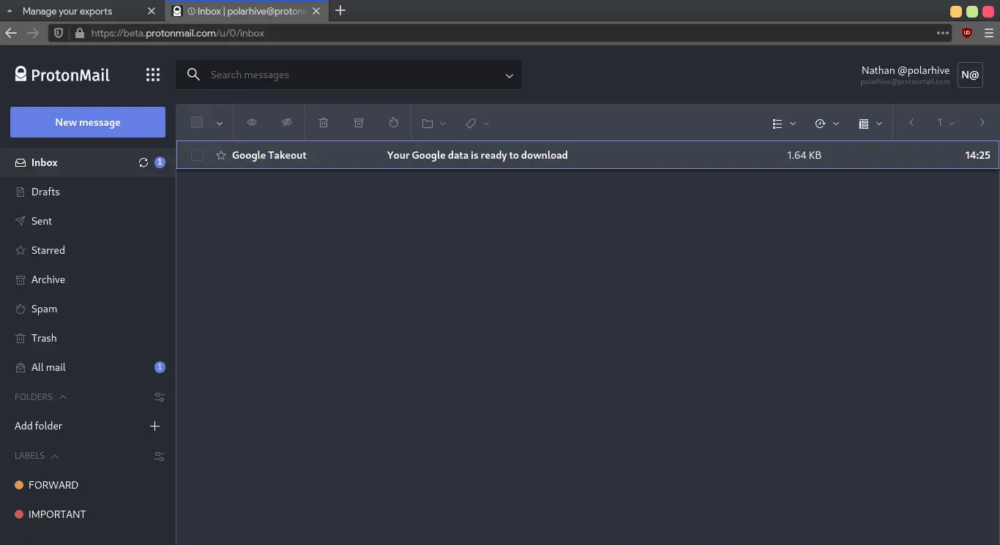
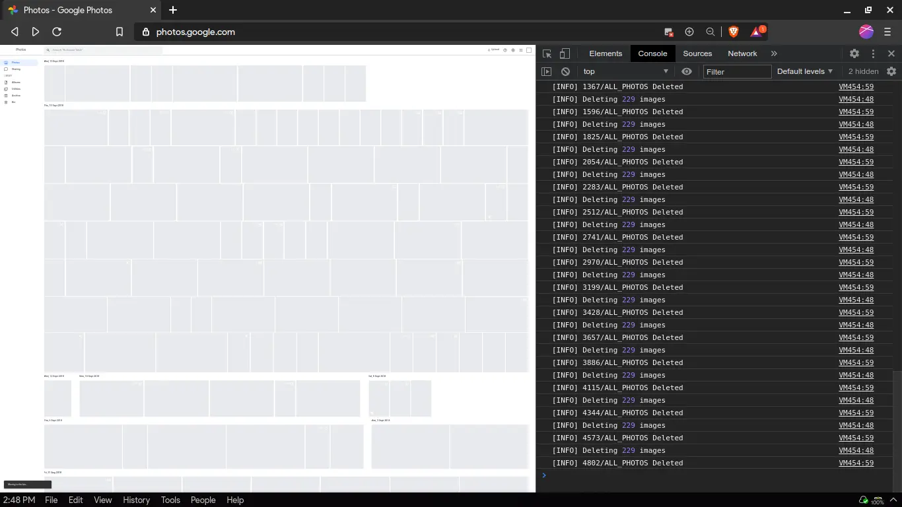

# [Google](https://google.com) is probably your search engine. Chrome your web-browser?

## Google flavoured Android + your OEM skin, the OS your phone runs on

I'm talking about — Xiaomi's MIUI, OnePlus/Oppo/Vivo's Oxygen OS, Color OS,
Samsung's OneUI, literally anything other than iPhones probably run Android +
proprietary Google software.

## YouTube? — it's the 2nd biggest search engine after Google

Often the only source of video hosting at such a cheap, subsidized rate. Not to
mention censorship 😷 / corporate gaslighting. I haven't even talked about the
deadly recommendation algorithm. My dependence on Google is disgusting. I store
all my photos using Google Photos, use Chromium, Google Play services for
Android, at least for now. Not to mention, gmail and search.

## Google excels as a product company

Google builds high quality products with great security like the Pixel phones
and the [Chromium](https://chromium.org/) web browser; but that isn't their
true goal. Google is an advertising company disguising itself as a product
company. All attempts at making their projects good are neutered by
anti-features like data collection, telemetry and straight up spyware, F/OSS
builds of the operating systems don't ship by default. You've gotta de-google
all their products, to make use of it.

## They trap you in their proprietary ecosystem

By shipping Android / Chromium with their proprietary services — Google Play,
Google Sync, Gmail, Drive. All of these services needs an active internet
connection and are switched on by default. You'd have to rely on 3rd party apps
instead.

Why does Android need to ship with Google Play by default? Can I ever buy a
mainstream phone without it phoning Google back home? **No, it's not the status
quo**. There are one or two phones phones that run de-googled'd android
out-of-the-box like the XDA Phone running Lineage OS or /e/ OS phones. But
these aren't available by where I live and it's way out of my budget for a
simple device.

---
## Don't put all your eggs in one basket

Have you ever read Google's [ToS](https://tosdr.org/en/service/217) / [Privacy
Policy](https://policies.google.com/privacy)? They can shut down my account
anytime for any reason. The more I use Google, the harder it gets to wean off
their gratis service. Every year they bring major changes to their services
like YouTube, Gmail and Photos, leaving you with 0 control over your data
hosted there.



### This ^^ doesn't include *YouTube (16GB)*

Yes, 15GB is quite generous for cloud storage! But, I've already crossed that
15 GB mark. I mean I am currently storing 32GB of photos + 16GB of YouTube
videos around 48GB worth of data, stored in my Google account.

---
## **2020 is the year I plan to *delete* my personal** Google account

By deleting my Google account — it allows me to reduce how much personal data
gets uploaded to Google's cloud. I need be able to live off-grid and reduce
cloud based dependencies regardless of the provider.

**I made a (new) brand account for my YouTube channel.** I plan to siphon users who find
my content on YouTube, towards my [PeerTube](https://polarhive.net/peertube) and LBRY channels.
[#FediFirst](/blog/fedi-first) Here's an excellent guide I found for exporting [Google Photos](https://robbie.antenesse.net/2020/11/25/exporting-google-photos.html).



## Export all your data: [takeout.google.com](https://takeout.google.com/)

You'll get an email when they're done:

### After June 1st what will I permanently lose?

Some icon packs I redeemed via Google Play credits and my gmail id:
[polarhive@gmail.com](/email). I can brag then, who uses gmail lol? If someone
claims to impersonate me ask for proof. If you get an email from my gmail
account after Nov-2020, that's not me!

---
## The Google ecosystem is weird

I like Google's efforts in [GSOC](https://summerofcode.withgoogle.com/),
improving the security of the [linux-kernel](https://security.googleblog.com/2021/08/linux-kernel-security-done-right.html),
[libre-software](/blog/free-libre-software). They have some of the best minds in
the world, have huge investments in computer research and engineering that
Googlers can exploit.

Chromium is a secure, powerful browser, PWAs allow for powerful cross device
web apps. WebRTC, WebM, WebP and other projects that have improved our lives.
Custom ROMs on Android can be flashed on almost any smartphone thanks to
project treble and alternative stores like F-Droid can be installed, unlike
Apple's locked-ecosystem.

The problem I have with Google is — you don't have control over your Google
account & other proprietary bits of the Google ecosystem. They can shut down
your account at any time. I don't want to **use or promote** GSuite, Google
Classroom, YouTube or other services which rely on 'signing up' for an account
unless Google lets you self-host like NextCloud!

Chromium's sync server can be self-hosted but Gsuite can't be self-hosted. You
can flash custom-ROMS; but don't expect any banking apps to work without Google
Play services. You get the point: Google as a whole (proprietary ecosystem) is
a big no-no. All the products they make are really powerful, but only when you
take the time to de-google it!

> ### Their true goals aren't really interesting i.e. to collect more personal-data. To improve their ad-targeting tech. After all, they are anadvertising company

---
#### UPD: Some other posts

* [Is Brave Really brave?](/blog/brave)
* [The Apple Illusion ~ On Privacy & Freedom](/blog/apple)
