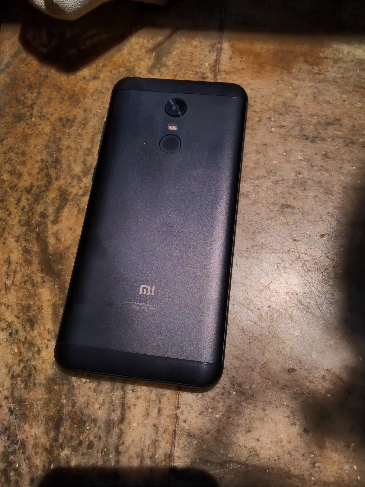
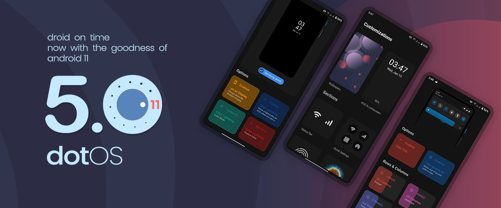
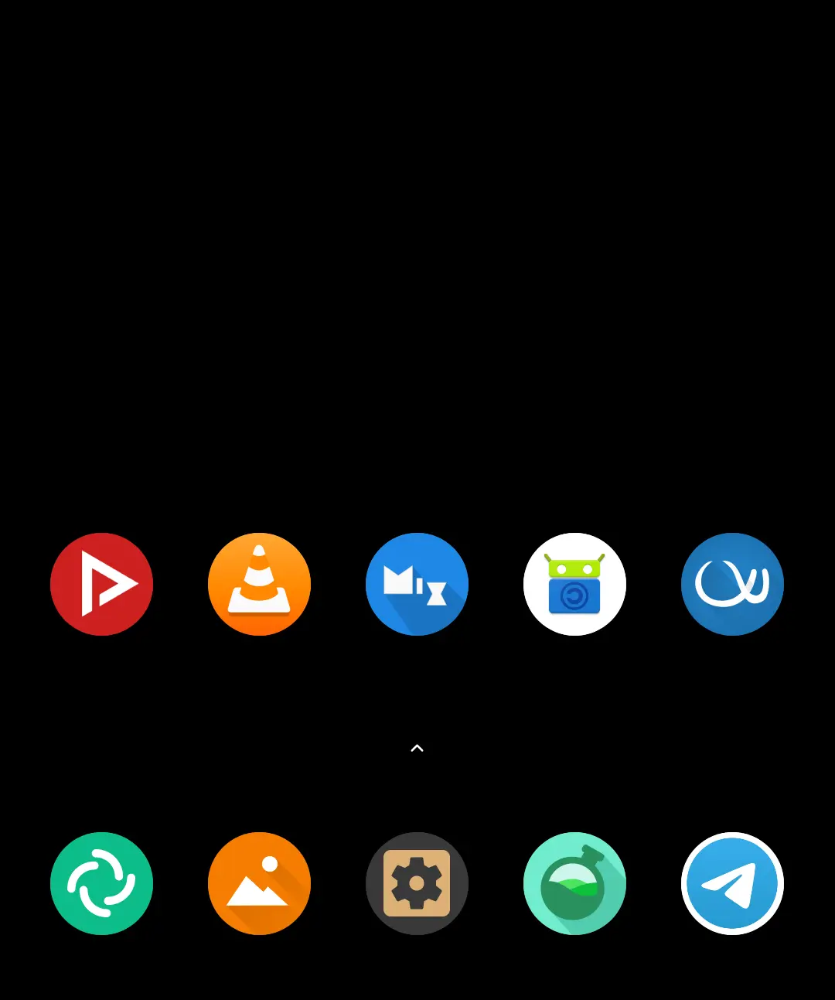

# Without the [big 5](https://en.wikipedia.org/wiki/Big_Tech#GAFAM_or_FAAMG) tech titans. Utilizing [FOSS/Libre software](/blog/free-libre-software/)

### Here’s what’s different from your average expectation from a phone

It runs Android, *without pinging Google* or other such servers without me
telling to do so. No ads, spyware, lag or [battery](https://dontkillmyapp.com/)
draining apps. No Google apps, none of the infested Facebook apps, Tencent,
WeChat, TikTok whatever that mistreats me, the user. There are better
alternatives to WhatsApp for example. You probably haven't tried it because
you'd have to migrate your entire social graph there: it’s called the [Network
Effect](https://en.wikipedia.org/wiki/Network_effect). Phone companies make it
extremely hard to switch from the defaults.

## I Make VoIP calls

I don't like giving my phone number for everything. Old school calls suck - in
voice quality and is pointless when you have internet 24/7 these days. Calls
are based on personal, traceable phone numbers that bar your **freedom** from
authoritative carriers. Take ISD calls as an example they cost so much when
data charges are dirt cheap. There's also cell tower triangulation, regular
surveillance in popular public places.

Never give your mobile number --- you could always give a landline or virtual
number. I also hate when call logs and other meta data are tracked on the other
person's phone and sold without your consent. Call logs and their meta data is
available to all the apps on your phone (on Android and iOS) whereas if you
used Signal — meta data stays in the app and is not logged by the ISP, OS +
other 3rd parties. Note: if you’d use Messengers like ones from *Facebook,
WhatsApp then you’re better off using normal calls as they promote a closed
network that encourages peers to install proprietary apps.*



---
# Hardware?

## I use a 2018, Xiaomi Redmi Note 5: [vince](https://forum.xda-developers.com/redmi-note-5)

It's packed with 3 gigabytes of RAM, 32 gigs of storage --- a mid-tier Xiaomi phone
chugging on a Snapdragon 625, still pretty good for day to day communication,
entertainment & photography.

## Just like my [laptop](/uses): I can flash a different OS on my phone

- Unlock your boot loader, they make you wait 360 hours (Xiaomi doesn’t want
  you to get rid of their MIUI)
- Flash the latest Orange Fox recovery.
- I switched my ROM or firmware from Xiaomi’s MIUI (Android 7) to
  [DotOS](https://www.droidontime.com/vince) based on the latest AOSP build of
  Android 11 (R) plus flashed Magisk for root.
- Reboot and setup your device.
- Install F-Droid and some Magisk modules.

Read [this](https://forum.xda-developers.com/t/rom-android-11-dotos-redmi-note-5-5-plus-official-vince.4231307/)
XDA thread for flashing ROMs if you don’t know the a-b-c of switching your OS.

---
## Use [libre](/blog/free-libre-software) apps that respect you

That probably means no **G**oogle, **F**acebook- WhatsApp, Instagram,
Messenger, (Skype) **M**icrosoft, **A**pple (iMessage) and **A**mazon apps on
my phone.

### List of Suggested Apps

- F-Droid to get apps
- Element - a Matrix client
- Telegram FOSS
- AppManager
- NewPipe
- Open Camera
- VLC
- Infinity for Reddit
- Bromite

I also encrypt my phone with a strong lock screen password with monthly house keeping
cleaning unwanted apps. Backing up photos and updating apps using F-Droid.

---
[UPD](/blog/phones-make-me-counter-productive "I still plug it in to
charge every week") : I've reduced my phone usage significantly.
