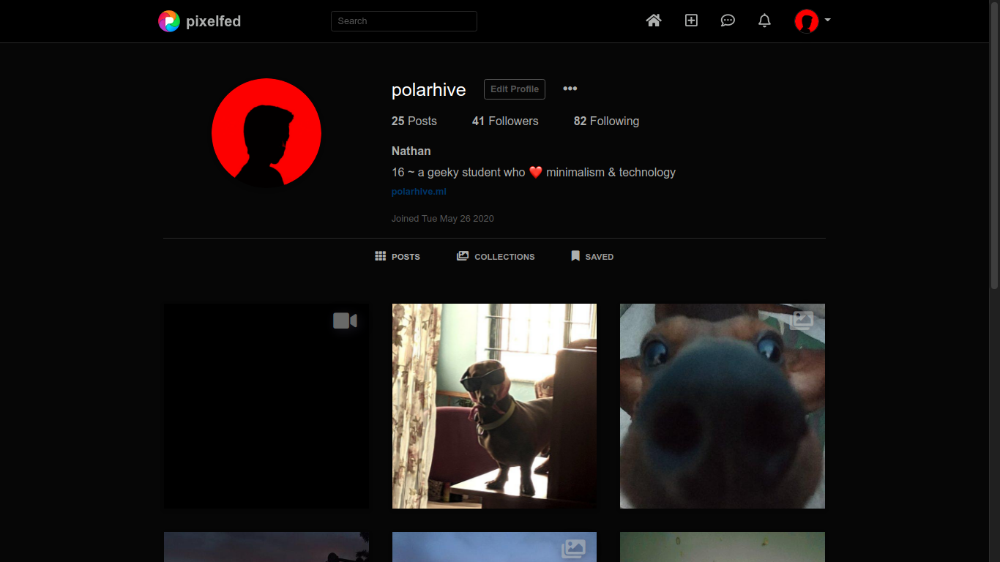
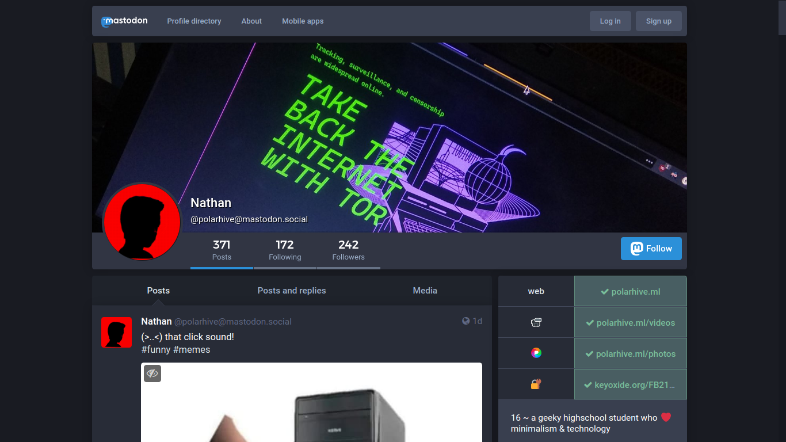
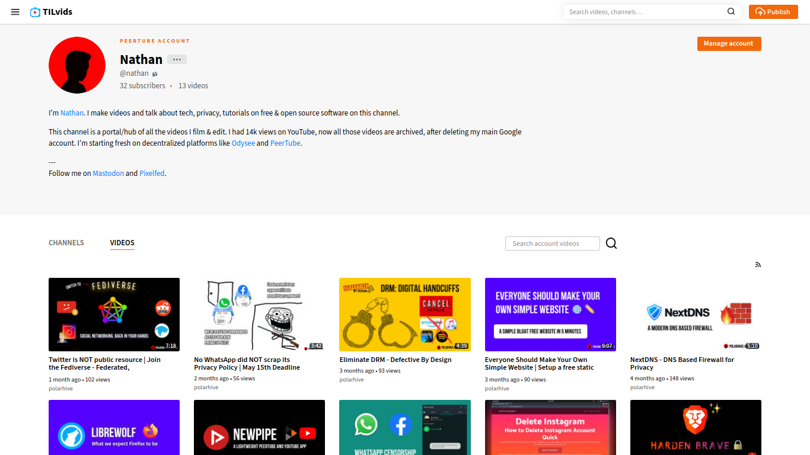

## "Imagine Instagram allowed users to follow and like Tweets through the Instagram app; vice-versa"

Social media is about connecting people right? Such Corporate speak! Much like
the earlier days of the internet where you can host a personal website, not
having to worry about walled gardens or 'signing-up' to view simple photos &
posts. Modern centralized social media isn't about 'connecting people' - excuse
the Mark Zuckerberg corporate speak.

## Protocols, not new platforms

Turns out, the clever people at [W3C](https://www.w3.org/TR/activitypub/) have
already proposed a protocol; Protocol you ask? Just like email or like HTTP
websites, the ActivityPub protocol - powers the next generation of social media
platforms. Since, it's a protocol just like email, you get to use any server
you want, use any client or develop features as you like. All these servers can
federate together.

## The Fediverse

On the fediverse you can like a [Pixelfed photo](/pixelfed) from your
[Mastodon](/mastodon) account. Watch and comment on a [PeerTube](/peertube)
video on your Mastodon feed, any ActivityPub powered platform. That's the
beauty of the Fediverse. There's probably a clone / alternative to popular
centralized social media platforms.

[Mastodon](https://joinmastodon.org/), [PeerTube](https://joinpeertube.org/),
[Pleroma](https://pleroma.social/), [FunkWhale](https://funkwhale.audio/),
[Lemmy](https://join-lemmy.org/), [WriteFreely](https://writefreely.org/),
[Pixelfed](https://pixelfed.org/) & many many more you can
[discover](https://fediverse.party)



## Honeypots

Before I made the switch - I used Twitter, Snapchat, Reddit, YouTube, &
Telegram [channels] all these apps on my phone - to stay updated. I still use
(some) even today, via RSS feeds & proxied-frontends.

People shouldn't have to be locked into a platform, when you post something
they always access it in-freedom. Platforms should be fast, scalable, easy to
port should I need to switch servers. Now, I exclusively use the fediverse. All
the platforms I use run [free/libre-software](/blog/free-libre-software/) - the
user remains in control. Most of them run not-for-profit, and are self-funded
by the community. No ads, or promotions, or algorithms pushing propaganda.

---
## Some embedded examples







---
## Do not **"compromise for data mining monsters like TikTok or Facebook ~ bEcAuSe eVeRyOne's uSiNg iT"**

You got to defend for yourself. Tell people when you decide to shift from
Twitter/Instagram/YouTube to Mastodon/Pixelfed/PeerTube, or whatever works for
you. They can always get your posts via RSS or visit your handle regardless
they have an account or not, unlike their centralized counterparts.

I use the [PWA](https://en.wikipedia.org/wiki/Progressive_web_application)
sites for my Mastodon, Pixelfed instances. For Android I use
[Tusky](https://tusky.app). For Desktop there's Toot a TUI Mastodon
client.

## That's how you go about fixing social media, exercising your freedom, re-decentralizing the web & expanding your audience

Since you've read so far ~ follow me on the
[fediverse](https://polarhive.net/contact)

---
Related post: [~/blog/fedi-first](/blog/fedi-first/)
