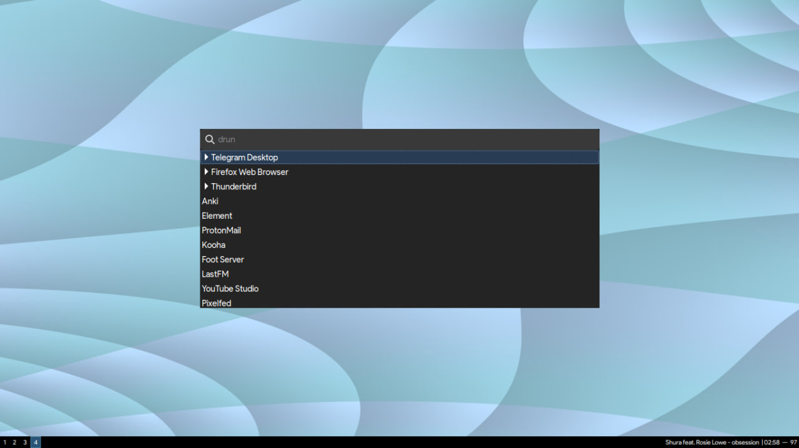

## PWAs

Progressive Web Apps (PWAs) work seamlessly on Chrome and are often lightweight
clones of their desktop counterparts based on JS frameworks like Electron.

If you've used Chrome --- some websites prompt you to install their web app.
PWAs on Chrome have features such as: service workers for offline capabilities,
responsive design, and push notifications. (Firefox is not far behind!) infact,
Firefox [uses](https://support.mozilla.org/en-US/kb/push-notifications-firefox)
Google's servers to push notifications to android-users.

[/vulpes](/vulpes): disables push-notifications entirely; remove [this](https://codeberg.org/polarhive/vulpes/src/commit/32ee807965b01ece2d017ff7e998b661aefefe7d/user.js#L151)
line to revert this change

## Why use PWAs over desktop-apps?

One word: *bloat*

Bundling V8, nodejs runtimes for *every-single-electron-app* is insane!
An average electron app takes around 200mb on my laptop. Because the
ecosystem is so fragmented, there are various issues around wayland
compatibility because the former dependencies haven't been updated in a
while.

> *There are some workaround like using flags. But signal-desktop and element-desktop just segfault and crash unless you run xwayland*

## security nightmare

Why would discord, slack, or other (*insert electron-app here*) have
un-restricted access to my system-resources. They can switch on your
camera, record your microphone or run in the background because they
aren't sandboxed unless you manually tweak your flatpak dotfiles. These
apps are proprietary and should be deemed evil until their source code
is public.

### Firefox had dropped official desktop PWA [support](https://9to5google.com/2021/01/27/firefox-discontinues-work-pwa-desktop/) in 2021

Electron developers can integrate PWAs easily, enabling access to
native features of the operating system. PWAs can be packaged as
standalone desktop applications, compatible with multiple platforms.

Yet, electron uses Google's [V8](https://www.electronjs.org/blog/latest-v8-chromium-features/)
engine under-the-hood. Which draws complications when sites don't work
as intended on Firefox which ships it's own JS engine. Microsoft's Teams
is one such example: it fails to run certain calling-features when you
use Firefox. But, if you change the useragent to chrome or edge it'd magically start
[working](https://addons.mozilla.org/en-US/firefox/addon/teams-phone-fix/).

### Discord: spyware

Discord's desktop client was caught recording running system-processes
and it gets uploaded to their [servers](https://archive.li/qFcQA). One
can technically 'turn it off'. But since it is a proprietary app there's
no way to see if it's true.

By running Discord via their web app or let's say, for convenience: as a
PWA you can limit it from tracking you / opt-in to use your mic/camera
when you need to.

### You can also containerize PWAs into their own profiles

Limit cookie tracking, have your social-media profiles and professional
accounts separated. uBlock Origin and any of your addons run in any case.
Since this is basically a full-screen browser without letting you
restore from full-screen.

---
## Replicate PWAs on Firefox

The `--kiosk` flag let's you run Firefox in full-screen mode,
restricting access to browser controls, tabs, and settings (*technically*). This feature
is commonly used in public displays, information kiosks, or any scenario
where you want to create a dedicated and immersive browsing experience
for users.

> *PS: You can still move-around-using keyboard shortcuts like `CTRL+T` to open a new tab.*

### Try it!

``` bash
$ firefox --kiosk "https://gnu.org"
```

---
### Step 1: Creating a .desktop shortcut

``` bash
$ touch ~/.local/share/applications/element-web.desktop
```

Note: The path might vary, depending on how you installed Firefox. If
you use the Firefox flatpak like me, use `org.mozilla.firefox` instead.

### Step 2: Edit your .desktop file

``` bash
[Desktop Entry]
Version=1.0
Name=Element Web
Exec=/usr/bin/flatpak run --branch=stable --arch=x86_64 --command=firefox --file-forwarding org.mozilla.firefox --kiosk "https://app.element.io/#/home" @@u %u @@
Terminal=false
Type=Application
```

### copy the following ^

*Find more such examples in my [/dotfiles](/dots) repository.*

### Step 3: Save and Launch

When you open Firefox using this modified shortcut, it will run in kiosk
mode, occupying the entire-screen and hiding all browser controls.



