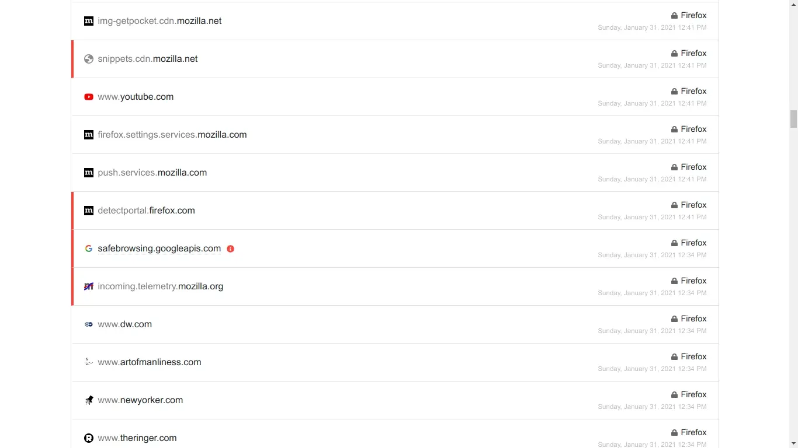

## "I trust Mozilla more than Google; but *Mozilla trusts Google* more than you"

Google is the [default search engine](https://www.zdnet.com/article/sources-mozilla-extends-its-google-search-deal/) on Firefox.
All their [app store screenshots](https://web.archive.org/web/20210129122110/https://play-lh.googleusercontent.com/xhsk9750TBC9NOZVwP33kH3kcb-pSRNWKx-EYOz_r8FvnADGJBBuuq2ozfDfdv0pLl1a=w1366-h674-rw) feature Google Search. No self hosted F-Droid repo. It's again Google Play.

Google is their primary & only ['real'](https://www.theverge.com/2020/8/15/21370020/mozilla-google-firefox-search-engine-browser) source of income. Ironically their only real competitor. Do they want to promote privacy friendly [social media](https://foundation.mozilla.org/en/blog/fellow-research-decentralized-web-hate/)? I see no PeerTube or Mastodon accounts to follow; it's again Twitter & YouTube. So much from a browser company that pushes for the open-web. They haven't dared to bite the hand that feeds them. They [violate](https://fosspost.org/mozilla-go-unfck-yourself/) many of their original goals listed in their [Mozilla manifesto](https://www.mozilla.org/en-US/about/manifesto/).

> ### Firefox by default, is more invasive of your privacy than [Brave](../brave), should you not change the default settings

Telemetry on first launch, pocket pinging so many sites, without your
consent. Hold up! I'm not saying use 'Brave' or 'Chrome' or some other
Chromium based browser. Using non-free DRM modules & location services
from Google. With $500 Million Dollars rolling in every year, it seems
like the browser is built for satisfying Google's needs at this
[rate](https://calpaterson.com/assets/mozilla-boss-pay.svg).

> ### Choosing Firefox comes at a cost — which benefits Google regardless of Firefox's popularity

Google does not care much about Firefox, as long as it exists they don't
have to face many anti-trust violations. Chromium has a 90% browser
marketshare, more specifically ``browser engine marketshare``. There are
legitimate reasons: an average person chooses Chrome because they expect
pages to render much faster, a better UX (Material UI), native PWA /
Android support, hardware-acceleration that works better, better
audio/video codecs (YouTube) and other proprietary Google ecosystem
integrations with Gmail and Gsuite.

## If you tweak Firefox and Chromium to the maximum:

> *The only reason you'd use Firefox is that it's not controlled by Google: or is it?*

Google funds Mozilla's [life support](https://www.searchenginejournal.com/google-to-remain-default-search-engine-on-firefox/377658/ "3 years more for the search deal to expire") but somehow their codebase
seems to favour user-freedom. At least they market the browser as
something that prioritizes - open standards, unlike the Chromium
project. But even that is slowly fading away with many proprietary
Google components like (Widevine CDM) for DRM and geolocation support.

Firefox also has many [security issues](https://madaidans-insecurities.github.io/firefox-chromium.html)
(process sandboxing/site isolation). They implement web technologies
very late (PWAs). Mozilla turns telemetry and other bloatware, on by
default. Things like Brave are upfront and less invasive in terms of
network requests / telemetry. Do note: Brave has other intentions like
shilling their BAT [crypto](/blog/brave) in mind. Privacy is a by-product
and more of a marketing term: on their browser.

## The average user doesn't have the time to [disable](https://polarhive.net/vulpes) all their telemetry, [ads](https://support.mozilla.org/en-US/kb/navigate-web-faster-firefox-suggest) with every new update!

When people ask what daily browser should I use? I suggest LibreWolf: a
sanitized version of Firefox, for security oriented users I suggest
ungoogled Chromium & Brave. There are no legit alternatives that aim at
Chromium's speed and security. Smaller browsers focus on one sided
platforms and a specific use case. For the forseeable future we have to
live with Chromium/Gecko duopoly, both funded by Google. If top notch
syncing features and upstream security updates are your concern use a
[hardened Brave](/blog/brave) profile. Although I do not recommend using
Brave in the long run.

---
## LibreWolf is what Firefox should be



## [Brave](/blog/brave) pricks Google's ad market share by blocking ads by default



---
## What do I use?

Firefox — with all the Mozilla crap disabled. For my usecase: I
don't really care about security bugs that Firefox is [vulnerable
to](https://madaidans-insecurities.github.io/firefox-chromium.html).
I do acknowledge it is a problem, that needs to be fixed, for the
general public, but I'm no boomer that visits shady websites everyday
and keep my install up-to-date. Here is how to [tweak](https://polarhive.net/vulpes)
your build of Firefox to do the same.

Stock Firefox is a pain to configure but is very customizable. Even more
than Brave or Vivaldi. Refer the [archwiki](https://wiki.archlinux.org/title/Firefox),
[arkenfoxuserjs](https://github.com/arkenfox/user.js/wiki), [LibreWolf](https://gitlab.com/librewolf-community/settings/-/blob/master/librewolf.cfg)
config files on GitLab. If you're geeky enough you should be able to use Firefox as
per your needs. Remember! Firefox is [free/libre software](../free-libre-software).
Use those software freedoms.

Here's how [my browser](https://polarhive.net/vulpes) looks like. Quite
minimal. Get's the job done.

---
# What's Mozilla been doing?

## Swiper no swiping

The current Mozilla CEO:  [Mitchell Baker](https://en.wikipedia.org/wiki/Mitchell_Baker),
took another yearly payrise. At a time when the browser is [struggling to survive](https://www.computerworld.com/article/3571168/mozilla-lays-off-250-says-pandemic-significantly-impacted-revenue.html).
Get the pun? [Swiper the fox?](https://dora.fandom.com/wiki/Swiper)

I don't think Firefox will die. There will always be someone forking or
patching abandoned code. But Mozilla not acting, is a painful thing to
watch. I will still continue using a non-Chromium browser, in this case:
Firefox as nothing better exists. For some weird reason I thought it
would be a good idea to try build a [web-browser](https://codeberg.org/polarhive/crust) from scratch.
Even if it's really hard I don't see anyone trying otherwise 😔. It'll
be a good research project! All hail the Chromium monopoly.

---
## Here's what Mozilla should do:

- Stop draining funds in unproductive [campaign programs](https://blog.mozilla.org/en/products/pocket/college-essay-contest-pocket-hercampus-announcement/) and [politics](https://blog.mozilla.org/blog/2021/01/08/we-need-more-than-deplatforming/).
- You're a browser company, stick to that or you'll lose more and more users.
- Ask help and ideas from users before the [3 year search contract with Google](https://www.theregister.com/2020/08/14/mozilla_google_search/) is over. 🤑
- Do not bundle non-free addons & cater to the [free-software](../free-libre-software) crowd, stick to the original founding principles, based on free/libre software.
- Release [Firefox Fission](https://wiki.mozilla.org/Project_Fissionf) ASAP, on all platforms including Android
- Change your release schedule, for the STABLE release switch to the ESR model with timely security patches. Leave the cutting edge features for the beta testers (nightly editions).
- Increase funding for the security team & finish [Site Isolation](https://wiki.mozilla.org/Project_Fission), keep all the new features for the Beta and Nightly editions.
- Start an F-Droid repo and focus on a de-googled, BigTech free experience.
- Remove all anti-features, telemetry, etc, in the STABLE releases of Firefox, keep it in the Nightly builds and of course OPT-IN
- Ask users for donations and effectively show us why you'll beat Chromium/Google in performance than shake their hands.
- Get away from Google, and eventually add uBlock Origin as a prebuilt addon with other privacy addons.

---
## I'm sticking to [hardened Firefox](https://polarhive.net/vulpes) & can not recommend vanilla Firefox to everyone, until it fixes itself

The fact that it is **not Chromium** is the only 'real reason to stick with Mozilla'. If Firefox fails, Mozilla is dead. Google holds Mozilla hostage & feeds them just enough, to defend against anti-trust laws 🚨

---
UPD: I made an easy to use guide for hardening Firefox called [/vulpes](https://polarhive.net/vulpes)

