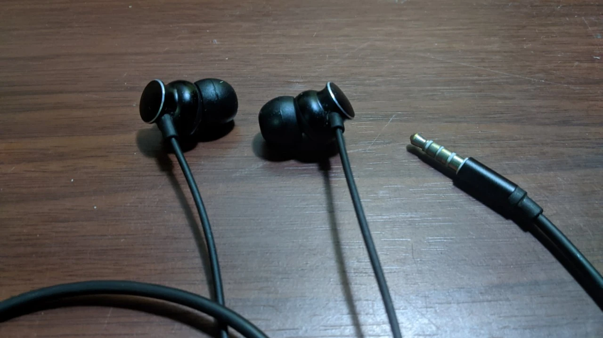
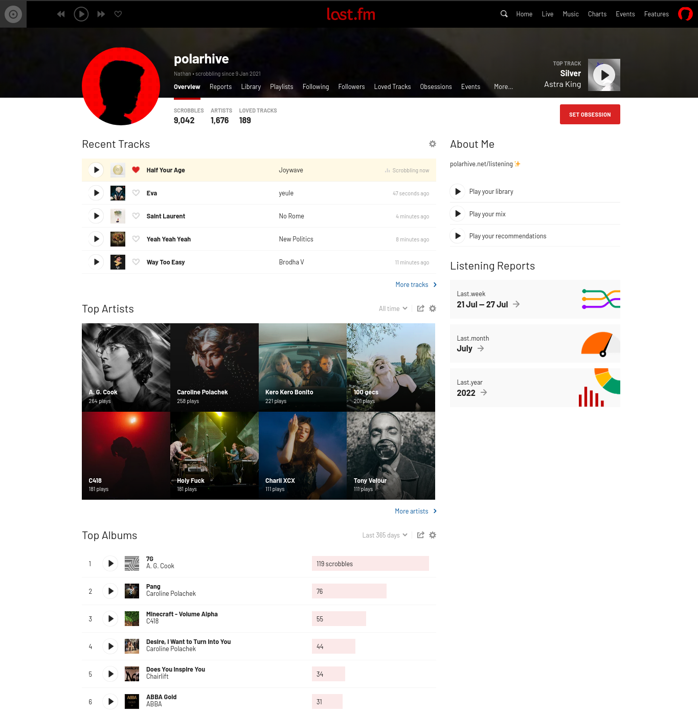
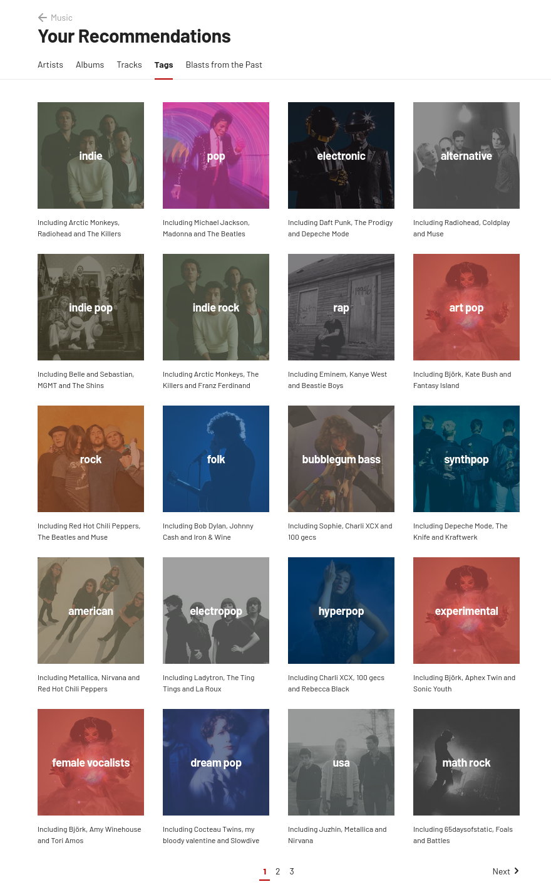
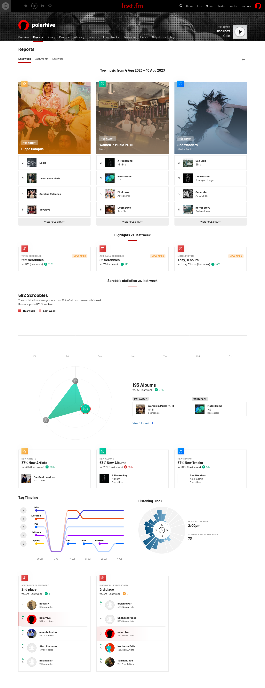

## I don't use Spotify, Apple Music, et al.

DRM'd content is a big no-no. I don't consume any kind of
[DRM](https://www.defectivebydesign.org/) these days. Most likely
like you: I have a ~/Music folder on my laptop. Yours is probably
empty, but I like to keep my music collection offline, available
any day I want.

[](https://polarhive.net/videos/notes/eliminate-drm-defective-by-design)

I keep music cached on my disk as long as I need it. Songs get archived
periodically every few months, if I have a change of taste. `yt-dlp` is a good
tool if you want to automate / batch download music for offline use, instead of
live streaming from YouTube.

``` bash
$ ls ~/Music -1 | wc -l
6842

# approximately these many songs
```
---
## metadata/tags?

Currently I have these many songs, neatly tagged using ``ncmpcpp's`` powerful
[tag editor](https://wiki.archlinux.org/title/ncmpcpp#Autoset_Tags_from_Filename_and_vice_versa).
If you don't want to tag them that's fine too, but I like having it easily
indexable.

### > a conservative count

I lost track of songs that I've listened to - prior to 2020. Sadly I hadn't
taken a backup of my Spotify data before I quit. I was using Spotify &
sometimes iTunes for offline music, because Spotify hadn't launched in India
yet and the random VPN I used had frequent connectivity issues. Some songs
hadn't released in India, so that was a bummer. You'd have to stream those from
YouTube/VLC.

These days — I listen to songs to keep me distracted from my surroundings or
serve as a timer when completing tasks assigned for the day. I don't care for
lossless audio quality or [FLAC](https://xiph.org/flac/), although they sound
nicer to hear.

PS. I wear some random cheap, wired earphones that fit well. I'm not an
audiophile so don't ask about hardware recommendations.



---
## New Song Recommendations

Spotify had a good recommendations engine. I remember every week you'd get 4
automatic playlists that suggest music based on your 4 favourite genres.

Mainstream songs would be featured in — "New Music Friday". Initially it could
not understand my taste in music, spamming random songs that don't even
remotely match my previous listening habits. Obviously, this was all based on
my listening stats within the Spotify ecosystem & not other sources like
YouTube /  CDs, so to improve my recommendations — I completely bought into the
Spotify ecosystem.

This was around the time when Spotify officially launched in India. Spotify had
control over the user. I was trapped in a vendor lock-in at this point. After a
couple of years, I got interested in free/libre software & realized it quite
late. It was bundled with a lot of proprietary DRM so I ditched Spotify.

---
## Enter LastFM

Now with streaming out of the way, I was organizing my old music collection,
manually editing tags like a maniac. Later on I switched from [Windows to
GNU/Linux](/blog/how-i-do-my-computing), and then LastFM.



After using it for a few weeks, it works like magic. I surprisingly hadn't
heard about it until late 2020 and it wasn't until 2022 that I actively
started using it. To use LastFM you need to setup [scrobbling](https://www.last.fm/about/trackmymusic)
or in simple words --- "syncing" your music playback to their servers.

Unfortunately, I deleted my Spotify account without taking a backup, so
I lost my songs that I wish would d be imported into my LastFM library
today, so if you wish to port, make sure to sync before you delete your
account.

The best part is unlike Spotify, YouTube Music, Amazon Prime Music or Apple
Music. This isn't a locked down ecosystem. It is supported by a lot of plugins
that work with their API. Beware, LastFM is technically a non-free platform,
but has a free/open API. So far, it has a good track record. It isn't exactly a
music streaming platform like Spotify, it's one part of it. The recommendation
engine based off your scrobbles.

There are alternatives like [libre.fm](https://libre.fm). But nothing
comes close to LastFM. As long as I can scrobble freely using any libre
background [daemon](https://github.com/MusicPlayerDaemon/mpdscribble), I
don't mind. For example: I still use YouTube: [via mpv, RSS feeds &
yt-dlp](/blog/rss-feeds), Telegram, and other front ends like Nitter,
even though these are made for non-free services.

## Weekly Reports

I get weekly stats on what I've listened to the past week, fancy graphs, and
recommendations on the homepage.



Neat! A pretty rich analysis; unlike Spotify. Spotify although has a
better font. The web-client is plastered in bold-typography (I quite
like that font). The best part is --- I can use any client to control
playback. I don't have to be trapped in 'an ecosystem' or worry about
devices running DRM. The only downside so far, sometimes it doesn't
match the correct album art for some specific tracks, Probably something
related to the tagging on my end.



I don't really need to use LastFM Pro, they have corporate backing anyway.
Their pricing seems reasonable: $2.5/month, but I'll pass, I guess you get the
point. Enough shilling for now.

P.S. You can scrobble from any source, even Spotify: if you don't care
about DRM. But try looking into DRM free marketplaces like Bandcamp,
SoundCloud & even to some extent YouTube Music. LastFM let me escape a
vendor lock-in. I don't have to worry about tracking songs in my
library, or sync gnome-music's .db files across flatpak sessions.

Perhaps one day I'll self host my own scrobbling engine or switch to libre.fm?
After all it's just stats, and you can export your data anytime.

---
## Worry free

Now with my library synced to LastFM, I don't have to worry about backing up my
`mpd / Lollypop` playlist or databases from one computer to another. Or even worry
about putting all of my songs on an MicroSD Card on my phone. For the
forseable future they'll live on my disk.

I can just rely on YouTube in case I need to find that song I was listening to.
LastFM fits into the UNIX ecosystem. *It does one thing, and does it
right*

## Tools

Consult my `dotfiles` [repository](/dots) for my exact setup. Yes, you could
use more tools if you'd really need to. I was previously using Lollypop which
has an inbuilt scrobbler and tag-editor when I was using a normal DE like
GNOME.

- `mpd` for playing songs
- `ncmpcpp` for interacting with mpd & organizing my library tags
- `mpdscribble` for scrobbling to LastFM
- `mpd-mpris` for using hardware buttons to control playback
- `mpd-sima` auto-queue similar songs from your library
- `waybar` to display the last playing song on my status bar


In 2023: I extended this setup, I wanted to fetch recommendations
automatically using yt-dlp, without needing to open a browser.
I call it [/jukebox](/jukebox):



<br><br>

> Play LastFM recommendations on linux: using `mpd(1)`, `yt-dlp(1)`, `bash(1)`

---
## This was my music setup in a nutshell.


Checkout what I'm <a href=/listening>listening</a> to rn!
<div style="cursor: pointer;" class="lds-ripple"> <a href="/listening"><div></div><div></div></div>



