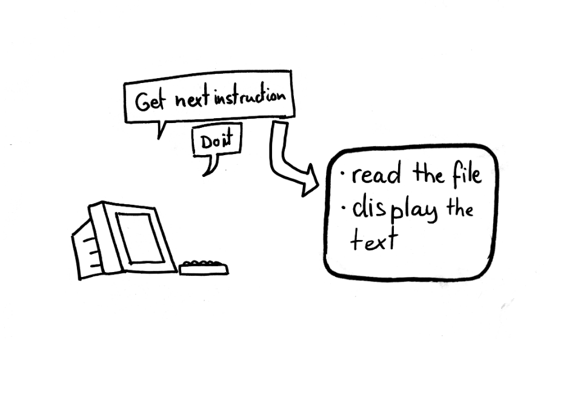
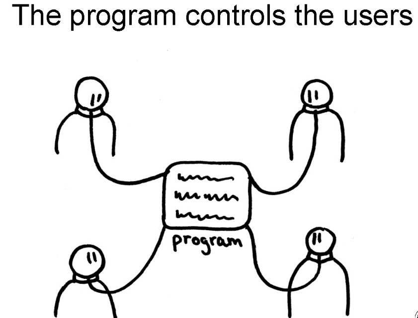
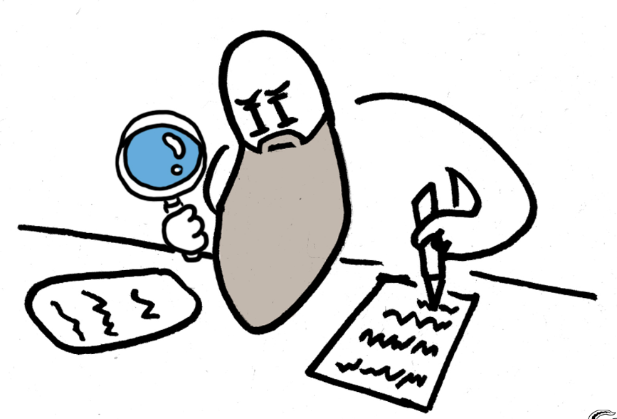
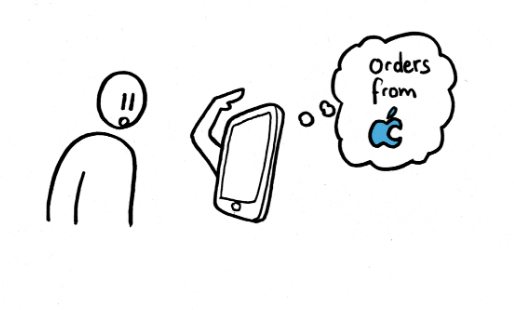
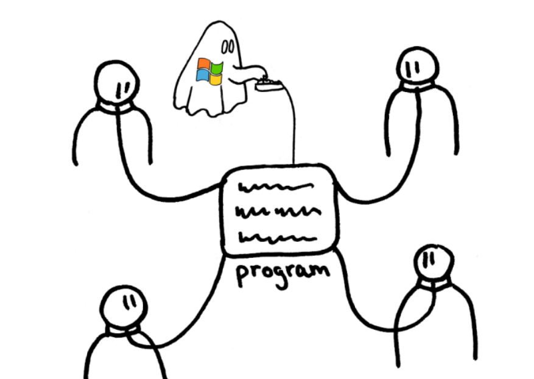
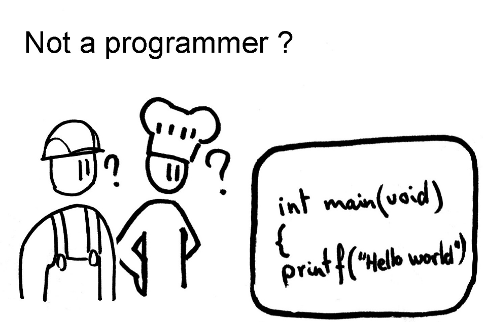
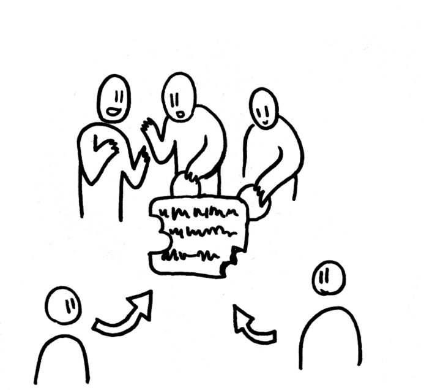
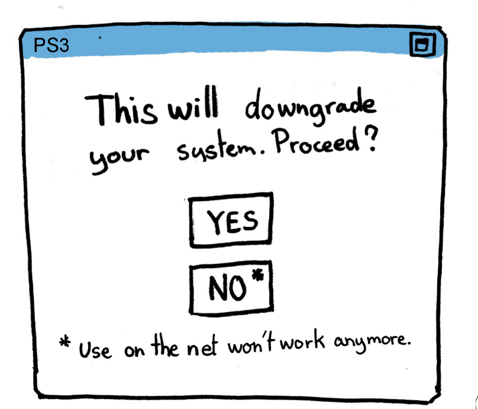
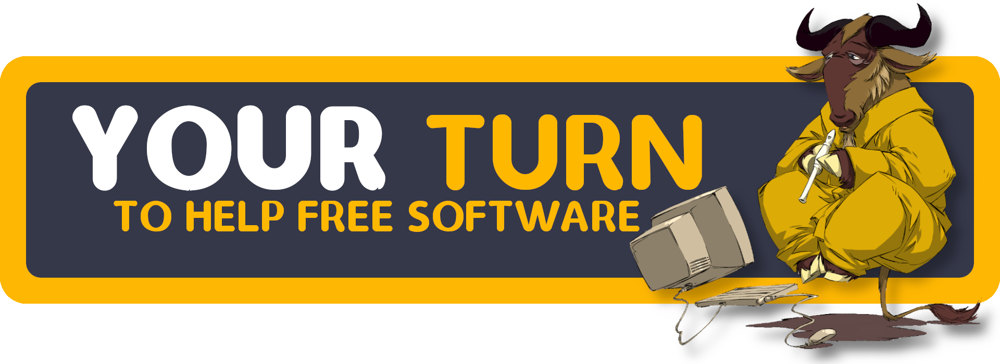
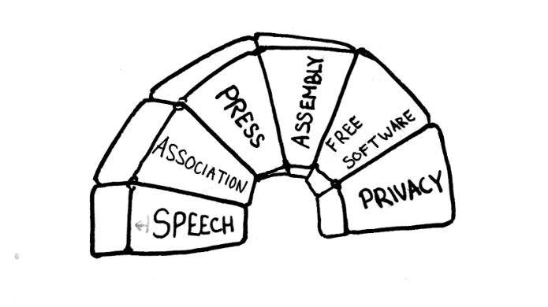

# Free Software is software that respects the user's freedom

### To someone who's not a programmer: this sounds totally absurd

What the heck is freedom that these people keep talking about? free? no paisa?
🤔 I had always thought it meant software — that was **free-of-charge**. After
reading Wikipedia I was even more *confused*. It talked about 'respecting your
freedom'. Respects the user from what? cyber-bullying? blocks-ads? respects
your time? I, just like you had no clue what they were talking about.

> *But to a GNU/Linux nerd this perfectly makes sense 👨‍💻*



---
## This is your laptop: 💻

It can do all sorts of cool stuff, browsing the internet for dank memes, you
can use it to make art, to write a blog post like this one, watching videos,
storing photos & other precious memories. The possibilities are endless! The
same computer ages ago was techincally powerful enough to send humans to the
moon. All of these computers share a common component --- a chip, specifically
special electronic chips called processors powered by electricity.

---
## Your phone 📱 is also a computer

A phone can also do all of the same stuff, albeit on a smaller screen and at a
slower pace. Because it's powered by a 'processor' & works the same way with
electricity. This is called a universal computer.

Of course humans can not understand the electric signals ⚡ and we ought to
communicate naturally using words and simple phrases ever since we were babies.
A computer is a non living thing, a tool for us to use for our needs and
benefits. It can not grow or divide into cells like living bacteria. It always
does the job you give it and has no intuition of its own.

In the 1940s people wrote — programs (instructions) written in English that
made the apps you use work. Computers translate these long lines of
instructions into electric signals in the form of 1s and 0s and other yada yada
that you can read [here](https://en.wikipedia.org/wiki/Assembly_language) so
that the the computer gives us the desired result.

## The only job of the computer is to take a program & run it as it is

If we know what the computer does we can predict what it'll do. The computer
can not be picky, or have a mind of its own. Nor can it decide if it's going to
harm the user or help the user, it does what is told. A computer does not have
life or a conscience of its own.

---
## What if this code was used:

> #### to detonate a bomb?

The computer will run that code, and trigger the bomb 💣

> #### to [spy on you](https://www.vice.com/en/article/k7e599/zoom-ios-app-sends-data-to-facebook-even-if-you-dont-have-a-facebook-account)?

Computer programs like Zoom, Google Meet & other such software are tools used against you

> #### to [delete](https://play.google.com/about/play-terms/) your files?

Including all your photos, music & movies that you got via Netflix, Spotify & iTunes?
It can be used to remotely delete your apps like how Apple removed
[Fortnite](https://www.theverge.com/2020/8/13/21366438/apple-fortnite-ios-app-store-violations-epic-payments)
from the AppStore?

---
## A computer is not to blame, it simply did what it was told

> But? Who gave the computer the instructions?

### Ah yes, the programmer!👨‍💻

Did you get what I'm trying to
[potray](#but-to-a-gnulinux-nerd-this-perfectly-makes-sense-)? the programmer
through their software has an unjust power over your computer and effectively
your digital / personal life.

Often it isn't one programmer but large companies that trap you into running
their non-free software. We don't have time to check for all the non-free
software each time the programs run. So we don't actually know what it is
doing, and don't have the ability to change it to our needs. This is totally
unfair!

---
# So how do we have control over our-own computers?

---

## Why can't I know what the program does?

We aren't computers and can't understand the 1s and 0s nor do we have time to
reverse engineer things. So we ask for the source code for the software we use.
The english text for the 1s and 0s. We can then remove the parts that harm our
goals and do our computing as we wish. This is how we have control over our
computers and not the other way round

## This is software that respects the user

Interesting ideas include - removing spyware from a program, add new features,
change the theme, translating it to help other people, debloating, reviving old
games making the things run faster and so on. ✨

---
# What if the programmer does not give you the source code?

You are left vulnerable --- it's like playing Russian Roulette every time you
run your computer, because you don't know what the billions of 1s and 0s are
doing 😵‍💫  when it's opening Chrome or Zoom. It may be spying on your
computer, selling your data and you do not have the freedom to even remove it
or verify their so called claims that it is 'spyware free'. They didn't even
give you the source code to start with!

## This way the programmer, often huge groups of programmer-teams:
Have control over your computer with their non-free proprietary software
Popular companies that do this are Microsoft, Google, Apple, Facebook and
literally any company that does not legally license their software to provide
source code and other freedoms to their beloved users have control over the
users.

# Wait so this means I don't actually own my computer?

Precisely: I wrote an article on [this](/blog/apple), the same rules apply for
any proprietary OS. You just rent it from the proprietor. Here's how I do my
[computing](/blog/how-i-do-my-computing) using free-software.

### Windows, MacOS, iOS, and many many Operating Systems today are mediums of unjust power over users

It does not mean they have to remain evil. These companies can stand-up and
move on from their old ways and start proving their 'not-spying','secure' or
'malware-free' claims by providing the source code and other freedoms.

---
## What are these other freedoms?

Source code - freedom to run the program in any way you wish and permission to
redistribute copies are 2 of the freedoms which give you personal control over
the program but we aren't all programmers so therefore we need collective
control over the program that's where the next 2 freedoms come into play.

> A program is free software if the program's users have the four essential freedoms.

# The four essential freedoms

*Note how in true programming fashion --- we start counting from 0 instead of 1*

- The freedom to run the program as you wish, for any purpose (freedom 0).
- The freedom to study how the program works, and change it so it does your computing as you wish (freedom 1). Access to the source code is a precondition for this.
- The freedom to redistribute copies so you can help others (freedom 2).
- The freedom to distribute copies of your modified versions to others (freedom 3). By doing this you can give the whole community a chance to benefit from your changes. Access to the source code is a precondition for this.

---

## You deserve freedom too!

> Not everyone knows how to drive, but the roads are indirectly used when you
> sit in a bus or walk on the road. These days everyone uses computers and
> software on the computer

And by using free-software you can exercise those rights. Everyone uses freedom
number 0. Demand freedom and you will get it. Reject proprietary non-free
[software](https://odysee.com/@blenderdumbass:f/why-you-keep-using-proprietary-garbage:6)
and the market will follow.

P.S. You can help in the development of free software in other ways too,
writing documentation, art, hosting events or hire someone to do it for you.

---
# Either the user controls the program or the program controls the user

---
# Isn't this opensource? ❌

Open-source quite simply means software which has it’s source available for
people to read. It does not guarantee anything. The developer can still use it
[spy on you](/blog/firefox) and legally prevent anyone from making changes to
the [software](https://en.wikipedia.org/wiki/Source-available_software#Distinction_from_free_and_open-source_software),
preventing distribution of copies that you bought. It is a diluted term often
used to misrepresent the goals of [free software](https://www.gnu.org/philosophy/open-source-misses-the-point.html).
Althoug -- there are some open-source licences that offer a bit more freedom
than the others.

---
## Free? Does that mean I can't sell my software?

- Free(dom) not about free of cost.

You can sell your software for any [amount](https://odysee.com/@blenderdumbass:f/Making-Money-Of-Free-Software:f).
For example take the example of [Elementary OS](https://elementary.io//),
[Ardour](https://ardour.org/) or get money by hosting the free software as a
[service](https://plausible.io/). The important thing to note is when you
'sell' software the person who gets the code is able to 'own the software'.
Unlike proprietary services like the Adobe Creative suite, Discord or other
things. Discord is sold too, for 0 charge in this case but the con is: it
prevents the user from changing the software as per [your needs](https://cadence.moe/blog/2020-06-06-why-you-shouldnt-trust-discord).

*This practically means you never 'owned' the software you bought. It's like
buying paper from a bookstore and you can't write on it because the license
says you are not allowed to. Like buying a book that you can't re-sell it
again*

Ringing any bells? Spotify, Netflix, ebook readers like Amazon Kindle are prime
examples of this kind of injustice.

---
# Watch my video on DRM



---
## Software designed to self destruct. 💣

### Apple and Microsoft [stop updates](https://www.theverge.com/2021/6/14/22533018/microsoft-windows-10-end-support-date) after the support cycle is over:

If they were free software users could have patched the code against security
threats or hardened the OS to minimize the risk of getting malware after 5
years after the last update and redistribute their changes if they wished.
Squash em' bugs! too🐞

---
## Want an insane example: Life or Death! 🫀

Read [this article](https://www.wired.com/2016/02/i-want-to-know-what-code-is-running-inside-my-body/)
about this woman running a pacemaker in her heart. It literally [controls her heart](https://www.thearticle.com/what-happens-when-software-becomes-a-matter-of-life-and-death).

If the software in the pacemaker doesn't work or stopped working, she loses her
life. The company behind the pacemaker did not agree to give her the source
code and freedoms to control the machine. Insane!

---
## Copyleft 🄯

> If you received a 'free' copy of the program. You must not distribute
> proprietary copies of the program and grant the same freedoms you received

Let's take this to the next level: what if we added another rule to the 4
freedoms which says -- this is a key point illustrating how the goals of the
free software movement differ from open source. There's strong copyleft
licenses and weak ones.

Note: the work under copyleft licenses are still copyrighted (haha pun), but
grant users the freedom to share copies as long as they grant it to whoever
they plan to share to. Popular licenses include GNU [GPL](https://choosealicense.com/licenses/gpl-3.0/),
Mozilla's MPL is a weaker one. For collective freedom always choose strong copylefted ones when you can.
It also extends the lifespan of the project.

This benefits both the original authors and the end users. The only people who
don't benefit are the ones trying to deprive you of your freedoms. There are
also other reasons like [so](https://lukesmith.xyz/articles/why-i-use-the-gpl-and-not-cuck-licenses).

Non-copylefted software is still libre-software but doesn't help users or the
developer in the long run.

---

## You can start by switching your browser.

Try: [LibreWolf](https://librewolf-community.gitlab.io/), [Tor Browser](https://www.torproject.org/),
[Brave](https://brave.com), [ungoogled-chromium](https://ungoogled-software.github.io/)
or [Epiphany](https://apps.gnome.org/app/org.gnome.Epiphany/).



- Here's is a [list of programs](https://directory.fsf.org/wiki/Main_Page) you can try
- [KDE apps](https://apps.kde.org/)
- [GNOME apps](https://wiki.gnome.org/Apps)
- [F-Droid apps](https://www.f-droid.org/)
- [Tell your Friends to Use Free Software](https://ayyzee.net/posts/tell-your-friends-to-use-free-software)

---
## Here's [how I do my computing](../how-i-do-my-computing/) if you're interested

Try switching your primary OS to something like [GNU+Linux](https://www.gnu.org/distros/free-distros.html),
[degoogle](/blog/degoogle) and flash [Android ROMs](/blog/digital-minimalism-on-my-phone-foss). Both of which
I have done and can strongly recommend.

- I haven't reached 100% libre software, but that's the goal.
- If you're technically inclined try learning to code or contribute to projects
- Join us in the [fediverse](/blog/federating-social-media), forums & other cool social media and interact with other people enjoying computing freedom

---
## How did I get into this?

I gradually discovered this over the course of the past 2 years learning about
software, the internet and its history. I first got to know about free software
from a free-software program called [VLC Media Player](https://www.videolan.org/legal.html).
It told me about it's free-software license called the GNU-GPL license when I first
installed the program on Windows.

I then went down the rabbit hole and learnt about called Richard Stallman, he's
the one who popularized free-software outside the AI labs / the hacker
community at MIT. Watch his [TED talk](https://audio-video.gnu.org/video/TEDxGE2014_Stallman05_LQ.webm). He's a
really dedicated guy and he's the guy behind the start of GNU/Linux,
free-software OS that's running the web and most of the computers these days.

This article practically paraphrases many of his words, and puts things into
perspective for most teenagers computing in the non-free world of MacOS,
Windows and what not.



<video controls poster="//static.fsf.org/nosvn/rms-photos/20140407-geneva-01.png" src="https://audio-video.gnu.org/video/TEDxGE2014_Stallman05_LQ.webm" type="video/webm"></video>
<i>Richard Stallman's TEDx video: "Introduction to Free Software and the Liberation of Cyberspace"</i>



---
## Free software is a movement, for computing freedom

He made very accurate predictions, lookup [#StallmanWasRight](https://teddit.net/r/StallmanWasRight/) it
proves how free-software keeps the users in control over the program & how non-free software
is a manifestation of unjust power. Even today it hold true. A lot of the free software has [remained
free](https://teddit.net/r/StallmanWasRight/comments/ofz62h/two_audacity_forks_called_tenacity_and_sneedacity/)
because of these 4 freedoms and the spread of strong copyleft licenses. His work has
helped billions of people everywhere even the companies which took away our freedoms
like Microsoft / Google are in some minor % contributing back to free-software projects.

> For the liberation of cyberspace
*— Happy hacking!*

---
- *Do try switching to free software, you don't have to go 100% libre on day 1 but that's always better than non-free software!*
- *There were massive smear campaigns against Stallman & free-software indirectly. Read [this](https://stallmansupport.org/) for an explainer*
- *I don't agree with Stallman's sour political views, but everyone has a right to free speech & he distances his personal views from that of free-software.*
- *Check out the free-software videos by [@blenderdumbass](https://odysee.com/@blenderdumbass:f) & the other articles linked in this video.*
- *Attribution for the illustrations (slides): Copyright 2014 Christian Noguera, Valentin Pasquier, Richard Stallman
Released under [CC-BY 3.0](https://creativecommons.org/licenses/by/3.0/)*
