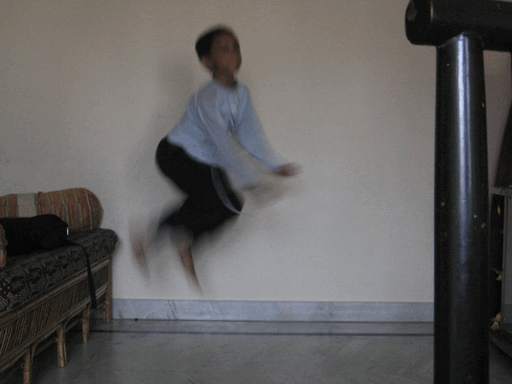
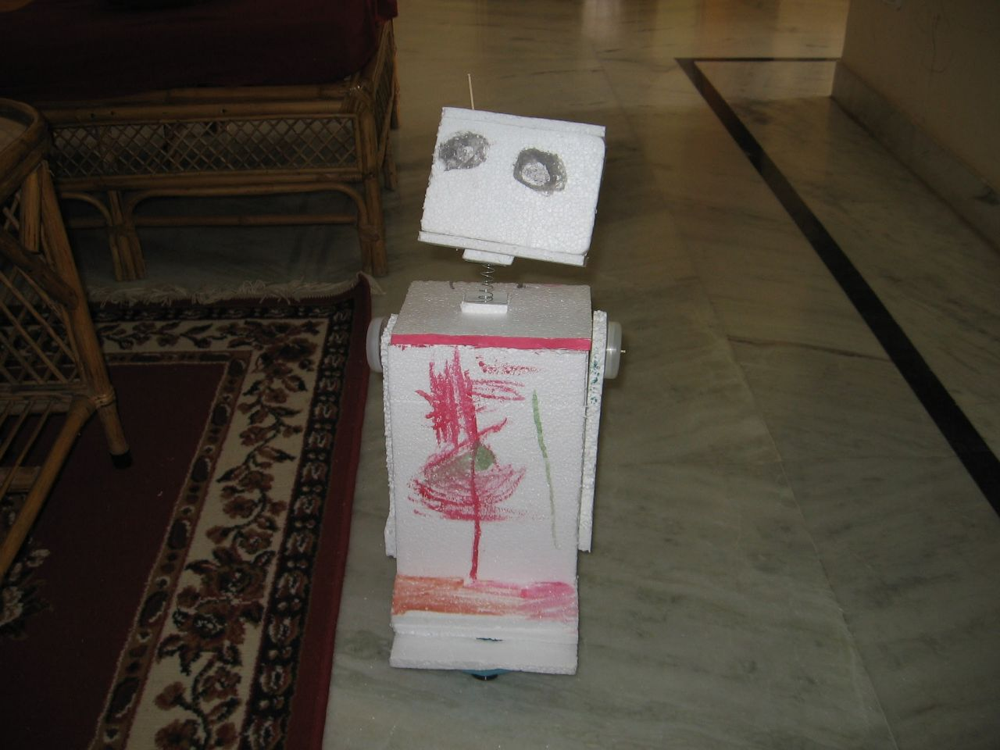
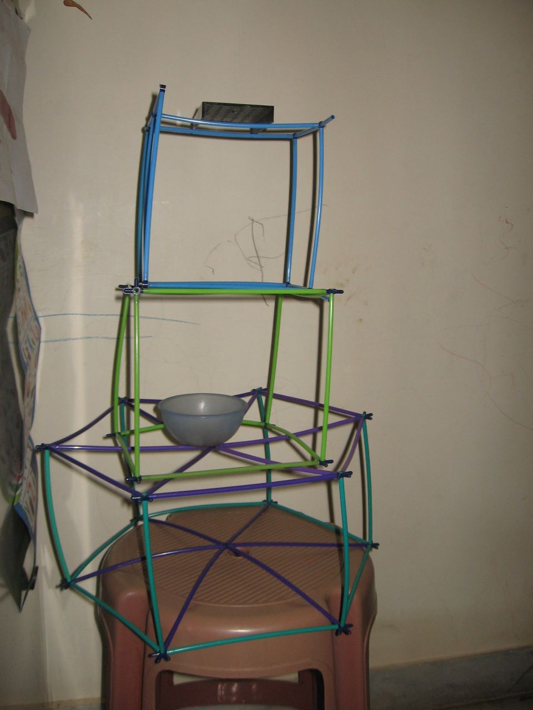

## What do you understand when you hear the word hack?

Hackers, ah yes scary people. Nerds in-hoodies who live in shady places? Mashing fancy green text into terminals?
Thanks to movies & coverage by the media --- hacking in the modern world probably means
someone who is skilled at breaking into/hijacking computers

## I bet you've often heard catchphrases like:

- 'Keep your data safe from hackers' ~ *le VPN shilling YouTubers*
- 'Hackers leak classifed --- Government documents'
- 'Can you hack my Instagram account?'
- 'Hacking! isn't that illegal? why would you be a hacker?'
- 'Whaat! you use Linux? --- aRe yOu sOme hAcKeR?'

---
# Hacking

As cringy as those phrases sound like---no one's to blame; words keep-evolving.
Hacking can mean [many](https://www.paulgraham.com/gba.html) [different](https://hack.org/faq-hacker.html)
[things](https://www.gnu.org/philosophy/rms-hack.en.html), there's no real
definition. A quick Google [search](https://www.google.com/search?q=hackers&tbm=nws) returns
news articles which often associate: hacking with 'security breaching' or 'stealing'. I beg to
differ hacking isn't about security breaking; when I use the word hacking or
say I'm a hacker: I mean `hacker` as in `hacksmith`

A hacksmith, a toolsmith?: a person who has total control over their tools. A
musician is a hacker, your mother who cooks for you is a hacker, a painter, a
mechanic, anyone can be a hacker. Someone who does it for the fun-of-it, not
driven by money or other worldly needs.

Someone who can build & forge things. A craftsman --- who strives for perfection,
optimizing resources, polishing blemishes. Someone who finds fun ways to build
/ 'hack on' things. You got to be [playfully
clever](https://www.stallman.org/articles/on-hacking.html) --- a prankster you
say? [maybe](https://piped.kavin.rocks/watch?v=MLg2XpY0L3w). Tinkering stuff,
not just [computers](/blog/how-i-do-my-computing), hacking as in life-hacks,
not breaching security as such. Those people too, are hackers but not the only
ones 👨‍💻

### Here's a cat hacking a roomba

---
## Some famous hacks!

Here are some hackers having [fun at
MIT](https://hacks.mit.edu/Hacks/by_year/2012/tetris/). Read more at it's
dedicated [!wiki](https://en.wikipedia.org/wiki/Hacks_at_the_Massachusetts_Institute_of_Technology)

*Residents of MIT's Simmons Hall collaborated to make a smiley face on the
building's facade.*

*An MIT hack involving a firetruck on top of the Great Dome on the morning of
September 11, 2006.*

---
## Hacking is art. A show of playful-cleverness

I used to hack on: Lego sets, old toys, music players, electronic/circuit
boards, striping it down to the bones. Learning about stuff that runs inside.
Ripping out DC motors from R.C. toy-cars and building my own robots. A world so
fascinating & boundless, compared to the jam-packed days I live today. I had an
`idea book` --- a scrapbook where I'd crayon sketch my nifty ideas. Looking back
at it today it feels so nostalgic.

A time, when I had [limited](/blog/how-i-got-my-username "1GB/month @ 512kbps")
internet access, no phone or personal laptop, (I used mama's laptop) & email
address. I had ample free time during my pre-teen days. I've blogged about it
here -> [~/blog/how-i-got-my-username](/blog/how-i-got-my-username/)

## Early hacks

*Me at the beach - holding the sun*

*trying to fly --- stop motion*

, because bending down was a pain")

*My Lego truck. Notice how I extended the steering shaft - to my height using
connectors (black/blue), because bending down was a pain*

A thermocol toy robot mounted on top of an RC controlled car.

A makeshift plastic-straw stand

P.S. I'll add more early hacks --- once I finish digging through my photos.

---
## Hackers learn from hackers

As a hacker you should be able to share, [collaborate](https://git-scm.com/),
exchange ideas freely. Open your ears to criticism, and make improvements. A
hacker should be free. Famous people that I regard as hackers include [Steve
Wozniak](http://www.woz.org/), the co-founder of Apple. [Richard
Stallman](https://stallman.org), the founder of the GNU Project // [Linus
Torvalds](https://kernel.org) --- the guy beind the Linux kernel & the popular
version-control tool: Git. [Edward
Snowden](https://en.wikipedia.org/wiki/Edward_Snowden), [Moxie
Marlinspike](https://moxie.org); a
[Cypherpunk](https://en.wikipedia.org/wiki/Cypherpunk) who developed the
[Signal Protocol](https://signal.org/docs/), [George
Hotz](https://en.wikipedia.org/wiki/George_Hotz) and many more!

---
## Growth & goals

I set out to utilize 2021 in a positive note. Made a
[bucketlist](/bucketlist). Added a lot of things to do. 'Learn from the best
hackers (clever people) in the realm of Computer Science & Research'. I'm
half-way there? One more year left.. Can't wait to go to college!

I learn from a lot of people on the internet. It's hard to find good content
these days, the modern web is trash. I hang out on the fediverse, other nooky
places on the internet like IRC & Matrix have people hacking together on
projects like Firefox, Codeberg & KDE. The [suckless](https://suckless.org)
community, [OpenBSD](https://www.openbsd.org/lyrics.html#68),
[GNU](https://www.gnu.org/)/Linux distros, [SponsorBlock](https://sponsor.ajay.app/),
the [IndieWeb](https://indieweb.org/), the [Tor Project](https://www.torproject.org/)
and [uBlock Origin](https://ublockorigin.com); the many tools that we use to navigate the modern-web.
Computing will always be a core part of society.



### Watch the entire [documentary](https://piped.kavin.rocks/watch?v=zOP1LNr70aU)

---
## Happy hacking!

Hope this article inspires you to become a hacker. Should you need any help. Feel free
to [reach out](/contact). Catch me in the next one --- till then adieu!
