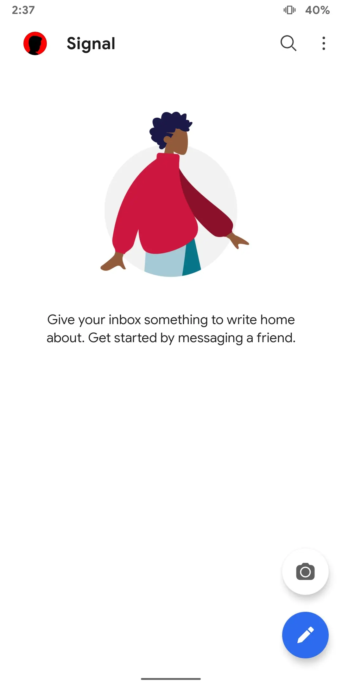
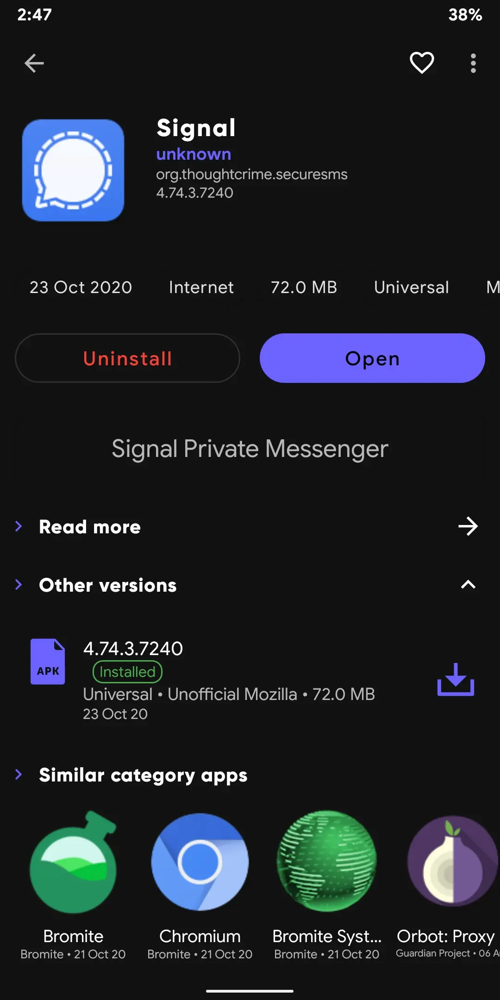
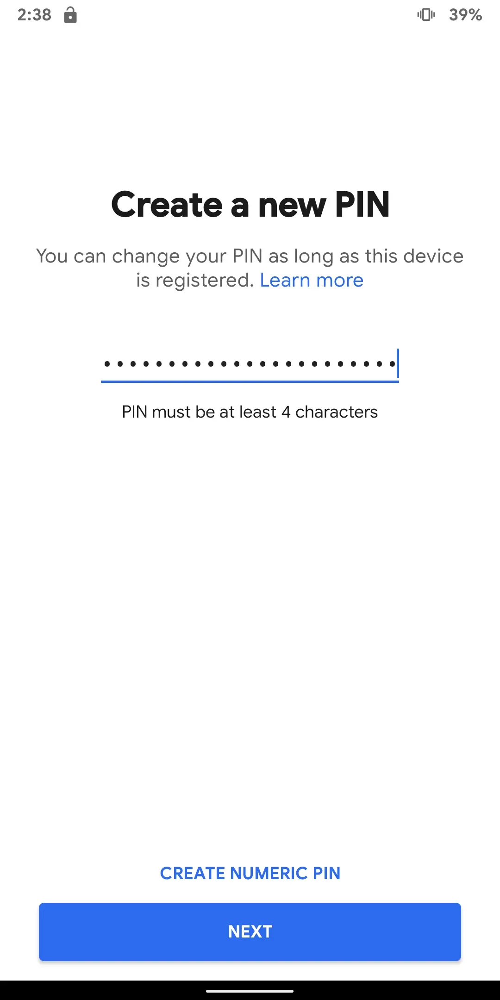
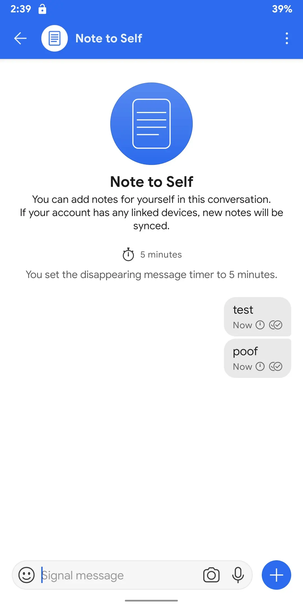
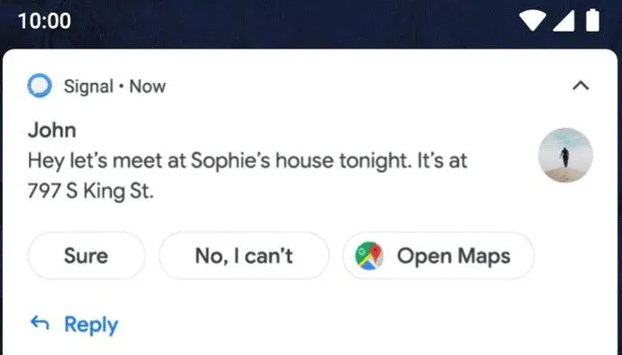
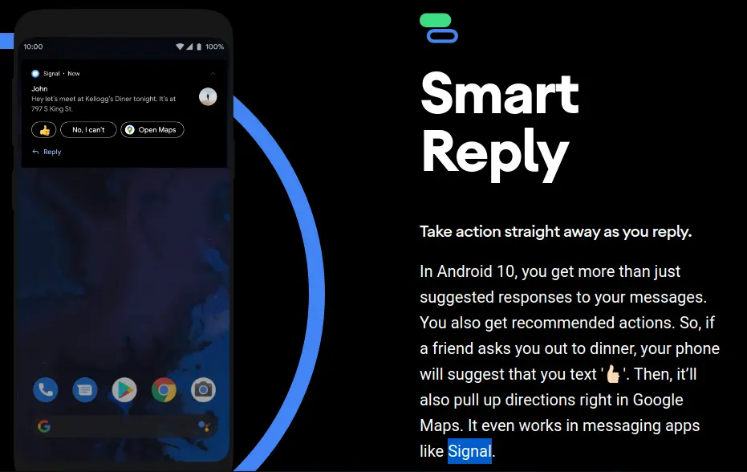
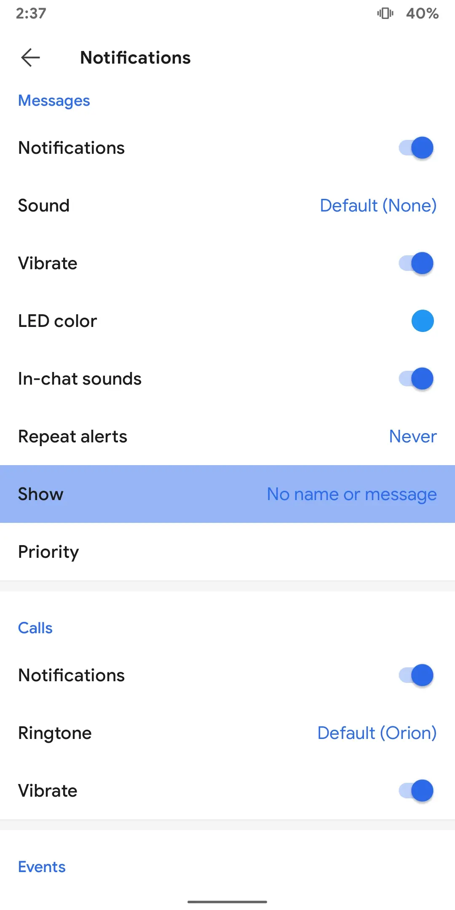
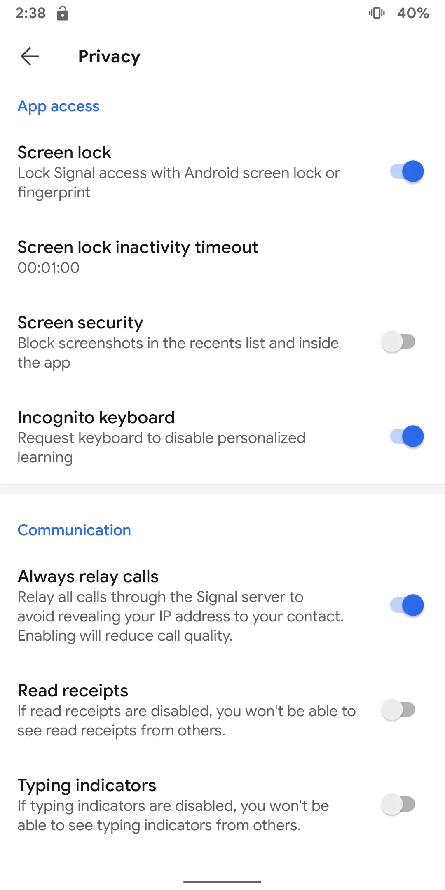
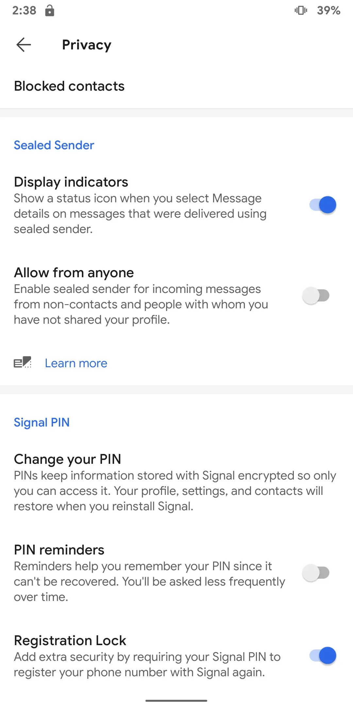

## If you've searched for [privacy oriented messaging apps](https://duckduckgo.com/?q=privacy+oriented+messaging+apps)

Signal is probably on that list. By now you've probably heard about **Signal** the centralized, [**navy blue**](https://signal.org/blog/signal-foundation/), [metadata resistant](https://signal.org/blog/sealed-sender/) messaging app, now anchored by an [ex WhatsApp co-founder](https://signalfoundation.org/).

## Signal out of the box still lacks a bit of polish. When compared to competition like [Telegram](https://telegram.org/tour/screenshots#screenshots) or [Element/Matrix](https://element.io/features)

(As of 2020-10-20) No usernames, hiding phone number visibility. Unsending messages with no trace. End to end group calls on the desktop, signup via the desktop app and better group management. All of these are partially or completely missing in Signal as of today.

> UPDATE: Good news, these are getting fixed with Signal v5.0+

## Let's tweak [Signal](https://signal.org) so you have a better Signal experience than before

Don't use your original phone number for Signal. Read my article on [Why you shouldn't use phone numbers](/blog/why-i-dont-do-normal-phone-calls/)

I am going to use Signal a free **VoIP number** that I got online. Remember, don't use this number for anything other than Signal or phone number based messaging apps. You don't want people to call you on this number, you aren't paying for it and you can't claim it is entirely yours.

> You got to use it because, as of today Signal uses phone numbers as a way for people to signup and you have to maintain that number for future logins.

Competition like Telegram offers a solution by sending the OTP codes to previously logged in devices. Signal says this is changing soon and I would reckon they would start phone number less signups. Once you have a number, in my case I used TextNow. This is your public username, no point in hiding this until Signal switches to non phone number based identifiers.

> TIP: Try [Session](https://getsession.org/), a fork of Signal without phone numbers and IP address masking.

# This guide tries to make the best of the native Signal ecosystem

## So let's get Signal

Head to [signal.org/dl](https://signal.org/dl) and get the app. If you're on iOS you don't have any choice and have to use the App Store. On Android you can either use Google Play / add an unofficial F-Droid repo with Signal or download the apk directly from their website. Here's a link to their [apk](/r/s)

")

> ## Get [Aurora Droid](/r/droid)

> Try [Molly-FOSS](https://molly.im/) A de-googled Signal fork for Android.
I do not recommend using Signal desktop yet, because it stores the local encryption key in plain text as mentioned in this related post [~blog/messengers](/blog/messengers) and you can't use it without a phone app this related

# Setup Signal

Open Signal, enter your VoIP phone number you've created just now and then enter the OTP code sent to your VoIP number, i.e. for me the TextNow page. Then setup Signal PINs set a long passphrase for example a sentence like ``I-love-eating-vanilla-icecream-on-sunday-mornings``

After this enter a nickname for example, `John Doe` or enter your real name if you're ok with it.

---

## Always Use Disappearing Messages

Signal does not offer bulk deletion of messages from both sides by either participant like in Telegram Cloud Chats. The only way you can guarantee ephemeral messaging is by using disappearing messages.

> Do note people can always take a screenshot or use a camera to record the screen, so this does not protect you from that. What we are trying to achieve is to - emulate a 'real life conversation'. No one carries a recorder around nor log every single word that comes out of your mouth.

## For one on one chats, Signal in IRL is worse than Telegram **Secret** Chats

1. Both examples here are end to end encrypted and have disappearing messages on.
2. Alice and Bob are sending messages on various devices using the official un-modded apps and that don't have root access.
3. In this case obviously, data can't be decrypted by the servers of Signal or Telegram since they are end-to-end encrypted.
4. Telegram Secret Chats are always 1 on 1 and, when a disappearing message is sent, one can always be certain that after the timer, it does not exist on the device.
5. Signal messages are sent to all the linked devices your account is linked to. Alice (sender) does not have an option as to which device they should explicitly send the message to (Bob - receiver).
7. Signal Desktop stores the key in plain text in this path which increases attack surface.
8. Notification previews are disabled and enforced on both sides when using Telegram Secret Chats, this way Google Assistant or Siri can't read the content of the messages.
9. Telegram Mobile comes with screen shot detection in Secret Chats (not foolproof but can't be turned off without root/modded apps)
On Signal it is not enforceable for both sides.
10. Telegram can send larger files (2GB) while Signal (100 MB)

# How does this affect you?

> Read points **4**, **5** and **8**.

This is why I recommend Telegram Secret Chats over Signal 1 on 1, in one click it does the anti screenshot thing, hides the sender's name in the notifications for both participants. Also other niche features like sending 2 GB files, animated emoji and easier themes. Further, you can legally use TG-FOSS from F-Droid than get bundled Google FCM like Signal, even on their website distributed apk. Try [Molly-FOSS](https://molly.im/) A de-googled Signal fork for Android.

Google can read your texts by default on Signal

---

# Let's do the best we can tho on the native app

## Let's wrap up - here's a checklist

- Use a VoIP number.
- Don't sync contacts yet
- Enable PINs with a very very long passphrase.
- Disable link preview.
- Disable notifications previews.
- Use disappearing messages.
- Don't sync with Desktop
- Toggle anti screenshot.
- Disable Peer to Peer, use call relays.
- Try to use FOSS clients like [Molly](https://molly.im/) for Signal.

---
UPDATE: Jan 2021

## Signal is a centralized app with no plans to support federation, decentralization or 3rd party clients

Thanks to the Signal Foundation **for spreading cryptography & privacy to the masses. But it puts users in a difficult long term vendor lock-in, and their friends who jumped on the Signal bandwagon.**

> To be realistic, Signal in its current honeymoon state won't last for the next *5 to 12* years without federating/decentralizing.

Governments, ISPs DDoS hackers, and [better competition](https://getsession.org) [will](https://matrix.org/blog/2020/01/02/on-privacy-versus-freedom) [outrun them](https://matrix.org/blog/2020/06/02/introducing-p-2-p-matrix) and every other [centralized](https://telegram.org/faq#q-can-i-run-telegram-using-my-own-server) app. And you'll have the [(WhatsApp dilemma](https://arstechnica.com/tech-policy/2021/01/whatsapp-users-must-share-their-data-with-facebook-or-stop-using-the-app/) all over again. This time it won't be about your privacy but about your freedom

> related post: [~blog/messengers](/blog/messengers)
