I am `0.9999/4` part an engineer! I've cleared all my courses and bank [44/160](/blog/college "27% to be fair") credits in my pocket. I took a much needed break from college; visited a couple of friends and family. A free mind and a whole lot of free time in hand before the next semester.

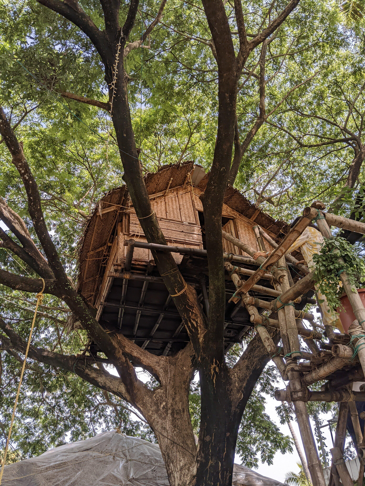

This warrants a blog post of it's own --- I've got some new hardware and plans I'd like to talk about to cover up for the months I've left you on read on your *\<insert fav newsreader\>* :3

## Keyboard

I've got my hands on a new mechanical keyboard, it shipped a week ago: The Portronics [Hydra 10](https://www.portronics.com/products/hydra-10) (red switches).

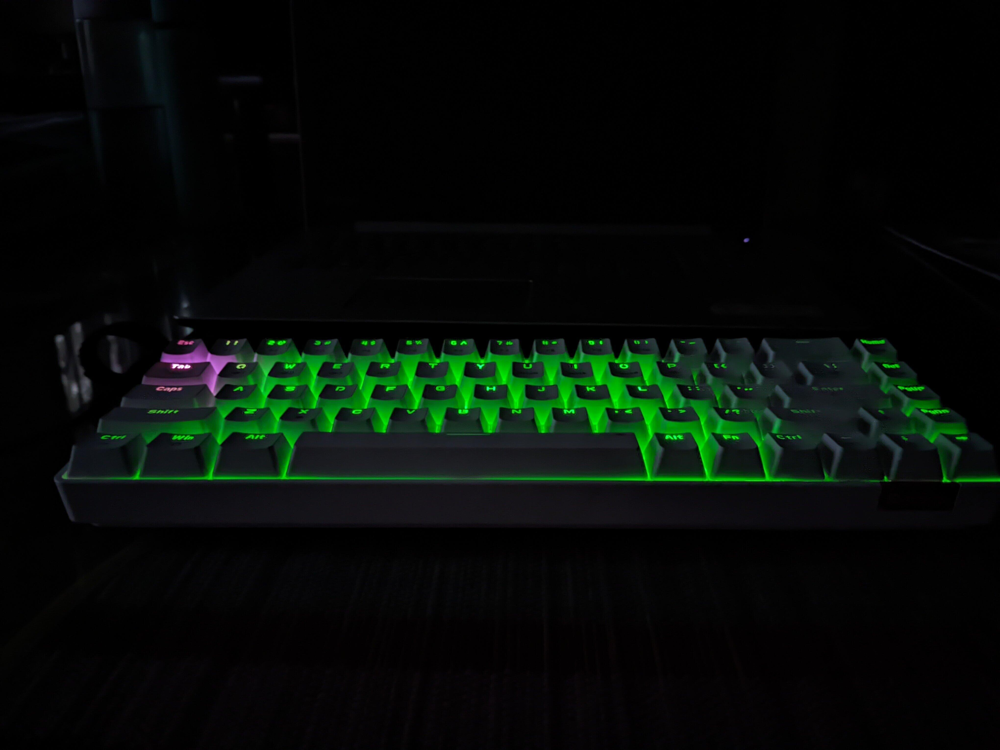

This was a no brainer, I wanted the cheapest, wireless keyboard I could find. I had tested this keyboard before on my friend's PC, he got blue switches.

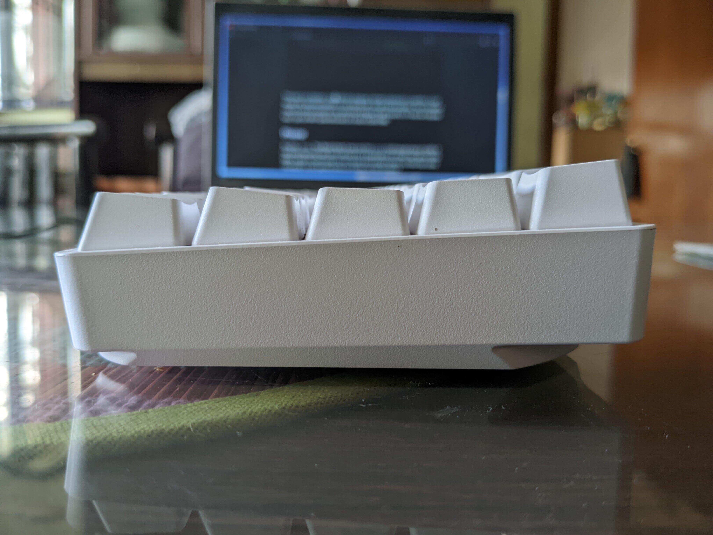

The inclination may be a bit too steep for my wrist but I'd figure I'll get used to it. It was an impulse buy: I got an 800 rupee discount at a total of 2000 INR. Here's my [/monkeytype](/monkeytype) profile, my avg WPM hasn't really improved after a week it's around 86 WPM.

## Phone

So long `vince` --- the Redmi Note 5 was my first [phone](/phone) I bought back in 2018. It has fared decently well, and I still use it as a spare phone or shall I say; alarm clock. With a dozen scratch marks on its chassis and a weary battery; its time has come. The plastic is also getting brittle and makes me feel burdened.

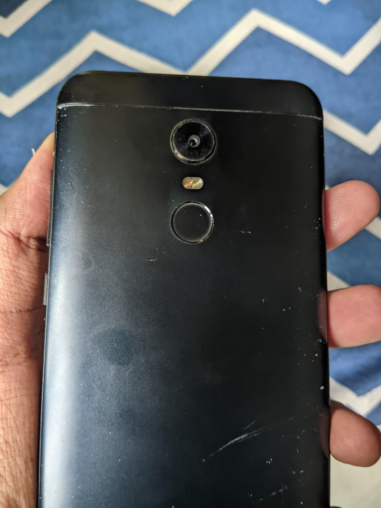

The phone which takes it's throne is the --- [Poco M6 Pro](https://www.gsmarena.com/xiaomi_poco_m6_pro_5g-12452.php) codename: `sky`. I quite like it, although it launched about a year ago. I got it for 9750 INR on sale. It was unironically cheaper than my older phone! It ships with 5G on the SoC and has UFS 2.2 compared to `vince`

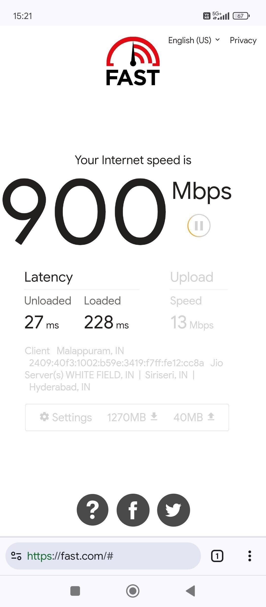

> ### Downsides

It's 2024 and `sky` does not have 4K video, it's capped to 1080p on the back camera. Video looks block-y rather, magnified. GCam on the other hand works flawlessly; the Sony IMX? on this phone does a good job auto adjusting the focus, and clicks photos much faster than `vince`. 

Auxillary cameras are a scam they don't show up in the viewfinder and I like my old phone's single back camera design. The least they could have was a wide-angle lens. But that's a bummer and a given, for phone companies these days trying to compete in an already saturated market.

Maybe I will still use `vince` for B-roll and as a handy cam for footage. I also like the old form factor it fits snugly in my hand, not too small like an iPhone SE, not too big like `sky` and other 6.8'' phones these days! My thumb and ring fingers go sore trying to type and simultaneously balance the phone while travelling.

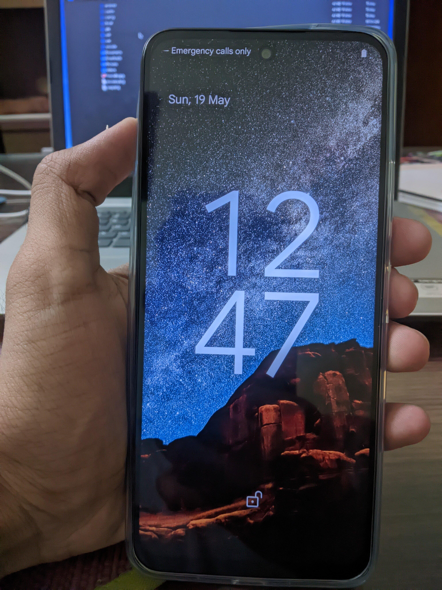

Apart from this, for the first week or so I had to suffer with MIUI, what they now call: HyperOS. It is bottled with ads and thankfully I had an old Xiaomi account so the bootloader-unlock process took 72h. Otherwise I would have to wait around 720 hours, which is around a month.

I swapped HyperOS for CrDroid, a stock android custom rom that had official support, so I didn't have to bother about keeping up with updates in Telegram channel. So far it's been 3 hours and everything works as usual. It's been around a year since this phone was released so the kernel / device trees are stable and occasionally I wish I could tweak / adjust the UI a bit to match my old phone, but this is so much better than what it shipped with!

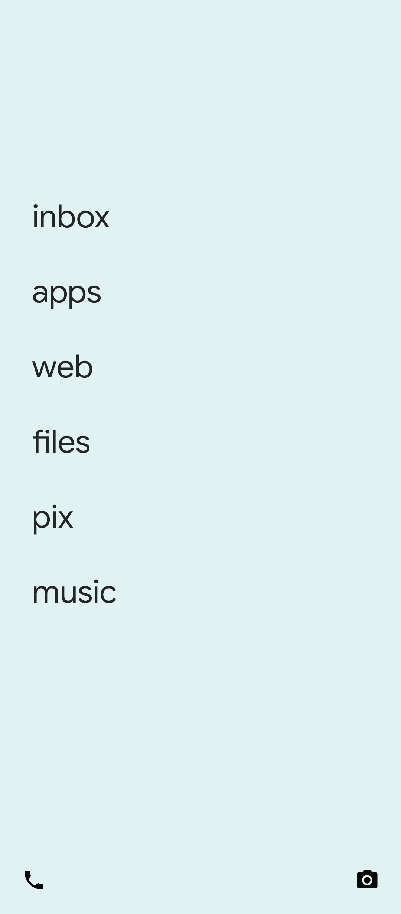

## Laptop

All my other hardware requirements have remained the same as it was a year ago; to be fair: the only upgrade that was 'totally needed' was a new phone. 4nm and 5G was worth the upgrade and this phone should hopefully last the next 3-4 years.

Just for fun, I tried booting up an old laptop I was using back in 2018 to see how I used to work a couple of years back. First, this beast gets really really hot, I can't afford to rest it on my thigh, it belongs on a table, apart from that I connected the new-found keyboard and paired it over bluetooth.

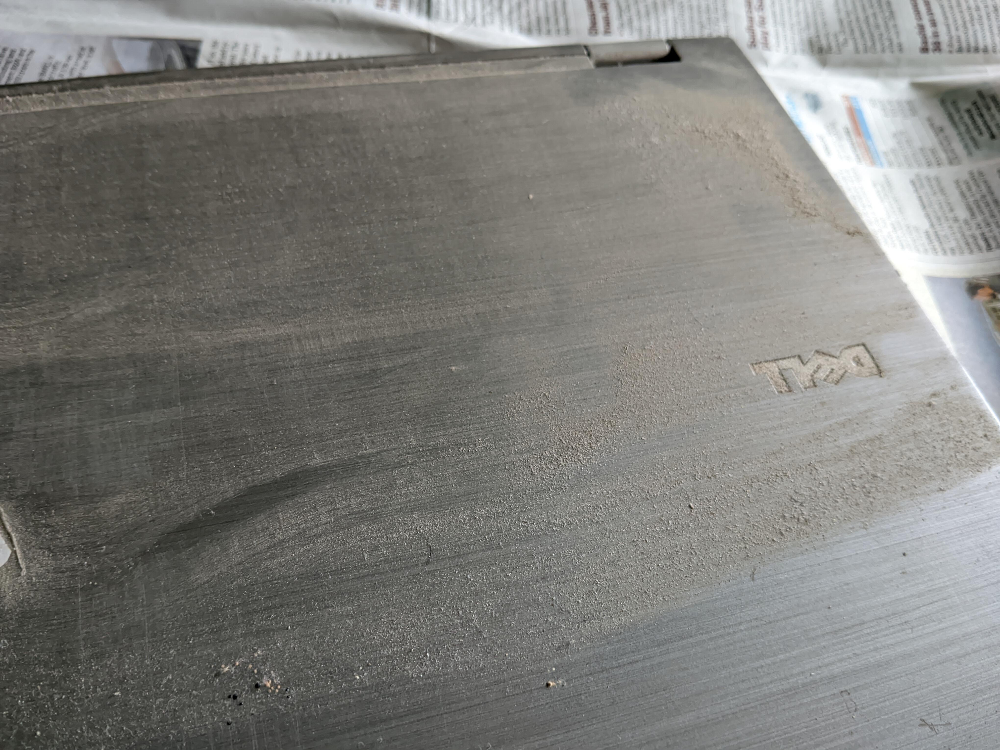

This was running Windows 10 but okay, I'll deal with it for a while. Tasks launch almost as quick as an SSD would, but the power draw was not. You could hear the disk spinning and it rarely idled.

**Obsidian** --- I've been writing a whole lot more, I have improved my typing speed. Thoughts in my `brain -> md` now stay cached on a disk more often. I have around 920h left before college starts again and I'm trying to squeeze every possible idea out of my brain to cover this summer.

I am not upgrading my laptop this time. Yes. Using just 8 GB of RAM is not a sin. You can breeze through everyday tasks as usual. Battery-life is a pain but I have found sufficient charging spots around campus. I've unscrewed the back and dusted the insides, this will do for now.

---

### I had an idea that should probably never come to fruit --- this site permanently turns into a photoblog

I don't have much content left to write so here are some photos that quickly re-cap how my year went.

## Jan: [2023 in review](/blog/2023/)

Right after my semester ended I took this cool photo on a bus-ride back from a NixOS meetup.

## Feb: AIEP building [/anna](/blog/anna)

Covered in a blog post of its own, part of this site is rendered using `anna` an easy to use ssg that we built in go. The rest, edited in HTML by hand.

Working in a team and shipping working code has helped me shape my collaborative skills. Understanding CI workflows, picking up Golang, and showcasing or rather benchmarking against other in-house SSGs was very fun. 

This was a 4-5 week stint, after which we moved the project from the ACM repository to our very own anna-ssg repository.

### March: FOSS Talks

HSP got a bunch of people working in various industries to give a talk about FOSS software.

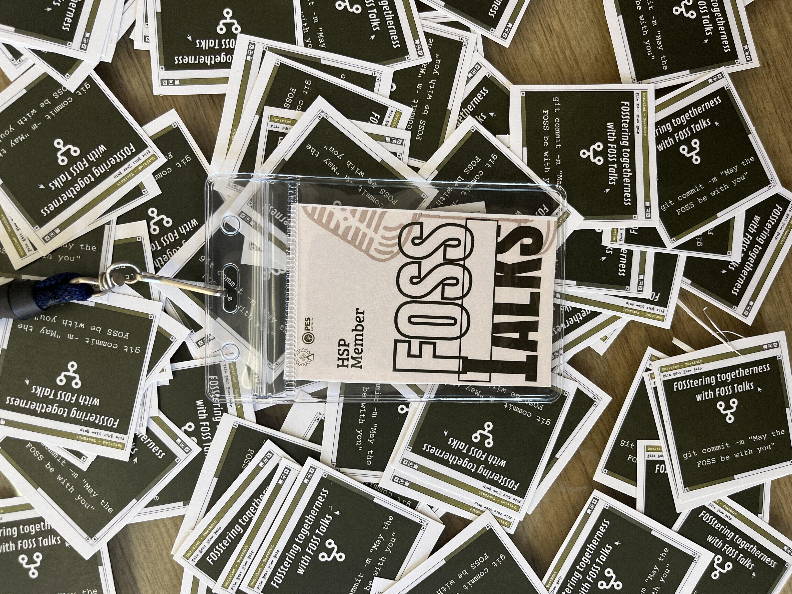

### Hashcode

Our team got shortlisted for PIL's flagship 24h-hackathon: Hashcode! Our idea focused on improving developer tooling by parsing a python program's syntax tree and add breakpoints in our code where we think a user is comiting a mistake. All of this, using static analysis methods. It was a team effort and we had no clue what to do or how we would even start.

Sadly we didn't really impress our judges and didn't make it to the final round. It was cobbled up last moment and we didn't want to choose something that we weren't really interested in like -- crypto or AI/ML that were not niche enough. We went in thinking we would not get selected, but hey --- that isn't your dice to roll!

March was also the month where I attended AT Nite: our college fest held every even semester. I got this cool pic on the way back.

## April: Golang Meetup

This was my very first golang meetup and the crowd felt more diverse, compared to the NixOS one, which was kinda niche in it's own way.

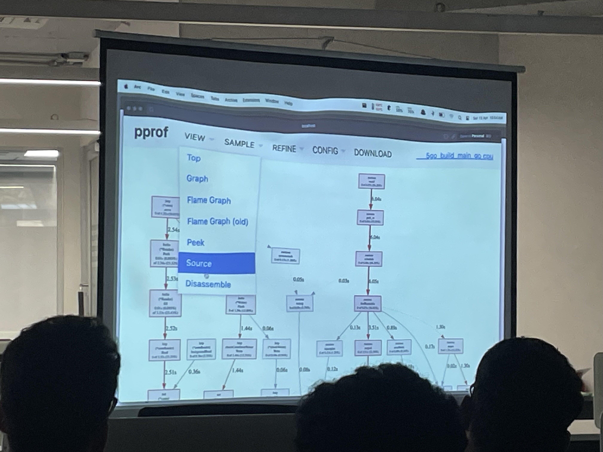

I learnt a lot about profiling, handling PII while in memory, and had a nice snack. We went back home, wishing we could be at a go meetup, talking about anna next.

## Ingenius 12.0

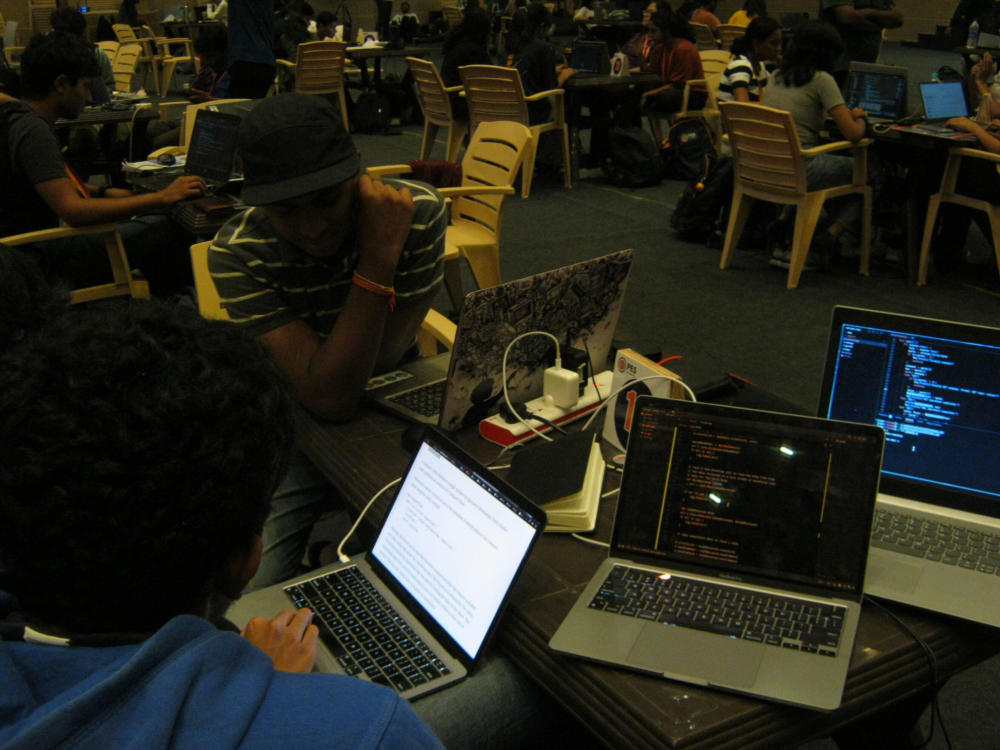

For Ingenius we had a solid idea; but we were trying to re-invent the wheel in many ways and did not implement enough checks and test to see if our implementation was viable. Checkout Aditya's dedicated blog-post on [this](https://hegde.live/posts/dist_sys/inginy12)

## May: I really don't remember what I did

My gallery is just flooded with screenshots and pictures of pizza in my dorm.
:P Some months do have to be this way. I guess you don't have free time when ISAs are around (internals).

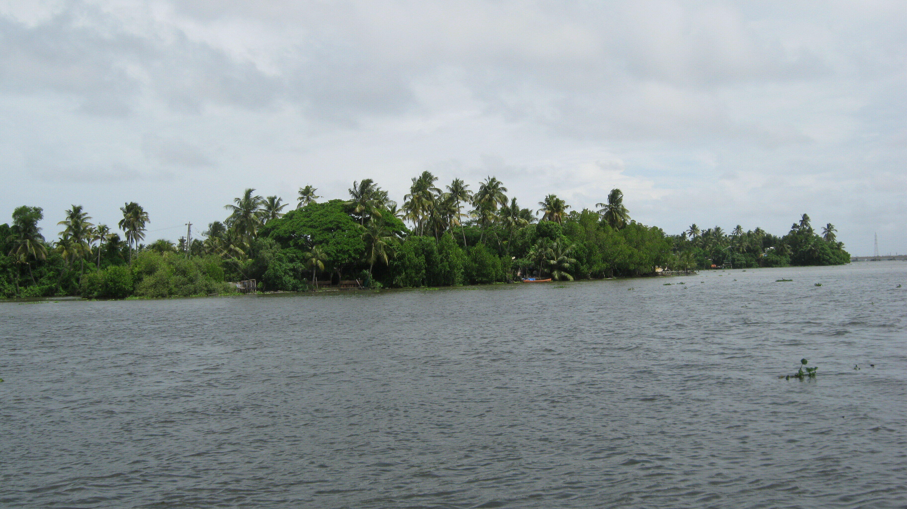

## June: I love train-stations

The first half of June was devoured in exams, and the last week I travelled to Kerala again to meet family. It was a short trip as usual, and I am back in BLR now, waiting for [Tilde 3.0](https://www.linkedin.com/events/7210204084853723137/comments/) to begin --- a summer mentorship program that HSP has in-store for July.

> P.S. We're building a fancy POSIX-like shell from scratch!

Blog post soon. This summer is already looking productive, I'd be back on track by August and wait for more plans to hatch! `\o/`
