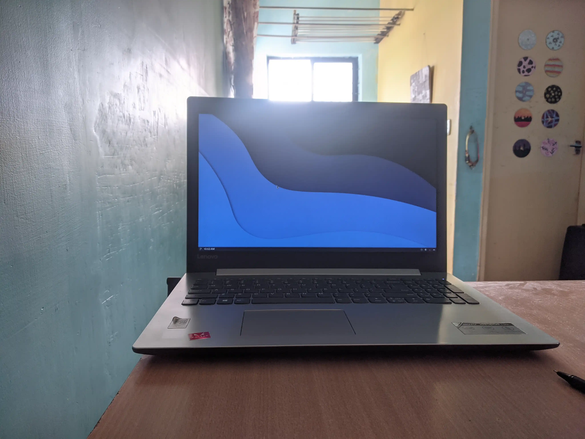
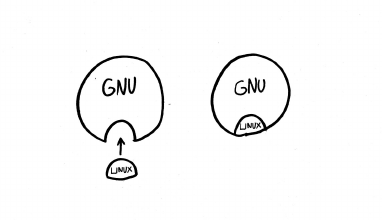
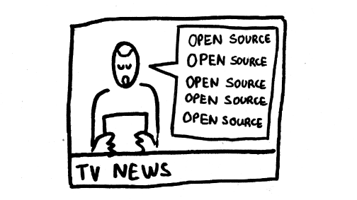
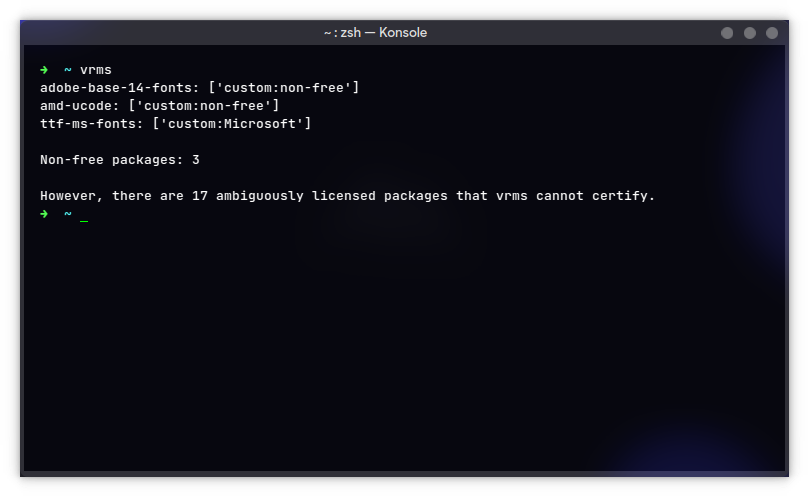
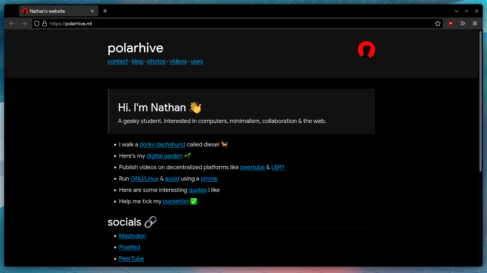

> ## Whaat? you use Linux? aRe yOu sOme [hAcKeR](/blog/hacker)?

No, that's not how I perceive it. People & the media - have confused us with the term *hacker*. I mean `hacking` as in a `hacksmith` [someone who is playfully clever](https://www.stallman.org/articles/on-hacking.html). Tinkering stuff, not just computers, hacking as in life-hacks, not breaching security as such, they too are hackers but not the only ones :0

> ## A musician has total control over their guitar, an artist over the paintbrush 🖌 me & (hopefully) you over our computers

The flexible/tinker-able nature of GNU+Linux is one of the reasons I use this over Windows, iOS or MacOS. Heard about Android? Android is based on Linux. It can be installed in a way without Google services and I recommend you to '[degoogle](https://grapheneos.org)' your phone.

---
# I use the '[GNU](https://gnu.org/)' operating system, the Linux kernel & a '[desktop environment](https://kde.org/)'



## It's the perfect OS for [hackers](hacking) - people who want total control over the tools they use


The GNU system is about freedom. You get to modify each and every thing about your system to get your [perfect match](https://libredd.it/r/unixporn). I get to run the apps the way I want to, because it's legally licensed to put the user in control. The apps I use don't spy on me, respect my privacy and can verified against source code. I can add features, remove bloat and sell the software if I want to.

You can remix, and make infinite combinations of the GNU system, commonly termed under the umbrella term 'linux' - a family of GNU like OSs running a piece of software called Linux. That's where people get confused - [PureOS](https://pureos.net/), Ubuntu, [Manjaro](https://manjaro.org) and such are examples of these modifications. Some are more serious about freedom and user-control like PureOS, Fedora others some include harmful proprietary bits with OS, like SteamOS, Ubuntu, PopOS & such.

## "GNU" in the GNU/Linux name doesn't necessarily mean GNU software

GNU + Linux + X11/Wayland + many other components make up a good, [libre OS](https://polarhive.net/blog/free-libre-software/) that puts the user in [control](https://polarhive.net/blog/how-i-do-my-computing/). Linux is a cool name but doesn't signify 'freedom' or the original goal behind the hacker ecosystem.  



### imo: What each word implies

- GNU = Software licensed under a (libre license)
- Linux = The core of the OS (kernel)
- UNIX = Proprietary (non-freedom giving) software

UNIX was a popular proprietary OS back in the day and today it implies proprietary software incarnate in the form of Windows/MacOS or standalone cross device apps/addons.

So what's GNU? - GNU's Not UNIX :P, **GNU's not proprietary software**

# Can you recommend some distros to try out?

- Fedora
- Manjaro KDE Plasma
- PopOS
- KDE Neon
- Arch linux (what I use)

Try to stay away from distros like Ubuntu, it has the reputation of Windows in the GNU/Linux world. Ubuntu also gives you a pretty bad first time experience with snap, PPAs and other stuff that their parent company bundles with. Generally, use freedom tending distros or do not use proprietary packages from distro repos. A program called ``vrms`` can help a bit.

If you have hardware from Nvidia, it's harder for you. Nvidia does not care about freedom and it's a pain in the GNU/Linux ecosystem. They do provide proprietary drivers but rather choose hardware + libre drivers from Intel/AMD next time.

# 'Open Source' / '[Linux](https://codeberg.org/polarhive/knowledge/src/branch/master/linux.md)' ❌

### Two faulty words which dilutes the goal I'm trying to convey

Linux is a [kernel](https://kernel.org) and not an operating system, it is one part of the operating system and does not do anything by itself. Android uses the Linux kernel and yet no one calls Android users as Linux users. It portrays a different meaning.

You probably use a partially [libre software](/blog/free-libre-software) operating system already! Do you use Android? it runs Linux (Google+Linux). So it's not something new or something that is only for 'geeky hackers' or relatively hard to install nowadays.



## Opensource simply means software which has it's source available for people to read. It does not guarantee anything

The developer can still use it spy on you & legally prevent anyone from making changes to the software, distribute copies or limit what you can or can't do. It is a diluted term often used to misrepresent the goals of [free software](https://www.fsf.org/about/what-is-free-software/).

## Free (libre) software puts users in control. A free'd (liberated) OS is a prerequisite to truly own your computer

- I'm looking at you MacOS, Windows and iOS users 👀
- Here free does not mean free of cost (gratis) or 0 price 💸 you can sell software.
- People sell 'free software' as well. Rather the word 'free' in 'free software' implies freedom and liberty (libre) 🗽
- FOSS, libresoftware, freedom software, and other such buzzwords are better used to represent the value of freedom.

## Companies like Microsoft, Google & Apple want to have control over you via their proprietary operating systems

A business model where you 'rent' the software running on your phone or laptop. Kinda like 'DRM'. You never get to 'own' your copy of MacOS or Windows. They control everything through automated updates. Apple and Google can remove apps from your phones because they are bundled with the OS and designed to not respect your freedom.

### **If you buy a generic computer they run malware like Windows 10 or MacOS out of the box and make it hard to run alternative OSs**

Teachers at school - tell young students that this is 'the normal' & the only OS we run is a proprietary one. Children then have to use these proprietary locked ecosystems. It's like a tobacco company sells free of cost cigarettes to school children in the hope that they become addicted.

### Jargon used in our everyday speech

- I've tried it on 'Chrome'.
- Writing a document? Use Word and .docx
- A Presentation? send me your .ppt
- A file to share? What's your gmail? I'll email it to you.
- Catch it on Netflix.

You get the point. Most users don't know about libre/open standards like [Matrix], RSS, WebDav and the [ODF](http://opendocumentformat.org/)'s .odt, .odp. and .ods that are designed to work perfectly fine with any software suite. Something everyone should be using. And Netflix? they don't let you rent DVDs like the old days, its all proprietary web based DRM.

---

## For me Privacy > [Free Software](/blog/free-libre-software)* > Security

[Security sucks on GNU/Linux](https://madaidans-insecurities.github.io/linux.html), yeah I know but keeping your guard and having a generic threat model should be fine. Just don't be dumb. I assume you would be using this as your personal computer and stay away from [proprietary software](../free-libre-software).

> *I don't run 100% free distros yet, or compile everything from scratch. I don't run the linux-libre kernel. This is what I meant by privacy>free software. Getting to 100% free software is the goal. It's [far better](https://www.gnu.org/philosophy/saying-no-even-once.html) than when I was running Windows 3 years ago!



---

## Apps

### TL;DR use native repo-packages

AppImages are the best for portable / onetime use-cases. Flatpaks allow for auto updates and bloated KDE/GNOME apps. They're like 'F-Droid' - custom repository that works regardless of your distribution. Snaps are the worst, and have no reason to exist. I use distro packages most of the time, because they are stable and well updated thanks to the Arch devs.

## Firefox



Here's how my browser looks like. Quite minimal. Get's the job done. [Firefox isn't that great](/blog/firefox) 
but it's the best we have against chromium. Remember to harden it using about:config



## ONLYOFFICE

I don't really use my computer to write documents or make presentations. Sometimes I do, I use ONLYOFFICE for that. LibreOffice needs a lot of UX and UI improvements imho, but have it installed regardless.

## Telegram & Element

For video calls, minimal cloud storage, usually quick notes, photos and links I keep & of course messaging.

Oh! you've read this far.. So here's the mandatory *'i use arch btw'* from me

``` text
yt-dlp - downloading videos
kdenlive - video editor
lollypop - music player
newsboat - RSS reader
LBRY - LBRY Desktop
mpv - video player
gimp - videos thumbnails
neovim - keyboard shortcuts <3
hugo - this static site
```

---
## That's about it, enjoy your freedom and [happy hacking](/blog/hacker)

*UPD 2021* : [Here are my dotfiles](https://polarhive.net/dots). My build / config has changed, I've switched to a tiling-wm now. thx KDE, I'll miss you. The principles are the same, all powered by [free-software](/blog/free-libre-software), feel free to check it out.
*UPD 2022* : Switched from arch to [void](/blog/arch-to-void) as my distro.
