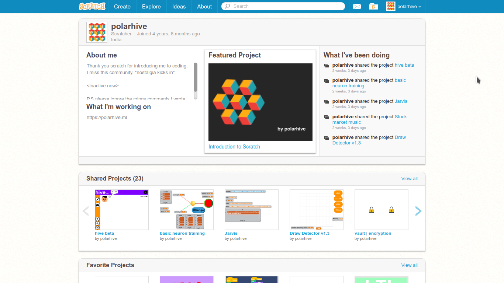
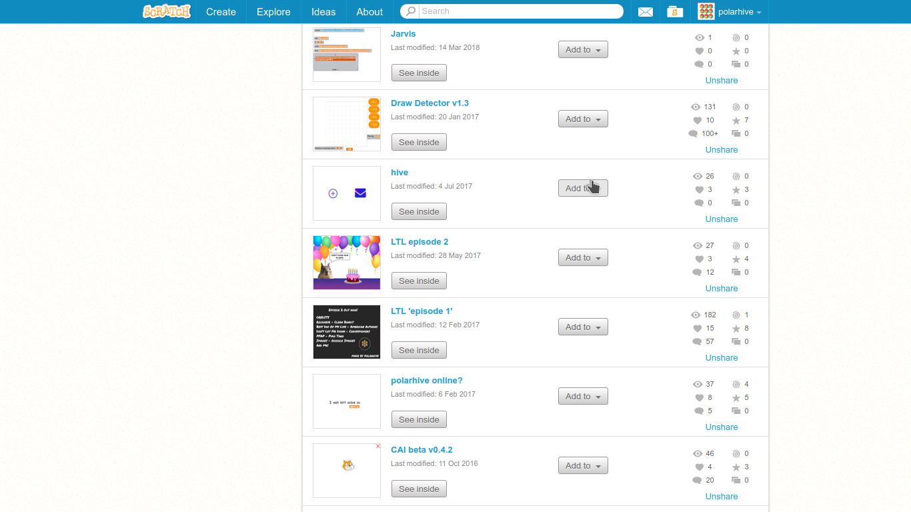
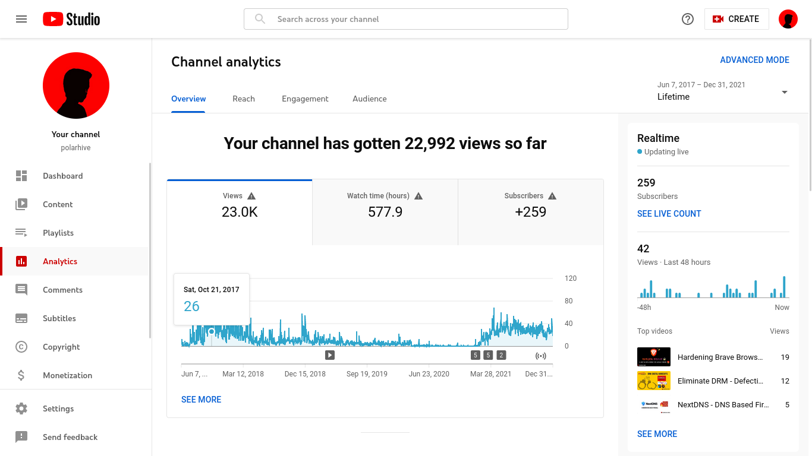

It all started from Scratch. Pun intended! The humble beginnings of
[scratch.mit.edu](https://scratch.mit.edu/users/polarhive) my first social
network!

## 2016: 5 years ago

I decided to sign up for a scratch account to share the programs I made locally
using '[Scratch 2.0](https://scratch.mit.edu/download/scratch2)'. If I recall
correctly it was — an Adobe AIR App that ran locally, and you could share your
scratch projects online after you setup a username and password.

Yep, flash used to be popular *in those days*. I recall the easy: drag-and-drop
interface to make programs. They had jittery animations and SVG sprites that
you could pick from the scratch inventory/backpack. Sometimes, lengthy
code-blocks would crash my computer. Don't get me started about the horrors of
running pepperflash in Chrome, especially when working with cloud variables on
a 200 KB/s WiFi plan and Scratch 3.0 was in beta.

The first time I heard about Scratch was through my mother. She was teaching
Computer Science to 3rd graders at a local CBSE school back in the day. I was
browsing through her school books when I read about Scratch. There was a CD
with an offline installer file. I was definitely hooked once I figured you
could publish your project over the internet and find other people's projects
and collaborate together! (In today's terms--forking a free software project to
improve the program)

### My school didn't have any of this in our curriculum

I thought the other 12 year old scratchers on the other side of the globe:
would bring their laptops to school and learn to code together in CS class. But
apparently, memorizing the **word-to-word steps** to **'insert a new row in a
Microsoft Excel document'** was apparently more-important. I was mugging-up a
bazillion things to ace a 50/50 for the school CS tests in 7th grade: I didn't
like it but had to do it anyway :P

---
## Anyways. I was on my own, finding how Scratch works & finding my own path

I Googled for '[random username generator](https://jimpix.co.uk/words/username-generator.asp)'
and after half-an-hour of scrolling I decided to land on 'polarhive'. There was no reasoning
behind choosing that particular name: just sheer joy and excitement of a 12
year old kid doing something no one in my class did. I was using some generic
name with fancy numbers previously and decided to let go of that account.

I made sure that no scratcher had a similar username. I wanted it to be unique
and catchy. None of us had Instagram or Facebook accounts back then. Not even
YouTube. The only social network most of my peers and I knew of - was "[Clash
of Clans](https://supercell.com/en/games/clashofclans/)" a popular mobile game
we used to play on our parent's 4"7 inch phones. Our labs didn't have Scratch,
nor did the junior labs have internet privileges. Something that was
exclusively for the big boys (2 grades higher). Here's the SVG file for the
[logo I made](/blog/how-i-got-my-username/logonotext.svg) inside [PowerPoint
2013](/blog/how-i-got-my-username/logo.pptx).

## I was active on Scratch for almost 2 years making all sorts of random projects

Ranging from [music/animations](https://scratch.mit.edu/projects/144897205/),
an attempt to make an '[encryption/decryption](https://scratch.mit.edu/projects/171060892/)'
algorithm. A hack, to increase the scratch-cloud storage limit by using [arrays/databases](https://scratch.mit.edu/projects/152465053/),
[a so called 'AI'](https://scratch.mit.edu/projects/125047598/) project that could learn what
the user was [trying to draw](https://scratch.mit.edu/projects/140975627/),
[voice recognition](https://scratch.mit.edu/projects/156171564/), and random
interactive camera based head tracking games after I had a chance to play some
Xbox Kinect games at my friend's house.

I realize today how far I've come and proud of my younger self!  P.S: The code
is definitely messy but the ideas 'clever'. I must admit I DO NOT remember one
bit of the spaghetti code I used those days, so don't ask me to explain it over
again lol 🍝, and some parts of the code is not compatible with Scratch 3.0 so
they break if you don't run it in Scratch 2.0.

## Scratch had addons for -- Arduino and MakeyMakey

Both of which I managed to get my hands on. I got an Arduino Uno. I found an
old breadboard. Ripped out a small DC motor from a toy RC car -- hooked it up
to the Uno, 5V was the best I could get from the USB port powering the Uno but
I was so happy!

I probably left Scratch after that. Dabbling with the Arduino which had it's
own IDE & a real syntax to follow. I was programming simple projects and was
binging on TopTechBoy's YouTube channel. This was in 7th grade and it was fun
learning about math and how we had to apply it.

## YouTube

I eventually got bored of Scratch and the Arduino, I didn't want to spend
pocket money on more hardware. After watching those helpful videos I thought of
doing something similar. I switched to video making, the hottest trend in
middle school. I started a YouTube channel - flexing my so called 'editing
skills' 💪

Chopping up 720p video on an old 2010 dual-core Dell laptop. I made around 52
videos which garnered north 14k views in total. I uploaded [16 gigs](/blog/degoogle)
worth of content. I had an average upload schedule of 1 video a month from 2017-2019;
I never really cared about the views or analytics. It was the fun in picking up mamma's
phone, spending all afternoon shooting, editing, uploading videos for friends, family and
eventually --- the world, to see.

I stuck with the 'polarhive' username & it got fairly popular in school. I used
to upload short sketches, made travel vlogs and gaming (i mean Roblox ahem).
All archived and reset after I deleted my old [Google account](/blog/degoogle).
P.S. If you know me personally I'd show you those cringy videos just for fun!

## Custom ROMs & the privacy rabbit-hole

I got my first phone, I hated MIUI, I wanted to root my phone because I wanted
to run GCAM. Camera-2API wasn't enabled by default on MIUI. It was running
Android 7.1 (Nougat). Withing a month I learnt how to unlock my bootloader,
flash a custom ROM. I was reading
[XDA](https://forum.xda-developers.com/m/polarhive.9068438/)-forums all night
and watching YouTube videos trying to learn what people were up to. I think
I've ROM-hopped at least 30 different times, always waiting for the next
release and trying to debug something that was broken.

Slowly this lead to me reducing my dependency on Google, because you'd need to
re-install and login multiple times over and over again just to setup Google
Play services. I stopped flashing GAPPs, and just ran the stock OS. I ofcourse,
had the power of root and flashed many mods and under-clocked my device. I
remember I was getting around 10h of SOT (Screen on Time) — during the
lockdowns of 2020.

## Facebook & Instagram

I regret signing up. Most of my school friends were on Instagram, that was the
only reason I used Instagram. WhatsApp was already too old for us and we left
it for the boomers with their daily 'good-morning messages'. Everyone used to
sneak phones into school, we'd trust our friends and keep our accounts logged
in as we wait for the bell for the next chance to scroll through our feeds.

To be honest: Instagram was good until 2018/19 and I would use it to just post
photos, I did not really use stories/DMs Until one day, when Facebook dropped a
ton of
[bloatware](https://www.theverge.com/2019/2/7/18215601/instagram-igtv-video-previews-feed-main-app):
trying to copy YouTube, Snapchat, TikTok to gain marketshare --- because of the covid lockdowns.

The algorithm was a trap for [consooming](https://odysee.com/@Luke:7/what-is-freedom-anyway:8?&t=491).
It took some time for me to realize that. I deleted my [Facebook](/blog/breaking-up-with-facebook) account(s)
after I heard they were planning to merge the 3 Facebook owned apps: Instagram, WhatsApp and Facebook.
Some of my friends still use --- Instagram, and almost everyone in my family uses WhatsApp. The
Facebook ecosystem was really annoying but I'm happy I got rid of it!

## Fediverse

I literally joined every single website I knew of, to claim my username but all
had the same issues as Facebook (centralized servers). After digging through
the weirdest corners of the web. Eventually it led me to the fediverse -
Mastodon, PeerTube and other AP powered sites, [very interesting](/blog/federating-social-media/)
and that's where I am now.

For the past 2 years I invested time to setup my own website,
migrated from medium.com and other centralized social media like Facebook,
Twitter and YouTube to [federated alternatives](/blog/fedi-first/). Getting a
[PGP key](/pgp) setup so that people can cross verify my identity and improving
my overall privacy and freedoms in the open-web!

Later, in 2021 I started focussing on collaboration, git, videos, documenting
my life, setting up a Matrix chatrooms to help people having similar interests
in the realm of privacy and just hangout for fun!

# Onward & Upward

This all began because I decided to setup a scratch account as a curious lad to
interact with other people.. though no one told me to. What if I decided to
just continue playing video games all day? It's hard to imagine how it would
have been today. No blog, no videos on my channels, none of the interactions
with the wonderful people I have met online 🧐

P.S. You can always [reach out to me](/contact) or ask [the
community](/chatroom). There have been so many people along the way that I'm
grateful for. The butterfly effect! & to return that favour feel free to ask me
for help!

> ### Take that leap ~ The best is yet to come
