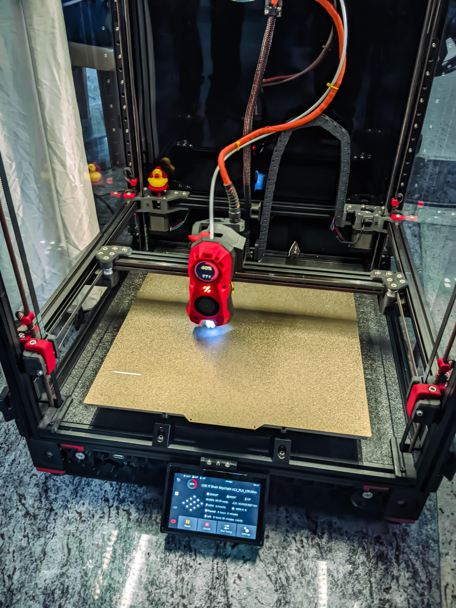
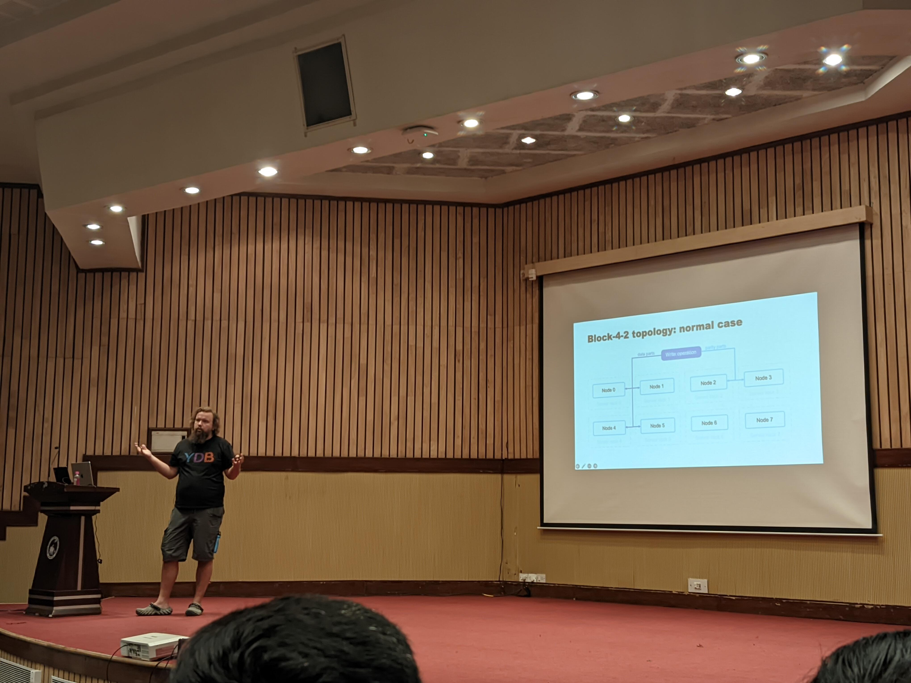
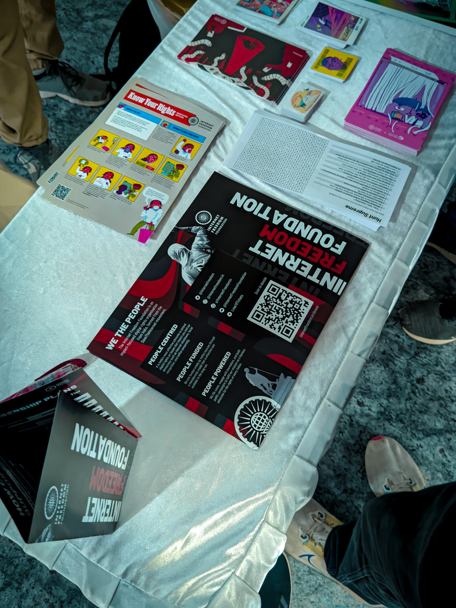

# Last weekend I attended IndiaFOSS 4.0

This was my first FOSS conference I'd been to. My friends, and seniors from college were nudging me to purchase a ticket pretty early on. Unfortunately, I did not and missed out on the discounted student ticket. I was lucky enough to find someone who was willing to transfer their ticket last moment who I found in the FOSS United Telegram chatroom.

The atmosphere! I caught the first bus to Nimhans that took me about 30 minutes to get to the bus-stop. I was pretty early I would say, I took a round of the venue and looked at a bunch of stalls. 

The demographic who showed up early, at the event were volunteers and college students from places outside of BLR. The check-in was smooth and ran on frappe. They were mostly volunteers from various different FOSS United communities around India.

I got a sticky patch nametag, I scribbled my name on it and the domains I was interested in. It still lives on the inside of my college backpack!

I met Tushar who we invited back in March, for [HSP's](https://tiramisu-dev.netlify.app/events/fosstalks) FOSS talks. I had also met a couple of seniors from college who showed up on the first day.

## What is FOSS?

Software that gives you the four essential software-freedoms. I gave a small talk on this [recently](/talks/gdsc-foss-101) at college, check it out as well as my blog post on 
[free-software](/blog/free-libre-software)

Since the event formally did not begin until 10:00, I had a couple of Idlis for breakfast and decided to scout the booths for some more interesting projects.
The first stall I had been to was [Mecha](https://mecha.so) it was a startup building FOSS hardware and selling custom edge compute devices.

## The Conference

The first talk was by [Vishnu Mohandas](https://vishnu.tech/), [Ente](https://ente.io/). They make a FOSS Google Photos alternative which is E2E encrypted and had a polished UI. Their primary userbase is the typical FOSS, privacy concious degoogler crowd. The slides say you need to market and build a userbase before you build a product and scale up. Fun fact, he used to work at Google, Switzerland but left that cushy job to build ente.

## Hardware: libretech.shop

[Abhas](https://abhas.io), founder libretech.shop had a booth which showcased their hardware and IoT projects, home automation and custom keyboards builds.

I spent my time alternating between chatting with people at the booths on the first floor and attending a few 20-30 minute sessions in Audi-1 and Audi-2. I later discovered there were even more booths on the second floor, which I hadn't known about—look what I found!

## Tinkerspace

TinkerSpace is a physical makerspace in Kerala for enthusiasts to learn and tinker with technology. They brought an entire team from Kerala to showcase their work at this booth.

## DIY 3D printer

I bought a small 3D printed whistle from the person at the booth and his smart kid, who was excited to explain how the material behind the print was sourced and the temperature conditions it could sustain.

## Friends: Nikhil, Sasank, Madhav.

Nikhil and Madhav took part and wont the wikirace. Nikhil is also known as [@heftymouse](https://heftymouse.me) online. Sasank as [@decentparadox](https://decentparadox.site) I know Nikhil from my JEE/high-school days. They're a part of [bi0s](https://bi0s.in/): a infosec/CTF club at their college.

##  A lightsaber: ft. [absurd.industries](https://absurd.industries/)

## e-ink

## Job board

## Stickers

---
## Day 2

I was certain I had exhausted the booths of interest and needed something to kill time. I got to a nix workshop, hosted by [@sphericalkat](https://kat.bio/). I recognized the username from a few online communities, though I never knew the person behind it. Fun fact, we used his pastebin: katb.in for our college lab sessions to share code snippets around.

## ydb: dist SQL db

Ivan talked about YDB, a distributed SQL database --- its fault tolerance model, architecture and scalability for diverse workloads. This was the first talk I attended on day 2.

## Early Linux/FOSS communities in india

I was there for the Frederick Noronha talk. I noticed his [youtube](https://yewtu.be/channel/UCxgCSgUVEG8QZGToC795wGQ) channel which he was interviewing people around, check it out. He is also publishing a magazine about FOSS contributions from India and the history of the FOSS movement in India.

Harish talked about game emulators, the early hackers and archivists who would go great lengths to preserve and revive games. He highlighted how some companies embraced these efforts, while others came down hard, sledging the ban hammer on them.

## Distro Tierlist

This stall was setup by [Mukti](MuktiCommunity.github.io) a FOSS club which originally started in Ramiah. The stall likely had the highest engagement rate. You could drop by at any time during the day to modify the tier list—a FOSS tierlist dare I say?

They also had a couple of USB sticks ready with distros of your choice in case you needed help flashing Linux on your PC.

## Lighting talks

Post lunch, I stayed at Audi-2 where people showed up, gave lightning talks on topics and mini-projects of their choosing. It was decided on spot. I particularly recall [blr.today](https://blr.today) by [Capt Nemo](https://captnemo.in/). I unfortunately did not take any photos.

I did not stay back for the final closing keynote and left after Kailash's talk.

He talked about how they use [dungbeetle](https://github.com/zerodha/dungbeetle) an internal middleware tool Zerodha developed to manage rush-hour tax-filing report generation on their stock broking platform.

## In summary

FOSS, Policy (lil bit of AI), Sustainability. I feel this was the theme around this year's IndiaFOSS. I loved how 
they asked us to bring our own water bottles, napkins and reduce any time time plastic or paper waste. Overall, 
the event was very well-organized, though I felt like I had explored all the stalls by the end of day one.

There were many more talks that I had attended, but did not document pictures of; a full list of speakers and a video recording of the event can be found on the IndiaFOSS [website](https://fossunited.org/dashboard/schedule/indiafoss24).

> P.S. We used ente to host and share all these pictures internally :)
