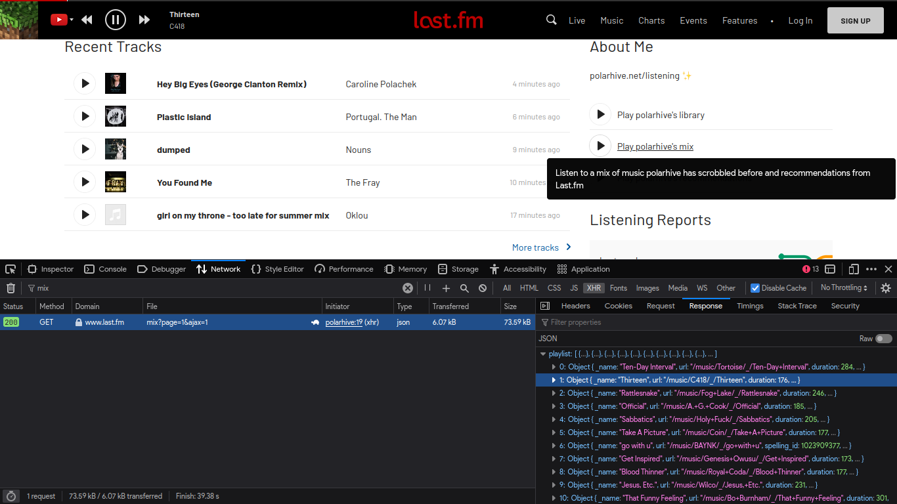
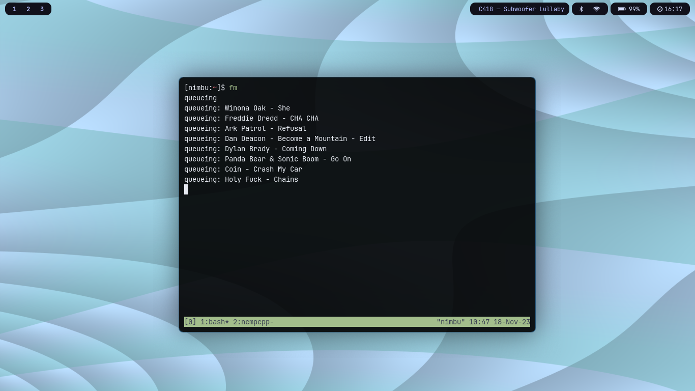
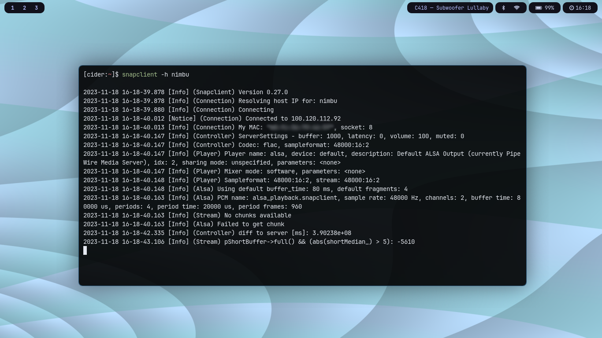
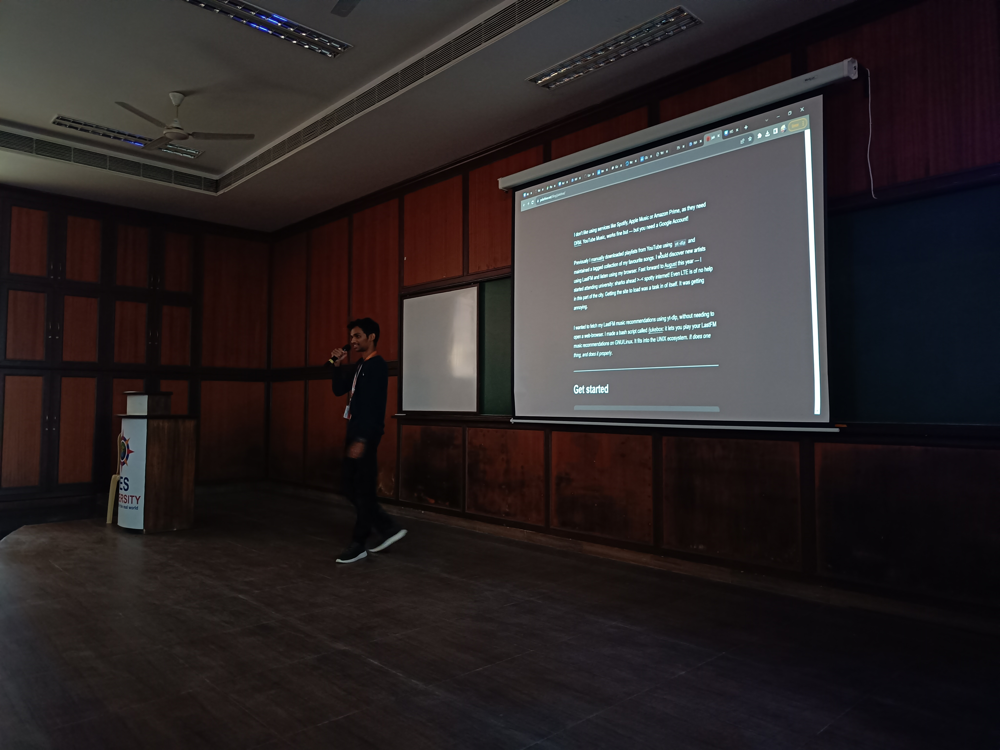

I don't like using services like Spotify, Apple Music or Amazon Prime, as they
need [DRM](https://www.defectivebydesign.org/). YouTube Music, works fine but ---
but you need a Google Account!

Previously I [manually](/blog/foss-music-setup) downloaded playlists from YouTube
using `yt-dlp` and maintained a tagged collection of my favourite songs. I
would discover new artists using LastFM and listen using my browser. Fast
forward to [August](/blog/college) this year --- I started attending
university: sharks ahead >--< spotty internet! Even LTE is of no help in this
part of the city. Getting the site to load was a task in of itself. It was
getting annoying.

I wanted to fetch my LastFM music recommendations using yt-dlp, without needing
to open a web-browser. I made a bash script called [/jukebox](/jukebox): it
lets you play your LastFM music recommendations on GNU/Linux. It fits into the
UNIX ecosystem. *It does one thing, and does it properly*.

---
# Get started

```
git clone https://codeberg.org/polarhive/jukebox
```

After cloning, `cd` into the jukebox folder and make sure you have `mpd` setup.
Install the prerequisites as prescribed in the [/readme](/jukebox). 

```bash
# setting perms to make this program executeable
chmod +x jukebox
```

```
jukebox -h
  -a: <artist name>
  -g: <genre name>
  -s: <song name>
  -u: <lastfm: username>
  -m: <lastfm: mix | recommended | library>
  -p: <lastfm: playlist url>
  -l: vosk: search songs with your voice
  -y: use ytmusic tags for songs
  -c: top charts in your region (setup your api_key)
```
---
## Devlog!

> *Time for a little webscraping and reverse-engineering!*

I went to the LastFM site. After clicking the **play-mix** button a little
YouTube iframe-window pops-up and it automatically starts playing the song one
after-the-other. You get to see how it's *scrobbling* with-in the browser.

I assumed this was using some api as these were regular YouTube videos,
manually tagged by fellow LastFM users (like how you can edit wiki pages)



After inspecting the network-requests the site was making, LastFM had a simple
json endpoint---that returns a playlist of songs that the browser needs to play.

---
## Let's try writing a script for it!

First we'll use `curl(1)` to fetch the response and understand how it works!

```bash
# $username and $mode is your LastFM username & playback mode of choice
response=$(curl -s "https://www.last.fm/player/station/user/${username}/${mode}")
```

### The response 👀

We see are in search of the title, artist, and the music-video of the song. The
full length response is [about](https://www.last.fm/player/station/user/polarhive/mix): ***3000*
lines**

```json
{
  "playlist": [
	{
		"_name": "Crash My Car",
		"url": "/music/Coin/_/Crash+My+Car",
		"artists": [
			{
				"_name": "Coin",
				"url": "/music/Coin",
				"name": "Coin"
			}
		],
		"name": "Crash My Car",
		"playlinks": [
			{
				"affiliate": "youtube",
				"id": "kv1wZPsvtuo",
				"url": "https://www.youtube.com/watch?v=kv1wZPsvtuo",
				"source": "global_suggestion"
			}
		]
}
```
> Note: I have shortened this json response and so we can focus on the relevant parts for this demo

I used `jq` to parse the json response to get the video `$id`, `$artist` and
`$title` of the song and store them in variables. Since there are about 3000
lines I made a function called: `loop()` which takes each entry, sets the
variables and calls the `dl()` method to start the download.

```bash
loop() {
    echo "queueing"
    length=$(jq -r '.playlist | length' <<< "$response")
    for ((i=0; i<length; i++))
    do
        id="$(jq -r ".playlist[$i].playlinks[0].id" <<< "$response")"
        a="$(jq -r ".playlist[$i].artists[0].name" <<< "$response")"
        t="$(jq -r ".playlist[$i].name" <<< "$response")"
        q="$a - $t"
        dl
    done
    echo "finished queueing"
}
```

## Downloading & metadata

`dl()` uses `yt-dlp` to download the video and extract the audio file. Here is
where things got a bit tricky --- some songs would not be tagged properly, some
refuse to play in my region. So I had to query YouTube Music and use it as a
backend to fetch the correct video `$id` instead of relying on LastFM.

```bash
dl() {
    if [ "$ytm_backend" = true ]; then 
        if yt-dlp ${ytargs} --playlist-end 1 --default-search "https://music.youtube.com/search?q=" "$q" --parse-metadata "title:%(title)s" --parse-metadata "artist:%(artist)s" --add-metadata -o '%(artist)s - %(title)s.%(ext)s'; then 
            queue
        else
            echo "ERROR: https://youtu.be/${id}"
        fi
    else
        if yt-dlp ${ytargs} --postprocessor-args "ffmpeg:-metadata title=${t@Q} -metadata artist=${a@Q}" -o "$a - $t.%(ext)s" "$id"; then
            queue
        else
            echo "ERROR: https://youtu.be/${id}"
        fi
    fi
}
```

## Queuing and playback

```
name=$(ls -u | head -1)
```

Initially I was using a [hacky](https://codeberg.org/polarhive/jukebox/commit/daec97717f30a92d27ac3e2603b46e0fdcc7cdd5.patch)-way
of queuing songs. It was trying to check if there were any updates to the local
filesystem and uses it to queue songs. It works --- but isn't the right
approach. It adds a lot of CPU overhead as it's running in a loop unattended.

```bash
queue() {
    mpc -q update; sleep 0.1
    if [ "$priority" = true ]; then
        name=$(ls -u | head -1); q=$name
        if [ "$(mpc playlist | wc -l)" -eq 0 ]; then
            mpc -q insert "dl/${name}"
            mpc -q play
        else
            mpc -q insert "dl/${name}"
            mpc -q play && mpc -q next
        fi
    else
        mpc -q add "dl/$q.opus"
    fi
    echo "queueing: $q"
}
```

Now I use `$q` which is just `$artist - $title` concatenated together. A tad
bit efficient. Priority mode is when you need to play a single song check the
`-s` flag.

---
# Extensibility

This is by-far the most fun part! I've designed `jukebox` to be simple and does
only what it's supposed to. Any additional functionality that isn't a
core-functionality I have written extensions, or other bash scripts that can be
found in the same repository. Let me walk you through.

## voice-search

The `-l` flag let's you search for songs using your microphone, it's basically
the `-s` mode but uses `vosk` to transcribe your voice to text!

```bash
# variables
set -e
time=4
VOSK_MODEL_PATH="$HOME/.local/share/vosk/vosk-model-small-en-in-0.4/"

# speech to text
mpc -q pause
google_speech "Listening: for $time seconds"

ffmpeg -y -f alsa -i default -acodec pcm_s16le -ac 1 -ar 44100 -t $time -f wav ~/.cache/audio.wav -loglevel warning
vosk-transcriber -m $VOSK_MODEL_PATH -i ~/.cache/audio.wav -o ~/.cache/audio_text.txt --log-level warning
read audio_input < ~/.cache/audio_text.txt
[ -z "$audio_input" ] && mpc -q play && exit 1

# pipe into jukebox
google_speech "Searching: $audio_input"; mpc -q play
~/.local/repos/jukebox/jukebox -s "$audio_input"
```

## global-charts

The `-c` flag fetches the top charts in your region and uses it as the playlist instead of recommendations. Note: *this isn't accurate* compared to (Spotify/Apple music)---because they have a far better sample size (userbase).

```bash
#!/bin/sh
# requires an api_key
api_key="{api_key_goes_here}"
country="india"

response=$(curl -s "https://ws.audioscrobbler.com/2.0/?method=geo.gettoptracks&country=${country}&api_key=${api_key}&format=json")
length=$(jq -r '.tracks.track | length' <<< "$response")
for ((i=0; i<length; i++))
do
    a="$(jq -r ".tracks.track[$i].artist.name" <<< "$response")"
    t="$(jq -r ".tracks.track[$i].name" <<< "$response")"
    ~/.local/bin/jukebox -s "$t by $a"
done
```

### glossary: an extensive list of tools I use to listen to my music

- `mpd` to play and manage your songs
- `mpc` controlling mpd via a cli
- `ncmpcpp` interacting with mpd 
- `jukebox` download and queue LastFM recommendations
- `mpdscribble` scrobbling to LastFM
- `mpd-mpris` using hardware buttons to control-playback
- `waybar` display the last playing song on my status-bar
- `snapcast` to stream music to multiple speakers/devices
- `tailscale` to access MPD ports and serve songs over a private VPN (I use it to ssh into my VPS) and stream songs using snapcast
- `psync` bash script to copy your current mpd-playlist to your phone---for offline playback and scrobbling on the go!
- `pScrobbler` scrobble songs on my phone
- `Pod Classic` android music player with an iPod interface

---
# Usecases

If I need to switch devices, or catch the bus in the morning I made this script
called **psync**---to copy my current mpd-playlist to the phone: for offline
playback and scrobbling on the go! I can pickup where I left off and continue
to listen on my phone. Checkout pScrobbler (like `mpdscribble` but for Android)

```bash
# cleanup
cd ~/.local/share/.Music/
rm -rf ~/.cache/songs; mkdir ~/.cache/songs
rm ~/.local/share/mpd/playlists/songs.m3u; mpc -q save songs
adb shell mkdir -p /sdcard/Music

# copy to phone
rsync -avL --files-from="$HOME/.local/share/mpd/playlists/songs.m3u" ./ ~/.cache/songs
adb push ~/.cache/songs/ "/sdcard/Music"
adb push ~/.local/share/mpd/playlists/songs.m3u "/sdcard/Music/songs" && mpc -q clear
```
## stream

Since mpd is available on all *nix systems, I can setup a remote mpd session and stream songs instead of having to carry my collection around in a hard-drive

```
Network:
[mpd ⟶ snapcast_server (on nimbu)] <~tailscale~> [snapcast_client (on vince): nimbu]

Hosts:
• nimbu: my remote machine (vps)
• vince: my local machine (android)
```



I can also leave it unattended in a for-loop, let it cache some songs for the
weekend. But this assumes---you're not having spotty-internet when you stream
from your remote machine back to your devices.

---
### LAN-parties:

Instead of streaming from a remote server, use snapcast to stream over your
local network, and let all your friends play music in-sync.



---
## archive

If you're okay with DRM (Spotify) or other such platforms. You can continue to
use Spotify but, setup scrobbling to LastFM, then run jukebox with the `-m
"library"` flag to download an archive of all your recently played songs!

### /listening widget on your website

I deploy this nifty-widget that lets me showcase what songs I am playing at the moment.
Also checkout blackpirate's widget, which I showcase here: [/listening](/listening)


---
## colophon

This post is a part of a talk I gave at **uni** as a part of [`</HSP>`](https://homebrew.hsp-ec.xyz/about) --- our college's FOSS community. 




[Free Software](/blog/free-libre-software) is about community, feel free to *dig through the source code* and open some **issues** on my [GitHub](https://github.com/polarhive/jukebox/issues). Happy Hacking!

