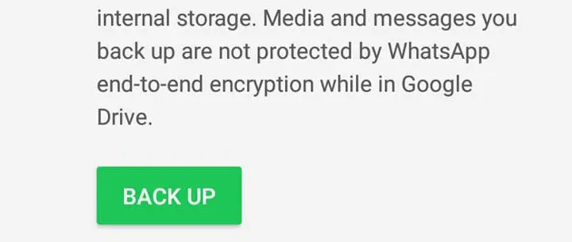
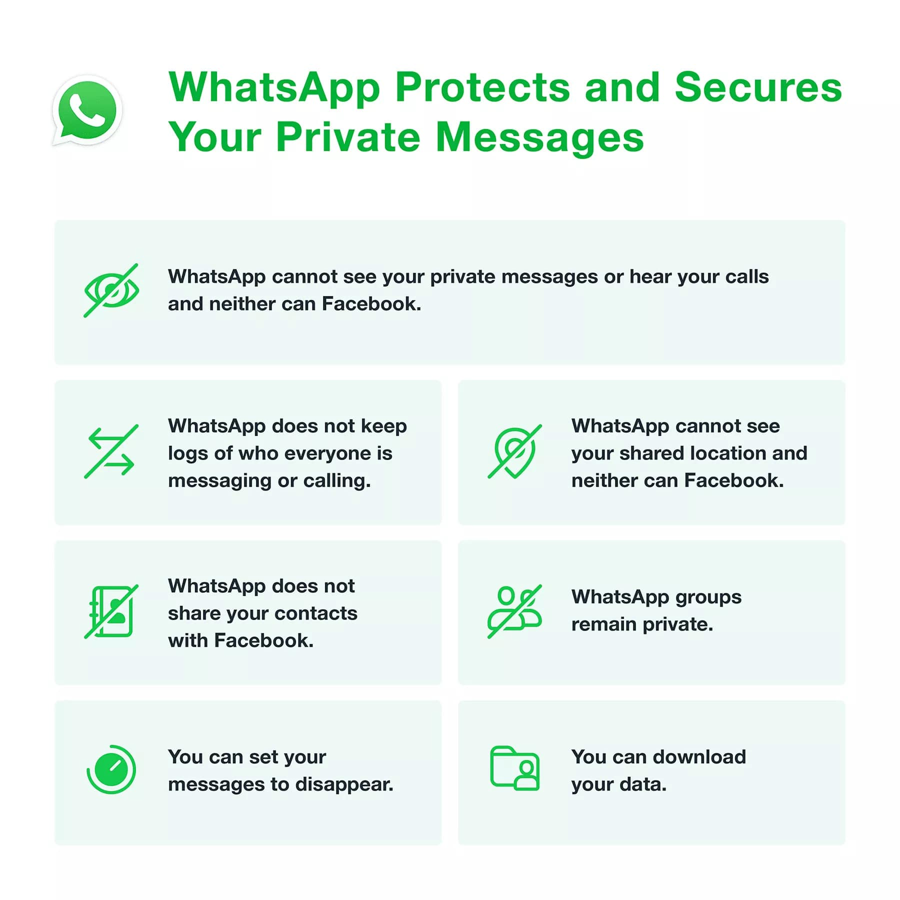
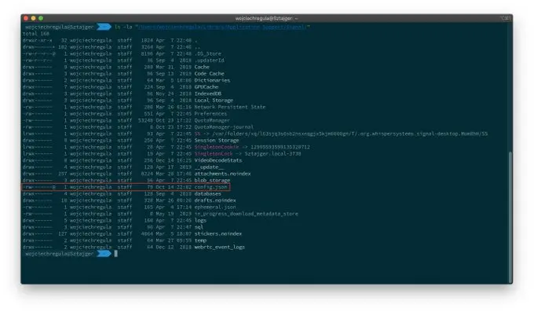
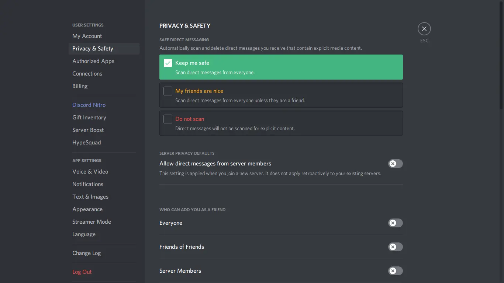

# Unless you're from the USA (the land of free SMS) you probably use a messaging app like WhatsApp, Telegram or Signal

> **Why? You get cross-device-sync, better features, ditch phone numbers as -- identifiers, huge privacy gains, stickers & share media in an instant!**

SMS is costly, outside of the US. At least in [India](https://economictimes.indiatimes.com/industry/telecom/telecom-news/telcos-double-corporate-sms-rates-for-overseas-entities/articleshow/83912099.cms)
--- I don't think I have ever used SMS other than receiving OTP codes, when
signing up for some services. The average person's SMS inbox is filled with
spam. If you're from the US, an iPhone user? you probably [hate green
bubble](https://www.androidauthority.com/green-bubble-phenomenon-1021350/) text
messages.

## [Network-effect](https://en.wikipedia.org/wiki/Network_effect)

This explains why apps like WhatsApp - from Facebook have taken over the world.
Most people don't care about [digital-privacy](/blog/digital-minimalism-on-my-phone-foss/), or
[user-freedom](/blog/free-libre-software). They find comfort using what
everyone else is using. Whatever is 'kewl' in `*insert current year*` It isn't
something new, when GMail launched, people switched to GMail, it was what
[everyone](https://www.wired.com/2011/04/0401gmail-launches/) was
[using](https://www.wired.com/2014/04/gmail-ten/), TikTok, Instagram, people
are quick to ride the hype train.

## Does Privacy = Security?

To most people, `Secure=Private=Anonymous` are interchangeable words and mean
the same thing. People aren't keen about digital-privacy, nor have the time to
look into the tech-stack behind the apps they use. Even if they are tech savvy
enough they can't convince their friends to switch to better alternatives
because their friends aren't using it ~ circular logic. Most people aren't
clear when someone says 'I care about privacy' or something around the lines of
'WhatsApp collects data' - they'd think as long as it works, why not use it?

I am someone who values digital-privacy. For my communication these days I use
messaging apps, I'm sorry but no one loves email anymore. There are some apps I
use & some I don't. I ditched WhatsApp, or as I'd like to
call it: "[Broken Up With the Facebook](/blog/breaking-up-with-facebook/)" apps.

## Some of my needs

To communicate properly I need to use apps that qualify these basic requisites.
Otherwise I'd fallback to PGP encrypted old-school email.

- [free/libre software](/blog/free-libre-software)
- native cross platform support
- end-to-end / 0 knowledge encryption
- good track record keeping up their promises
- comfy UX (not a dire need, more like a want)

This blog post aims to review popular messaging apps one by one, in terms of
popularity, starting with WhatsApp.

---
## WhatsApp

Born in 2009, a simple plain-text app that allowed users to update their
status: *I'm at the airport, at the gym, don't ping me*. People slowly began using it for
sharing messages and it [pivoted into an instant-messaging app](https://github.com/fikrikarim/companies-with-successful-pivot).
Later, in [2014](https://en.wikipedia.org/wiki/WhatsApp) it sold out to
Facebook and to this day Facebook runs & maintains it.

### WhatsApp is a part of our social-fabric

It's where grandpa gets the latest family photos, answers video calls with
grandchildren, gets the daily dose of good-morning messages. You could say an
app like WhatsApp has hacked into our emotions, just like the other - many
$[BigTech](/blog/tags/tech) surveillance companies have. It leaves the user
strangled, helpless, a manifestation of the unjust [control the developer has
over you](https://seirdy.one/2021/01/27/whatsapp-and-the-domestication-of-users.html),
when using [proprietary apps](/blog/free-libre-software).

### What else is wrong?

- 👎 free/libre software - app is proprietary
- 👎 native cross platform support - no GNU/Linux app
- 👎 end-to-end / 0 knowledge encryption - not possible when your app is
  proprietary
- 👎 bad track record keeping up their promises - after selling out to Facebook
  it's all downhill
- 👍 an okay UX - doesn't matter now, anyway
- 👎 being proprietary is why I'll pass, not to mention Facebook's track
  record.

## Major news sites just jump on the bandwagon

Copy paste first hand information from the app's page or what the spokesperson
says. *it does more harm than good.* News & media sites keep using the buzzword
~ 'End To End Encryption' claiming your messages are secure - [because Facebook
says so](https://fosstodon.org/@deletefacebook/105520209686737194). There's no
use when you have a proprietary encryption algorithm. We can not verify such
claims, on the user's end. They don't school readers about 'verifying' over
'blindly trusting'.

Leaving readers confused - thinking privacy is some vague, trivial issue that
can't be solved even with end-to-end encryption deployed by WhatsApp.  Here are
some examples

- [Here’s how you can keep your WhatsApp chats secure - End to end encryption | The Economic Times](https://economictimes.indiatimes.com/tech/heres-how-you-can-keep-your-whatsapp-chats-secure/end-to-end-encryption/slideshow/78362207.cms)
- [Messages are end-to-end encrypted, says WhatsApp amid alleged leaks | The Indian Express](https://indianexpress.com/article/technology/tech-news-technology/messages-are-end-to-end-encrypted-says-whatsapp-amid-alleged-leaks/)
- [Amid leaked chats of Bollywood actors, WhatsApp reiterates messages are end-to-end encrypted | The  Hindu](https://www.thehindu.com/news/national/amid-leaked-chats-of-bollywood-actors-whatsapp-reiterates-messages-are-end-to-end-encrypted/article32692207.ece)

> ### End to end is useless when WhatsApp itself can not assure their users

That data of both parties in a chat would not be backed up to Google Drive or
iCloud. Your data is free for the [NCB or any government
agency](https://www.indiatimes.com/technology/news/ncb-drug-case-whatsapp-chat-leak-523646.html)
to clone your SIM card & take over all your chats. They don't enforce 2FA pins
too like [Signal](https://signal.org/blog/signal-pins/).

### show me the encryption?

We can't prove they use the latest version of the Signal Protocol; the only
hope you have is an old article from Signal talking about their work with
WhatsApp - you have to trust [Moxie's word from 2017](https://signal.org/blog/there-is-no-whatsapp-backdoor/).
Moxie keeps mum when asked about this.

> *[Please help me understand why is GPL3 library used in proprietary software WhatsApp?](https://github.com/signalapp/libsignal-protocol-java/issues/42)*

### track record ~ who are their real users?



## damage control

No hard bound proofs, as I said. Even if your trust them today: data once collected can be misused. In the
worst case always assume it will be misused. It is in their interest as an
advertising company to misuse this data. That's how they make money.

---
## Signal

First looks; their Desktop App sucks. Both in performance & features. It's
another [Electron](https://drewdevault.com/2016/11/24/Electron-considered-harmful.html) app.
I don't like electron apps. If at all I want to run electron apps I'd run them in
my browser of choice instead since browser's bundle the same code to run electron apps.
I also don't like exposing electron apps to my filesystem and other system-level resources.
Signal does not give user's the freedom to use 3rd party clients with their servers.

### vetted cryptography ✅

Signal is built on something called the Signal Protocol. The
[cryptography](https://signal.org/docs/) implementation arguably is the best in
the eyes of modern cybersecurity & privacy researchers. Perfect forward
secrecy, and [clever ways to minimize
meta-data](https://signal.org/blog/sealed-sender/). Signal is a good
recommendation and the Signal Protocol is the industry standard, when
communicating securely. There are other messengers like Session - a fork of
Signal which takes the Signal Protocol and builds on top of that.

> *Quick reminder: In these hard times, when we focus on local vulnerabilities
> as [@zoom_us](https://nitter.net/zoom_us) had,
> [@signalapp](https://nitter.net/signalapp) on Desktop still stores the
> encryption key in a plaintext file. So, any malicious app running with
> typical user permissions may decrypt your messages. 😅 1/x* — Wojciech Reguła
> (@_r3ggi) [April 7,
> 2020](https://nitter.net/_r3ggi/status/1247631376914026499)*

## A rouge program can scan & send the encryption key to the attacker

Well, you got to have some basic OPSEC hygiene when trying to talk privately.
I'd not explicitly blame Signal, but being end-to-end doesn't mean your
messages aren't private after they are delivered (reach the other end). Using
Signal doesn't magically improve your OPSEC hygiene.

### By default notifications are visible to the host OS

The same thing, but for mobile phones. Here Telegram Secret Chats > Better than
normal Signal chats it hides previews for 'both sides' when using Telegram's
mobile clients. Here's an old article I wrote to [harden
Signal](/blog/hardening-signal/)

### IRL usecases

There's no way to bulk un-send messages you've already sent like Telegram or
Matrix. Your only hope is to use 'disappearing messages' with everyone. Which I
do - in case you message me on Signal. I don't want messages to stick around
forever!

## Moxie promoting centralization

They (Signal) is hostile to forks, and 3rd party clients. They claim, opening
up to 3rd party forks dilutes their security standards, & overall security
promises. I'd rather have control over worrying about security. But there's
more to it.

- [Please help me understand why is GPL3 library used in proprietary software WhatsApp?](https://github.com/signalapp/libsignal-protocol-java/issues/42)
- [Reflections: The ecosystem is moving](https://signal.org/blog/the-ecosystem-is-moving/)
- [Server side code was last updated on 23rd April 2020 and is licensed under AGPL 3.0](https://web.archive.org/web/20210118184819/https://github.com/signalapp/Signal-Server)

Signal is not going to bother with decentralization. They practically gave up,
and decided to fix and build stuff for the centralized world of messaging. As
of now it looks fine, but sooner or later,
[funding](https://signal.org/blog/become-a-signal-sustainer/),
[censorship](https://news.ycombinator.com/item?id=26026994),
[bandwidth](https://indianexpress.com/article/technology/social/signal-app-is-down-not-working-7148052/)
and load balancing will be a pain. Users, just like WhatsApp have to use the
official Signal server, which in turn is hosted on Amazon & Google servers. I
don't think their clients natively would ever support logging in to alternate
servers or promote anything outside of their ecosystem. That's why I don't like
donating or
[promoting](https://matrix.org/blog/2020/01/02/on-privacy-versus-freedom/)
Signal in the long run. Read - [We can do better than
Signal](https://icyphox.sh/blog/signal/)

## Good tool, not a platform

- 👍 free/libre software - apps are FOSS
- 👍 native cross platform support - meh, electron apps but okay
- 👍 end-to-end / 0 knowledge encryption - no compromises, vetted industry
  standard
- 👍 good track record keeping up their promises - they've digressed, adding
  bloat like - [integrating a crypto wallet](https://www.wired.com/story/signal-mobilecoin-cryptocurrency-payments/)
  (MobileCoin) in their apps but okay in terms of privacy promises
- 👎 comfy UX - it can do a better job, it should get on par with Telegram's
  apps
- 👍 I use Signal, it doesn't compromise on security, in my opinion it works
  for short term, ephemeral conversations and calls

As mentioned before, Signal's servers are non-free. Not the code, their policy.
[They don't allow 3rd party
clients](https://github.com/LibreSignal/LibreSignal/issues/37#issuecomment-217339450),
even though the code running is all GPLv3 libre-software. Not being able to
customize my config sucks, I want to have control over my comms and setup, not
depend on Signal and wait them to develop new features.

Signal isn't the place for non end-to-end encrypted chats, like public
chatrooms or live-events. It's a good tool for a niche usecase, but not a good
'all-in-one' platform. Pick decentralization > centralization.

---
## Telegram

The biggest problem in Telegram is that people tag it as an end-to-end
encrypted messaging app. If you ask any Telegram user they don't use Secret
Chats unless it's needed. It's a hybrid between Twitter / Discord with public
chatrooms & channels. Even if you don't plan to use it for 1-1 chats it still
is better than Twitter or Discord for group chats. That being said there are
better things than Telegram ~ [Mastodon](https://joinmastodon.org) /
[matrix](https://matrix.org) are better alternatives.

The CEO ~ [Durov](https://tx.me/s/durov) keeps claiming till date they've
disclosed [0 bytes of cloudchat data with 3rd parties](https://telegram.org/faq#q-do-you-process-data-requests);
he claims ~ Signal, Tor & other US Open Tech Fund projects have vulnerabilities &
backdoors, because they're funded by the US. He doesn't back his claims with
proof. On the other hand - no one except Durov knows about the '0 bytes shared'
claim. But the talk of backdoor in 'Tor or Signal' can be clearly proved to be
false.

Just like Telegram's apps Tor and Signal are transparent, well-documented,
libre software. You can mathematically verify 'E2E encryption' with QR /
verification codes, or run nodes & try to decipher Tor traffic.

Durov is biased towards [Tor](https://torproject.org), I think here is what he
was planning to do: [TON](https://polarhive.net/blog/messengers/Telegram/TON.pdf)
used to build a Tor clone as a proxy for Telegram in censorship prone regions. It was almost done,
and then poof the SEC / US gov killed it. I assume this is why he is biased
against Tor / the US Gov.

> *Signal is a tool of the US Gov, backed by the US National Security State.
> [Here's a good summary of its
> history](https://surveillancevalley.com/blog/government-backed-privacy-tools-are-not-going-to-protect-us-from-president-trump)*
— Pavel Durov (@durov) [June 8,
2017](https://nitter.net/durov/status/872900098111492100)

## For Durov ~ *Signal seems shady*

But their native mobile apps are solid in terms of security. i.e. If you verify
QR codes. I don't need to trust Tor or Signal here. I can verify by default,
all chats in person with a QR code that my chats aren't being intercepted. You
can do this on Telegram too [Secret Chats] but not ON by default.

## **Edward Snowden** explains it well

> *"We've seen some improvements, and that's not nothing. But not the
> revolutionary rework it needs. Telegram still seems to encourage dangerous
> cloud messaging instead of secret chats. Experts ask "why?" And the answer is
> "convenience." That's unsafe.*
— Edward Snowden (@Snowden) [December 30,
2017](https://nitter.net/Snowden/status/947216112428769280)

> *And this is where we start getting to my core concerns.
> [@Telegram](https://nitter.net/telegram) has for years faced criticisms about
> the basic structure of its security by prominent cryptographers and
> technologists. Many defenses rely upon unbroken trust in a central authority
> (the company). "Trust us."* — Edward Snowden (@Snowden) [December 30,
> 2017](https://nitter.net/Snowden/status/947209647592701952)

> *Trust us not to turn over data. Trust us not to read your messages. Trust us
> not to close your channel. Maybe [@Durov](https://nitter.net/durov) is an
> angel. I hope so! But angels have fallen before. Telegram should have been
> working to make channels decentralized—meaning outside their control—for
> years.* — Edward Snowden (@Snowden) [December 30,
> 2017](https://nitter.net/Snowden/status/947211176542441472)

## So is Telegram bad?

Edward basically summarized what you compromise when you use Telegram ~ 'trust'

- 👍 free/libre software - all clients are FOSS
- 👍 native cross platform support - really good support, native QT / Swift /
  Android / Windows UWP / PWA apps
- 👎 end-to-end / 0 knowledge encryption - own standard, built for speed; but
  hasn't had major mass-exploited vulnerabilities unlike WhatsApp
- 👍 good track record keeping up their promises - they've fought many times
  against suppressive governments, denying encryption keys, or share cloud-chat
  data of their users, it's okay in terms of privacy promises as long as Durov
  is in charge
- 👍 comfy UX - literally the best, in terms of UX; every update is like
  eyecandy
- 👍 I use Telegram, I have to compromise on 0 knowledge encryption, but I use
  it for public-group chats, managing todo-lists and groupchats (where I assume
  everything is public anyway), again, in my opinion it works for short term,
  also ~ ephemeral conversations and 1-on-1 calls [E2E]

Basically what Telegram does right now is **manage the keys**, assure users -
as long as Durov is CEO; they'll keep your cloud chats safe. *This is still
trust*. Trust as in - you 'trust' they haven't handed over keys via legal
safeguards like splitting encryption keys & distributing it to different
jurisdictions. Although one day *they can* in the future just give up & knock
you off your feet ~ because this is privacy by trust & not by design (as far as
cloud chats go)

## Verifying, clearly gives you peace of mind than trusting someone

You can't predict the future. I have to use Telegram's one-on-one Secret Chats,
when I don't want things being held by Telegram's servers. You can still use it
as a hybrid social media app, it's the best centralized social media app in
terms of a their generic [privacy policy](https://telegram.org/privacy#1-1-privacy-principles)
and freedom-of-speech. But real freedom / privacy only exists on federated platforms
like [matrix] or the fediverse. Where you set your own rules. So [prioritize that over
Telegram](/blog/fedi-first/), use the [fediverse!](/blog/federating-social-media)



<video autoplay loop controls title="Now you see me, now you don't" alt="Remove groups, secret chats and call history for both sides"><source src="Telegram/unsend.mp4" type="video/mp4"></video>


### cloudchats + instant sync is something that can help with IRL privacy + convenience

If my phone gets stolen I can un-send all the years of chats from another
device. Or a chat with my friend and I from my friend's device. If you value
[security](https://cqi.inf.usi.ch/publications/telegram_vs_signal.pdf), you
should use Signal. But as I said Security does not equal privacy. You can't
un-send messages on Signal that easily. Telegram gives you IRL applications of
privacy.

In case of an emergency or decide to delete your account - what you can do on
Telegram is **delete your chats from both ends**, assuming they don't log stuff
(No way to prove or disprove this yet).

## What they need to do is roll out: 0 knowledge encryption

Things can vastly improve! Reduce the 'trust factor' I suggested to set a
minimum a --- 12 word seed as a passphrase like how Bitwarden, ProtonMail,
Bitwarden, MEGA Cloud or most crypto wallets work.

All encryption and decryption should happen, 'on device'. E2E 0 knowledge
encryption for all users, with a coming update. Assuring 2FA and an event
should they have to hand over data, it would take years to decrypt depending on
the encryption algorithm they plan to use. Something MTProto 3 should tackle.
The only thing left out in terms of security would be perfect forward secrecy.
In fact right now that's how Telegram Passport works.





> ### Update: Durov says he's 'exploring that path' [when I asked him](https://web.archive.org/web/20220110155545/https://t.me/durovschat/531942).

This would mean no server side search ~ I think it's a valid compromise. Also: if they can
do server side search? don't they have the ability to just clone our plain-text messages any time?

### Here are some ideas about that 12 word seed that I talked about

Actually they had built these things: for the TON wallet / TON network. Hover
your cursor over the screenshots

---
## [matrix] ~ redpilled?

## [Matrix](https://matrix.org) is a protocol/platform rather than a new messaging app

Unlike the Signal Protocol which is centralized - Matrix could solve
**decentralized** peer-to-peer & federated messaging. Personally if you'd give
me $100 to donate to any of these messaging platforms. I would fund Matrix. The
most daring among the others, making slow but steady progress in terms of
cutting edge communication technology.

As of right now it has many issues compared to Signal - because of it's
decentralized nature (meta-data issues). But I would rather fund to fix those
issues than fund Signal which says - ['we don't
care'](https://signal.org/blog/the-ecosystem-is-moving/)

I would not recommend it for 1 on 1 messaging just yet, unless you both know
how to use [Matrix], and can maintain good OPSEC hygiene, not revealing too
much info when chatting. It's practical for public forums, government forums
and events but not for one on one chats unless they're peer to peer - which,
btw is [also coming!](https://matrix.org/blog/category/this-week-in-matrix)

> ### If I host a public group, as an inclusive leader: I would pick/host a matrix server

To make sure to everyone can join in. From any platform, running libre-software
javascript-less/lightweight clients. For schools, classrooms, coding events,
fundraisers, protests ~ "easy to circumvent censorship since ~ it's not one
server they need to block" users can login from one web client or another. You
can use Matrix over bluetooth or any other intra-net mesh network. Any client
can be used.

Matrix also supports [bridges](https://matrix.org/bridges/) - bridging with
Jabber/XMPP, IRC, Discord, Telegram, you name it! Literally anything - that can
be hacked on, with [enough eyeballs](https://en.wikipedia.org/wiki/Linus's_law)
looking  at it. I do this for my matrix chatroom, which you can join [here](/chatroom),
briding Matrix & Telegram.

- 👍 free/libre software - DIY clients that are FOSS
- 👍 native cross platform support - basically runs anywhere
- 👍 / 👎 end-to-end / 0 knowledge encryption - built for scaling & federation;
  tho - it's up to the sys-admins to keep maintain upto-date up-stream patches,
  tho leaking meta-data is an pain
- 👍 good track record keeping up their promises - there's something new every
  week, in an open, youtube styled, dev-vlog series - "this week in [Matrix]"
- 👎 bad UX - literally the worst part about [Matrix]; onboarding will be hard,
  the default clients have a lot of polishing left to do. It's growing
  organically, without much marketing or hype, so it'll be okay, not pissing
  off users in its early stages.
- 👍 I use [Matrix] for public chats, I have to compromise (meta data) if I do
  E2E 1-on-1 chats. I am really excited what Matrix will solve in the future. I
  plan to move to my own [Matrix] homeserver on my website in the no-so-far
  future, that helps with meta-data.

---
## Discord

Forget [privacy](https://spyware.neocities.org/articles/discord.html). Discord
is cringe & I hope it'll die soon. Quite childish, not a serious messaging app.
Watch [this video](https://www.piped.kavin.rocks/watch?v=k5FcL99NuB8)
criticizing their customer support. It's target audience is Gen Z.

People, (mostly gamers) use it for low latency comms. Discord is worse than
Telegram or [Matrix] in terms of encryption; rather, all chats are plain-text &
public domain, not even encrypted at rest, or utilize browser caches that
expire. You can (right click on an image in a chat and fetch your photos,
shared in a chat). Just like Google Photos, Instagram or Messenger DMs. The
only reason I would use Discord is to bring everyone trapped in Discord to
[Matrix] ~ [#FediFirst](https://polarhive.net/blog/fedi-first)

## Discord proudly says, they spy on all your running apps and messages, run it through their AI and flag it. So don't expect privacy on Discord

- 👎 free/libre software - Proprietary clients built on
  [permissive](https://discord.com/licenses)
  [OSS](https://discord.com/open-source) tool-kits ~ shame, shame, shame!
- 👍 native cross platform support - basically electron PWA apps, but unlike
  WhatsApp it is makes more sense going the PWA route.
- 👎 end-to-end / 0 knowledge encryption - plain text messages, piped through
  some AI scanning shit, worse than WhatsApp
- 👎 bad track record - famous for annoying users - demanding their phone
  numbers, holding their accounts hostage, tracking current running system
  processes, et. al.
- 👍 / 👎 addictive UX - really good at hooking users, you get the dopamine hit
  whenever you hear that Discord notification ping! can't say much but they
  know how to target their primary audience.
- 👎 I don't use Discord. It's 'cringy' what else can I say, please don't use
  it. Especially for [FOSS projects](https://drewdevault.com/2021/12/28/Dont-use-Discord-for-FOSS.html)
  --- relying on a proprietary user-subjugating tools? That's a joke!

## Why do people use Discord?

Idk, its what the kewl kids use, sorry I don't have any of the Gen-Z traits
😮‍💨

---
## Synopsis

- Use [Signal](https://signal.org) with 'disappearing messages' - but miss out
  on cloud chats & other UX stuff found on Telegram.

- Use [Matrix](https://matrix.org) for Public group chats or at least ensure
  you can bridge it to [Matrix] first. Don't use it for DMs unless you're Peer
  To Peer or own the homeserver.

- Use [Telegram](https://telegram.org) for casual, non-personal chats, & clear
  your history for both sides once a year. Make sure you keep an eye out if
  Telegram server's get raided or if **Durov resigns**, should - Telegram not
  use 0 knowledge encryption by then.

---
Last updated: Jan 22'
