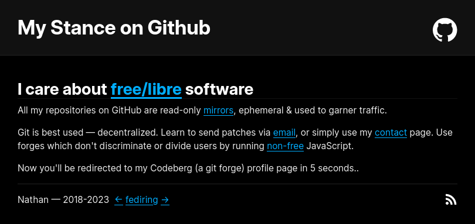
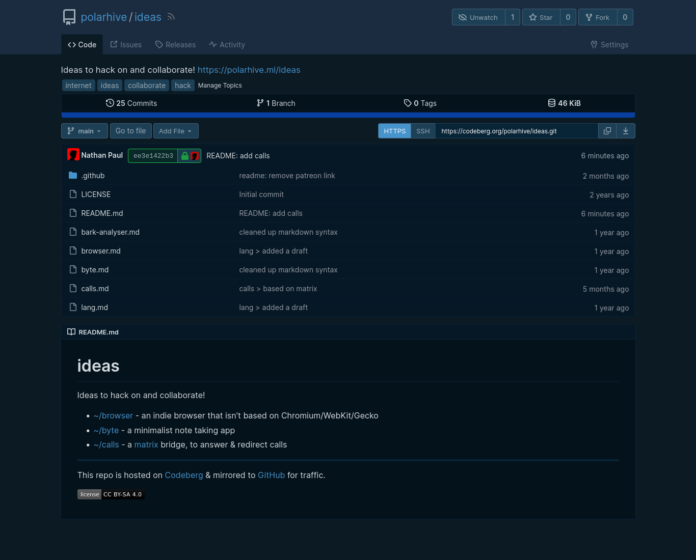
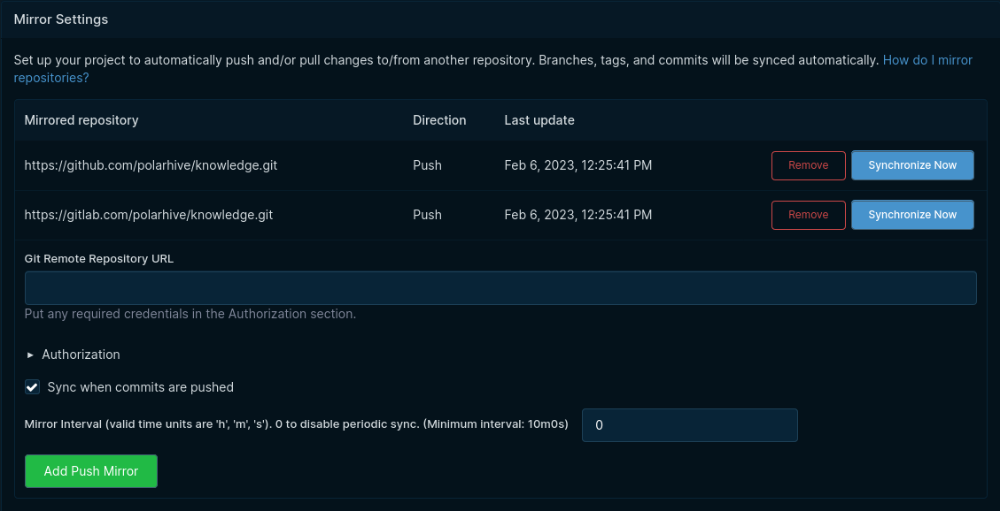

## If you're into the FOSS/tech ecosystem; you've probably heard of 'GitHub'

GitHub, now owned by Microsoft is a web-based social coding platform for
everything "open source". At least that's how I feel they brand it.
After the Microsoft takeover there has been a significant
[increase](https://github.blog/2023-01-25-100-million-developers-and-counting)
in traffic with new users joining the platform. Isn't it ironic that
GitHub itself isn't open-source?

> #### Oh, it's on *GitHub* so your project must be **open-source** right??

Many people don't know about the difference between open-source software
and proprietary shareware. I've seen many cases where people use GitHub
releases to distribute proprietary binaries of their programs. Some people
don't bother to license their software, they just dump it on GitHub,
so even though you can see the source code you're not legally
allowed to modify / re-use it for your own project.

Your projects don't have to be explicitly licensed under a FOSS license.
There are plenty of web-based git forges. GitLab, Codeberg, Sourcehut to
name a few. Isn't it ironic that GitHub itself isn't "oPen sOuRce". Historically,
`git(1)` was meant to be used over [email](https://git-send-email.io/),
decentralized ✨

---

You can clone my project, make edits (commits) locally, then send me
patches over email or [any](/contact "these are just plain .txt files
after all") medium of your choice. All while retaining your copyright,
when I apply your patch. Git was meant to be used this way, you don't
need to 'fork' or send 'pull requests' or make an account on a git
forge.

I call open-source a 'diluted marketing term', it never talks about
software freedom. I write [free/libre](/blog/free-libre-software)
software and wouldn't call it opensource even if it technically is.
Open-source is a fancy PR term that all the big-tech companies use. I
don't explicitly block GitHub or GitLab like I block Facebook, YouTube
or other [social media](/blog/rss-feeds/) even though these forges are
hosted on BigTech server farms. You are free to share my public projects
as long as you follow the license I use to release them.

## Ethical hosting?

I don't really have an argument for/against ethical hosting. It's plain
old code, regardless of the platform — GitHub, GitLab, or Codeberg
hosting the project the license of the project remains the same. While
it's true that GitHub (Microsoft) may use my GPLv3'd code to train their
AI algorithms (co-pilot).

I can't really avoid it, once I've exposed my code out on the internet.
There's nothing in the GPL that prevents that. I think the FSF and other
libre-software lawyers should figure it [out](/ "GPLv4?"). Someone can
fork or technically re-upload my project from Codeberg to GitHub for
their personal use. I (the GPL I mean) can't give freedom to one person
and deny it to another.

GitHub deploys *proprietary javascript*, the page loads fine without js
but only when logged out. I don't keep my GitHub account logged in, I
use it like YouTube, I use YouTube only when uploading new videos,
otherwise I am logged out, I also block it using [arceo](/arceo).
Besides, I mirror my repositories to GitHub, the setup is a one time
thing, keep reading to find out.

## I host all my repositories on Codeberg, another web-based git forge

Codeberg stands for free/libre software and forbids proprietary
software. This should be the default, for any public software forge. I
primarily host all my projects there, I don't have a need for a CI/CD
toolchain so I'm not really missing out or exploiting (s̶h̶i̶l̶l̶i̶n̶g̶) the
gratis resources GitHub or GitLab has to offer. Other than my github.io
pages site, which basically redirects to this website.

## Traffic

I like getting feedback on my projects. I leave a /contact link in the
README on some of my projects. For arceo I've received entries over
email and it was really convenient, rather than opening a web browser
and asking them to sign up, fork my repository and then send a pull
request.

Similarly this process is independent of where you host your git
repositories. Infact Codeberg (essentially Gitea) — allows you to use an
external issue tracker, which is really cool. I use it to redirect
people to my /contact page where they can either send me an email or
anonymously report issues via a HTML form. You don't need to know fancy
git stuff.

Mirroring to GitHub means more eyeballs looking at my projects. GitHub
is also really well indexed by search engines and people can discover my
projects if they want to. And ideally visit the project on it's intended
homepage which currently is Codeberg. I kind of followed the stratergy I
used when switching to the fediverse — [fedi-first](/blog/fedi-first).

I've got a couple of stars on some projects, even though it doesn't mean
anything. I don't follow anyone on GitHub or use any of it's social
features. It's pretty cringy. I understand why Microsoft is doing this,
it's to keep user's hooked! GitHub also has some lock in features like
Codespaces (Copilot) / NPM hosting both of which I'm not interested in.
Oh, also the integration with Netilfy where I currently host this static
website.

---
## Let's get to the nitty-gritty[!](/git "pun intended!")

1. Mirroring your repository to GitHub is quite simple. We are going to
be setting it up as a push only mirror. First make sure your local copy
of your repository is up-to-date. Push any pending commits and make a
backup of your repository.

2. Create a new repository on Codeberg — use the import / clone tool, or
upload your local copy, remember to change your git repo's remote
[url](https://git-scm.com/docs/git-remote).

3. Create an access token with the pre-requisite permissions,
documentation can be found
[here](https://docs.gitea.io/en-us/repo-mirror/#pushing-to-a-remote-repository)

4. Visit your project's settings page on Codeberg.

Under mirror settings: Use your GitHub username and enter your access
token as the password. You'd want to use '*sync when commits are
pushed*' to keep both repositories upto date.

5. Try it out, push a new commit and you should be able to see the
changes reflect in both repositories.

> TIP: Make sure to sign commits using an SSH or [/GPG](/gpg) key, so
> people can verify it's actually your code.

---
## self hosting?

What if you self host your projects on your own Git repository, where
you don't have this cloud-sync feature? You can set 2 or 3 git remotes
that you can locally push to, but I avoid doing that I just let
[Codeberg](/git "at least for now :^") do the syncing for me.
[Here's](https://seirdy.one/posts/2020/11/18/git-workflow-1/) an
excellent guide by — Seirdy, if you're curious.

