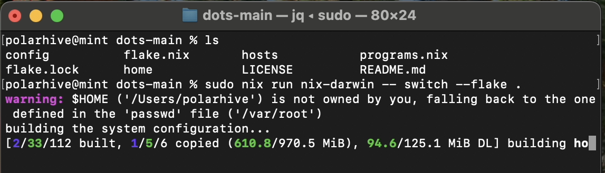
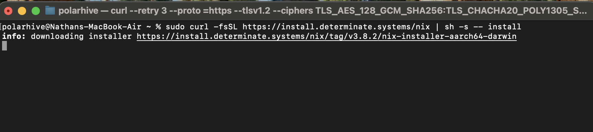
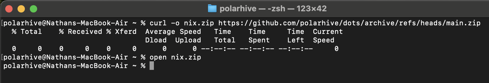
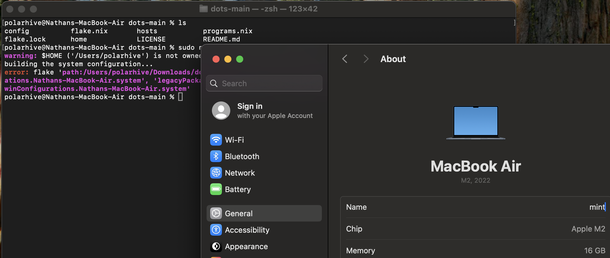
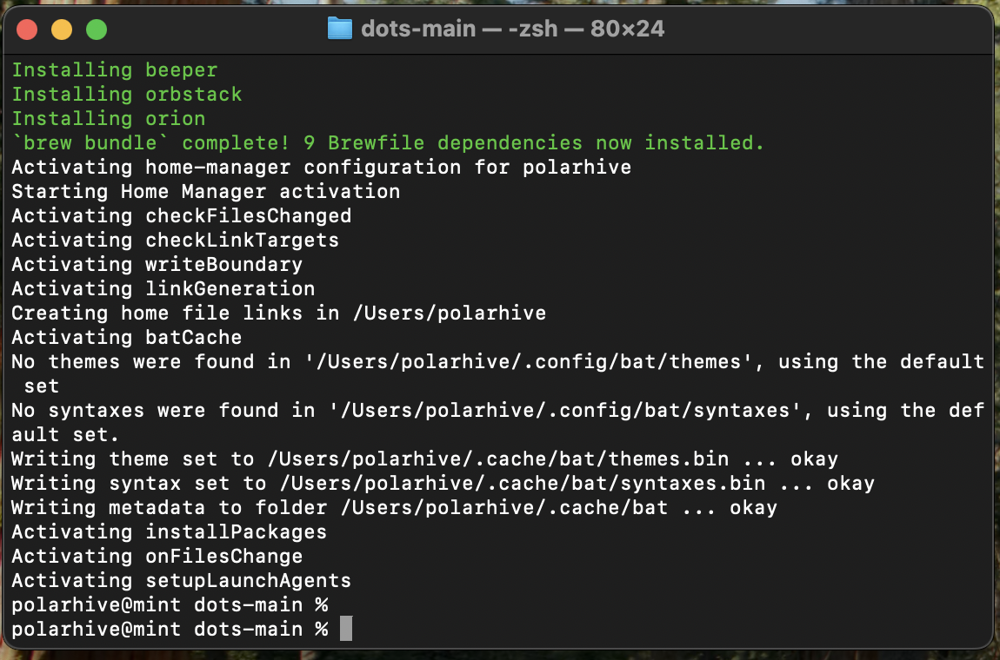
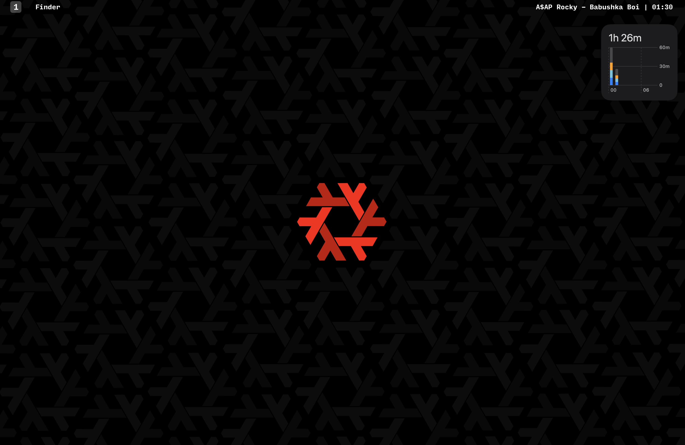

I recently purchased a MacBook Air M2. Yes I know M2 in 2025. There's a reason—Asahi. It was cheap 65k INR ~(750 USD) I know, I jumped the gun, I have not given into proprietary software. I still back my rant on [Apple](/blog/apple) 4 years ago. I will not be using any native MacOS exclusive feature like Safari, Airdrop, Apple Music et al.

Unfortunately this has become my main machine right now, `cider:` (my old laptop) has served me well for the past 6 years, the battery is almost dead and the hinge is on the verge of breaking. It was time for a hardware upgrade. I have mitigated most of the issues by using `nix-darwin` to manage my Mac. I set it up without using an Apple account and block DNS traffic calling home.

---

## What is Nix?

> Nix is a language. Nix is a package manager, Nix is an OS, kinda.

At its core, Nix lets you declaratively manage configurations across multiple systems. You can install different packages, even multiple versions of the same package, all on the same machine—without dependency conflicts.

1. **Inputs = dependencies (with exact versions)**
    - You define _exactly_ which packages, modules, or configs your system depends on (e.g., `nixpkgs`, `nix-darwin`, `home-manager`).
    - Inputs are **locked**, so your config is reproducible, so if you rebuild on another Mac or six months later, you’ll get the exact same versions.
	
2. **Outputs = reproducible builds**
    - Outputs take the inputs and generate a set of **derivations** (build artifacts).
    - In this case, the output is a complete `darwinSystem` configuration for my Mac.
    - Because outputs are deterministic, you can be sure that the same flake will produce the same system setup every time.

## Flakes

A **Nix flake** is a self-contained, reproducible Nix config with clearly defined inputs and outputs. In this case, it sets up a full `nix-darwin` + `home-manager` environment on macOS, handling everything---system settings, packages, homebrew, user accounts, and home-directory configs: all in one declarative setup.

```nix
{
  description = "mint: nix-darwin system flake";

  inputs = {
    nixpkgs.url = "github:NixOS/nixpkgs/nixpkgs-unstable";
    nix-darwin.url = "github:nix-darwin/nix-darwin/master";
    home-manager.url = "github:nix-community/home-manager";
    nix-darwin.inputs.nixpkgs.follows = "nixpkgs";
    home-manager.inputs.nixpkgs.follows = "nixpkgs";
  };

  outputs = { self, nixpkgs, nix-darwin, home-manager }:
    let
      system = "aarch64-darwin"; # arch
      pkgs = import nixpkgs { inherit system; };
    in {
      darwinConfigurations."mint" = nix-darwin.lib.darwinSystem {
        inherit system;

        modules = [
          ({ pkgs, ... }: {
            nix.settings.experimental-features = "nix-command flakes";
            nixpkgs.config.allowUnfree = true;
            system.primaryUser = "polarhive";
            users.users.polarhive = {
              home = "/Users/polarhive";
              shell = pkgs.zsh;
            };

            # install Nix packages
            environment.systemPackages = with pkgs; [
              eza go neovim zoxide obsidian
            ];

            # macOS preferences
            system.defaults.dock.autohide = true;
            security.pam.services.sudo_local.touchIdAuth = true;

            homebrew = {
              enable = true;
              brews = [ "sketchybar" ];
              casks = [ "alt-tab" "orion" ];
            };
          })

          # home-manager import user configs
          home-manager.darwinModules.home-manager
          {
            home-manager.users.polarhive.imports = [
              ./home/zsh.nix
              ./home/tmux.nix
              ./home/kitty.nix
            ];
          }
        ];
      };
    };
}
```

## So, fancy dotfiles?

Sort of. I use it to manage everything, apps (GUI & CLI), brew packages, system services, and even native macOS settings like enabling TouchID for sudo: all from the same Nix configuration.

Unlike traditional dotfiles, Nix is declarative, meaning, you define inputs, outputs, and modules, and Nix builds the system to match. You can even tweak configurations per host, making it much more powerful and reproducible than a simple dotfiles repo.

A module defines configurable options (e.g. `services.ssh.enable`, `programs.zsh.enable`. You set these options in your configuration instead of writing imperative commands.

### For example: `ssh.nix`

```nix
{ config, pkgs, ... }:
{
  programs.ssh = {
    enable = true;
    addKeysToAgent = "yes";
    forwardAgent = true;
    extraConfig = ''
      AddKeysToAgent yes
      UseKeychain yes
      IdentityFile ~/.ssh/id_ed25519
    '';
    matchBlocks = {
      "*" = {
        extraOptions = {
          UseKeychain = "yes";
          IdentitiesOnly = "yes";
        };
      };
    };
  };
}
```

The beauty of this is that everything is standardised into Nix’s key-value format. You don’t need to juggle multiple file types `rc` files, `JSON`, `plaintext`, or `.toml` Nix's homemanager translates it all behind the scenes and applies it consistently across your system.

This same configuration now works across macOS, Linux, and even Windows (if that’s your thing). That’s the real advantage of using Nix and moving all your setup into Home Manager—it abstracts away the platform differences and lets you manage settings for all your apps in one place.

## Symlinks

Nix builds a derivation, which is a fully reproducible description of how to build a package or configuration. Every dependency (libraries, tools, configs) is chained together with a unique hash, so nothing conflicts. This is why you can have multiple versions of the same tool (e.g., Python 3.10 and 3.12) installed side by side without issues.



Once built, everything is stored in the `/nix/store`. Each item there has a unique path like: `/nix/store/<hash>-python3-3.12`

Instead of scattering files across your system, Nix creates symlinks from /nix/store into your "live" filesystem (e.g., /Applications or /usr/local/bin). This way, switching versions or rolling back is as simple as repointing a symlink.

Your flake acts as the playbook: build it on two Macs, and you're guaranteed that both will get the exact same symlinks, packages, and settings. No manual tweaks or guesswork needed.

---

# Bootstrapping

The first step is to install Nix. I recommend using the [Determinate Systems](https://docs.determinate.systems) installer: This installer is really well maintained, and you can easily uninstall nix should you need to. The official nix installer is a pain to uninstall later.



Next, we git clone or rather download our `flake.nix` and its required files locally.



## Fix: Match your hostname

My `flake.nix` configuration is host-specific. This case, it looks for `mint` which is what I named my Mac. Make sure you update the flake to match what you end up naming your host. You need to re-run the nix-darwin command for it to try switching again.



# Magic

I have set it up to source my favourite taps, enable services and brew packages. On a fresh Mac, it will first prompt you to install brew, and the usually Xcode dev tools. This is all you need:

```
sudo curl -fsSL https://install.determinate.systems/nix | sh -s -- install
sudo nix run nix-darwin -- switch --flake github:polarhive/dots#$(hostname -s)
```



# Reboot

This is how the system looks after Nix symlinks finish activating. (The widget is something I added just to make it obvious this is MacOS, not a Linux rice setup!)



---

## Why not MacOS defaults?

I don’t inherently like macOS. Honestly, I think W10 has a better window management experience. On macOS, window management is just.. terrible. I bought this Mac solely because it can run Asahi Linux down the line. Spending an extra 20k INR for the M4 Air didn’t make sense, apart from two extra efficiency cores, I wouldn’t notice a difference. I don’t need a machine that "beats everything out of the park."

> The problem with macOS is that **everything needs a plugin or third-party app**:

- Don’t like the tab switcher? Install a separate app.
- Need proper ad blocking? Use Orion (because Safari can’t).
- Want a package manager? Brew.

This is where **Nix ties it all together**. Without it, you’d be stuck juggling checklists and endless tweaks just to make macOS usable.

Eventually, I’ll boot into **Asahi (w/ NixOS)** once my warranty is up or this Mac gets replaced by a work machine. When that happens, I can simply source my old `darwin` Nix file and get to work asap.

---

Some of my views have not changed since 2021, I still think macOS is as terrible as I once believed. It remains restrictive and limited to whatever Apple decides is “good for me” and I hate that I have to tweak almost everything, but hey I am able to do so, so long as I am a sudo user and disable SIP.

That said, the **battery life and system-level optimizations are undeniably excellent**. Asahi Linux won’t be able to match that anytime soon, because Apple isn’t obligated (and likely won’t) release the necessary kernel drivers.
