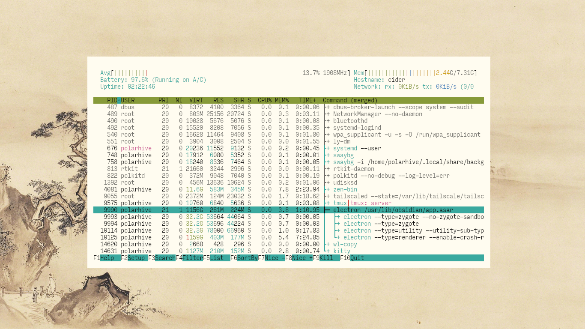
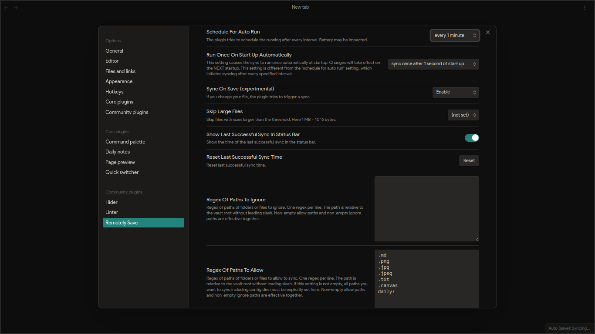
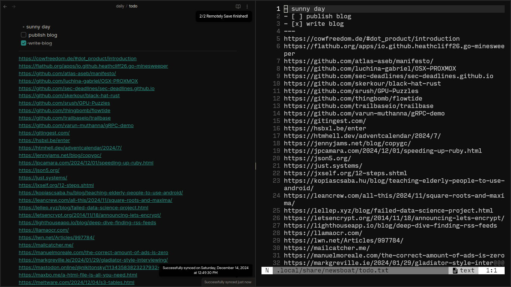

# This post talks about my Obsidian workflow

Obsidian is a proprietary markdown editor built on electron. It's just another text editor --- your notes are just `.md` files in a directory. [Borrowing](https://obsidian.md/about) a lot from the [unix philosophy](https://en.wikipedia.org/wiki/Unix_philosophy), it does one thing and does it well.

I use it to edit and work with `[[wikilinks]]` on my [/wiki](/wiki), journal notes, archive the web, organize my files across devices and it pairs nicely with my existing UNIX based workflow.


Although the app is proprietary --- I've managed to mitigate any shortfalls and I quite like the app's approach to the [file based](https://stephango.com/file-over-app) workflow: à la `git` `rsync` `wl-clipboard` and `nvim`.

Files? It's upto your filesystem to handle symlinks, crashes, backups and organization across different systems. It lets you do cool things such as combine from different sources (different git repos in my case) whilst keeping them logically in different locations (using symlinks).

Obsidian relies on your file-system to index and reference any other note -- as long as you have your file on your disk, it can work within this workflow. Back in Feb, our ssg: [/anna](/anna) used to have this feature in 2.0 (ref: deep data merge).

This post is much less about Obsidian in of itself; but how it works well with my current linux workflow. You'll notice this as I flesh out my usecases but first --- let's see what's under the hood!

---

# Extensibility

Because it is based on electron, there are quite a few plugins written in TS and JS that let you modify and tweak how Obsidian works. I use 3 in particular along with the Flexoki colorscheme.

## Plugins

I am not a fan of huge electron apps (RAM), but JS has it perks, its easy to pickup and it's guaranteed to run everywhere. Here are my plugins, in order of their importance:

- [Remotely Save](https://obsidian.md/plugins?id=remotely-save) (must)
- [Hider](https://obsidian.md/plugins?id=obsidian-hider)
- [Linter](https://obsidian.md/plugins?id=obsidian-linter)



## Remotely Save

To save you time, use my obsidian config look at the `.json` files in the `config/obsidian` folder: [/dots](/dots)



This uses an `rsync` implementation for syncing files across devices, so I setup a [webdav](https://httpd.apache.org/docs/2.4/mod/mod_dav.html) instance on my VPS, setup auth and configured the plugin it to start syncing whenever I open the app or hit save.

### obsidian-git?

There is another extension called obsidian-git: [implementation](https://isomorphic-git.org/) (but I ssh-keysign) all commits and do not trust my phone enough to cache passkeys. Resolving merge conflicts on a phone? No physical keyboard on a phone? That is very painful.

The sync implementation relies on atomic commits with autogenerated commit messages, which looks bad, and I have more than just text files, so this is very inefficient to handle over git.

> Note: Obsidian offers a native sync by signing up for an account but I'm not interested, because webdav fills this gap and I already use webdav on it's own via `rsync`

Also --- there's an arbitrary limit of 5 MB per file on [base plan]() for sync. I get paywalling total storage but per file is not cool. I have a bunch of PDFs >5MB with highlights and markup that need to be periodically synced, so native sync doesn't workout for me.

### Hosting on a VPS

> Here is a `webdav.conf` sample for reference: edited for brevity don't copy paste.

```sh
[ark:~]$ cat /etc/apache2/sites-available/webdav.conf

<VirtualHost *:443>
    ServerName webdav.foo.bar
    DocumentRoot /var/www/webdav
    
    # WebDAV setup
    <Directory /var/www/webdav>
        Options Indexes FollowSymLinks
        AllowOverride None
        Require all granted

        # Enable WebDAV
        DAV On
        DAVDepthInfinity On

        # Authentication 
        AuthType Basic
        AuthName "Restricted Access"
        AuthUserFile /etc/apache2/.htpasswd
        Require valid-user

        # Permissions
        <LimitExcept GET POST OPTIONS>
            Require valid-user
        </LimitExcept>
    </Directory>
</VirtualHost>
```

If you don't have a VPS like most people try using OneDrive or another 3rd party cloud providers listed in the menu. Setup an encryption key in that case. But you are again limited to the 5 GB that OneDrive offers.

### Self Hosting

If you have space or a spare machine you might want to roll-your-own cloud i.e. a self-hosted webdav server on a spare machine at home. The easiest way to bootstrap is to sign up for tailscale, install it on the spare device --- say an rpi or old linux machine.

Visit the admin/console page to provision a [SSL certificate](https://tailscale.com/blog/tls-certs) subdomain for your tailnet and then run `tailscale serve` on the spare device.

```sh
[rpi:~]$ tailscale serve 443
Available within your tailnet:

https://rpi.fox-red.ts.net/
|-- proxy http://127.0.0.1:443
Press Ctrl+C to exit.
```

Notice how your machine is now exposed to the web --- your `rpi.fox-red.ts.net` is a reverse proxy to `localhost:443` where your webdav server should be running.

Install apache or another webdav server of your choice and run the command again with the port where your webdav server is at. You can figure it out by visiting the [services](https://login.tailscale.com/admin/services?q=apache) tab in your tailscale console. Make sure your server is running locally though!

Now run serve and try connecting to it using the remotely plugin by specifying `rpi.fox-red.ts.net` in the "Server Address" field under the remotely settings page.

---

## Two birds, one stone

The cool part is I don't have to reconfigure everything on other devices. I can just `tar -czvf ~/.local/repos/wiki/.obsidian` and copy it to my phone, it just uses the same config as my laptop. Now it begins to pull changes from the webdav server. First sync will take time as expected but subsequent syncs are quick.

> I sort-of exploit the rsync feature --- rather than syncing `.md` files I need to sync pdfs and images.

Another cool thing is, I don't have to keep an instance of syncthing or tailscale running 24/7 in the background to push-n-pull files on my phone. No termux, or git either. One less app --- I can just open obsidian, remotely syncs with my webdav server, pulls changes and updates the local android filesystem. If something is deleted by mistake: I've set it up, that it gets moved into the `.trash` folder.

### git and vim

Say I edit / add something to my wiki on the go on my phone. When I launch obsidian on the desktop, it pulls changes from the webdav instance to my local repository. Then, I run `git diff` to see if changes are ready to be staged, and commit this change.

I have it setup to `*` ignore all files and  allowlist only `.txt`, `.png`, `.pdf` and `.md`  files. Note: I have a different ruleset in my `.gitignore` file which prevents tracking and uploading PDFs in my repositories.

Unless I am doing a lot of reading-based-writing (research and cross linking posts) usually my wiki/uni coursework. I stick to nvim for most of my text editing work. I've setup a hotkey that opens the current file in the system default `xdg-open` text editor. It could be a PDF too! I don't like PDF.js and would rather markup PDFs in a more performant PDF reader like Zathura or Evince.

Back to the point: when I hit save, the PDF gets overwritten and is periodically tracked and synced, pushed back to the webdav instance (usually no conflicts I edit at one place at one time). So I can view these highlights on my phone when I am on the go! If I'd have to do this natively via git or syncthing it's so cumbersome and a waste of battery.

## Hider

I hide almost all the UI elements, because I can navigate with vim motions and custom hotkeys. I barely use any of the extra features like slides, canvas and graphs. I disable them in the settings and like a plain WYSIWYG ui.

I hide scrollbars, icons, statusbar and tab bar. I prefer the quick navigation almost all the time.

## Linter

On `nvim` I have this markdown linter which formats text and warns me if I write bad markdown incoherrant heading levels, missing alt-text and empty spaces here and there.  It keeps things neat before staging commits. This is also in my config dir on GitHub.

You don't really need it on a desktop because there's a Mason plugin for it. Its handy on android.

---

# Monovault  and /wiki

A vault is simply a collection of your `.md` files that Obsidian gets to look at. Here is my file tree --- I've shortened it for brevity. My vault is called `content`

```sh
content
├── algorithms.md
├── books.md
├── biology.md
├── blog -> /home/polarhive/.local/repos/site/content/blog
├── daily
│   ├── clippings
│   │   ├── 'Announcing rust-query by LHolten.md'
│   │   ├── 'Boltzmann brain - Wikipedia.md'
│   ├── notes
│   │   ├── 2024-11-16.md
│   │   ├── 2024-12-14.md
│   │   └── note.md
│   ├── PYQs
│   │   ├── AFLL_2024.pdf
│   │   ├── DSA_2023.pdf
│   ├── slides
│   │   ├── AFLL.pdf
│   │   ├── DSA.pdf
│   └── todo.md
├── design.md
├── ideas -> /home/polarhive/.local/repos/ideas
├── uni -> /home/polarhive/.local/repos/pesu/UE23CS/src
└── index.md

```

Notice how there are these -> pointers. They are called symlinks which tell Obsidian to point to that new destination. Which, in my case is a couple of git repositories. It doesn't know these are git folders and does not follow the gitignore ruleset.

This way I can edit files, cd into the directory when I'm done: run a `git diff` to check for anything suspicious and commit it when I want to. The `content` folder is also a part of a git repo. It's truncated, the real path looks like

```sh
[cider:wiki/content]$ realpath .           
/home/polarhive/.local/repos/knowledge/wiki/content
```

You'll notice how the repo is called knowledge but the actual content is two levels down. This is because this knowledge repo contains a static site generator called [quartz](https://quartz.jzhao.xyz/)

## Quartz

Using quartz+[netlify](https://github.com/polarhive/site/blob/main/setup.sh) I deploy an online sub-set of my vault -- it contains notes only from the wiki and uni directory which points to my [UE23CS](/ue23cs) repository for university coursework.

This way I get to share some parts of my wiki with the world. I just gitignore all the personal notes and `todo.txt` bookmarks. I also gitignore all symlinks and don't push them to git. For the wiki --- the netlify script just clones the repos I want and `mv` them into the content repo and before building the site.

The cool part is all these tools work independently and you don't have to use Obsidian in the first place. But Quartz shares a similar design with the graph view and supports RSS feed updated whenever I add a new entry. It also looks really cool btw as your vault becomes bigger.

---

# Archiving the Web

## RSS feeds

If you remember? I had this blog post where I [showcase](/blog/rss-feeds) how I consume content only via RSS feeds. When I find a new YouTube video or HN article on newsboat, I run the `,+.` keybind.

```ini
# set the browser globally
browser "echo >> ~/.local/share/newsboat/todo.txt"

# or use a macro
macro . set browser "echo >> ~/.local/share/newsboat/todo.txt"; open-in-browser; set browser "xdg-open"
```

It's a newsboat macro that takes the current URL and dumps it into a todo file in my `newsboat/todo.txt` folder, which is in-turn a symlink to -> `content/daily/todo.md`. Ignore the md extension, content inside the file is what matters.

Notice, how if I have Obsidian open, it periodically syncs this `.md` file across devices so I can pickup where I left off. Kind of like a booksmarks folder. You can use this with your clipboard to have it dump anything into your todo file.

Then I made a bunch of bash scripts which takes that very `todo.txt` skips any markdown headings `#` and `-` and `/regex/` matches YouTube URLs. It then proceeds to download them one by one into my `~/Videos` directory for offline viewing later on.

If it isn't a video then it opens it with `xdg-open`. If it's a `file:///` path (from clipboard) --- usually a PDF it opens in with the default app on your system, or else it's a link which means it opens up as a new tab and I gave it a buffer to prevent it from racing to a deadlock. (I have 800-900 lines here).

```sh
#!/bin/sh
echo $(wl-paste) >> ~/.local/share/newsboat/todo.txt && notify-send "done"
```

```sh
#!/bin/sh
cd ~/Videos/.tmp || mkdir -p ~/Videos/.tmp
todo_file=~/.local/share/newsboat/todo.txt

while IFS="" read -r p || [ -n "$p" ]; do
    if echo "$p" | grep -qE "(www\.youtube\.com|youtu\.be|yewtu\.be)"; then
        yt-dlp "$p"
    else
        :
    fi
done < "$todo_file"
```

```sh
#!/bin/sh
todo_file=~/.local/share/newsboat/todo.txt
nvim "$todo_file"
while IFS="" read -r p || [ -n "$p" ]; do
  if [[ $p =~ (www\.youtube\.com|youtu\.be|yewtu\.be|^\#|^\-) ]]; then
    :
  else
    echo "Opening: $p"
    sleep 8
    xdg-open "$p"
  fi
done <"$todo_file"
nvim --headless -c "edit ~/.local/share/newsboat/todo.txt" -c "sort u" -c "write" -c "quit"

```



> Notice how I sort it at the end so that I can batch visit the same / similar kind of websites at once. I can visit all the HN bookmarks, it saves me time preventing context switching.

## Web Clipper

Recently, they [released](https://github.com/obsidianmd/obsidian-clipper) a web clipper it parses the DOM and spits out `.md`. I haven't gone through the source code but it uses Firefox's reader view [library](https://github.com/mozilla/readability?tab=readme-ov-file). It's a nice way to archive websites and keep an readable offline copy without distractions. All you do it hit the hotkey in your browser and hit enter --- I've set it up to dump the parsed page into my `daily/clippings` directory.

Although I'd like it to be a part of Obsidian natively maybe a plugin? Instead of spinning up a browser just for visiting a site might. The idea is I can just have a `todo.txt` and it parses links --- headless chromium/electron? instead of me visiting the site and opening the extension hitting enter.

The quick and easy way is to run the clipper right now and hit enter, it isn't a pain when I have a keyboard but on the phone (FF mobile) I have to tap the extensions sheet, tap obsidian, then tap add to vault, wait for it to launch the app and then save the markdown doc. Instead, what I usually do is tap share -> Obsidian -> append to daily note or `todo.txt`

I want to offload it to a native plugin. Say I get a link from Telegram I can just append it to this special daily note and it parses it without me opening up a browser. Who knows? I might try to work on it in the winter break or work on a SaaS alternative (server side headless chromium) seems more plausible. Let me know if you have any suggestions / ideas let me know.

This would work nicely with the [local-images](https://github.com/aleksey-rezvov/obsidian-local-images) plugin.

## Offline

Keep in mind, all of what we did today, apart from sync is completely offline. Your vault works today, yesterday and should work 10 years later -- so long your computer can boot and run electron.

Unlike Notion, Apple Notes or even FOSS apps that don't expose notes to the native android filesystem without root and keep data within the `/data/app data` directory -- this workflow lets you dip your hands and manage files the way you want to.

You aren't limited to notes, it can be Python scripts, screenshots, executables and stuff you just want on your other device. It's a solved problem -- webdav+rsync. Its convenient having coordinating it all in one app.

# FOSS alternatives?

I have tried logseq and anytype but I don't see anything Obsidian is missing, no accounts, no bs. Maybe the only caveat is the license bars you from using Obsidian if you use it as a 2+ person company, the license requires you to subscribe to a yearly enterprise plan.

Say in the future; I find a drop-in replacement (preferably QT more Linux native) I'd switch to that. I quite like the idea of simple markdown files and having everything mentally / digitally in the same space. A second brain, that's easy to work around and will stick around forever. Because it's just a text editor at the end of the day
