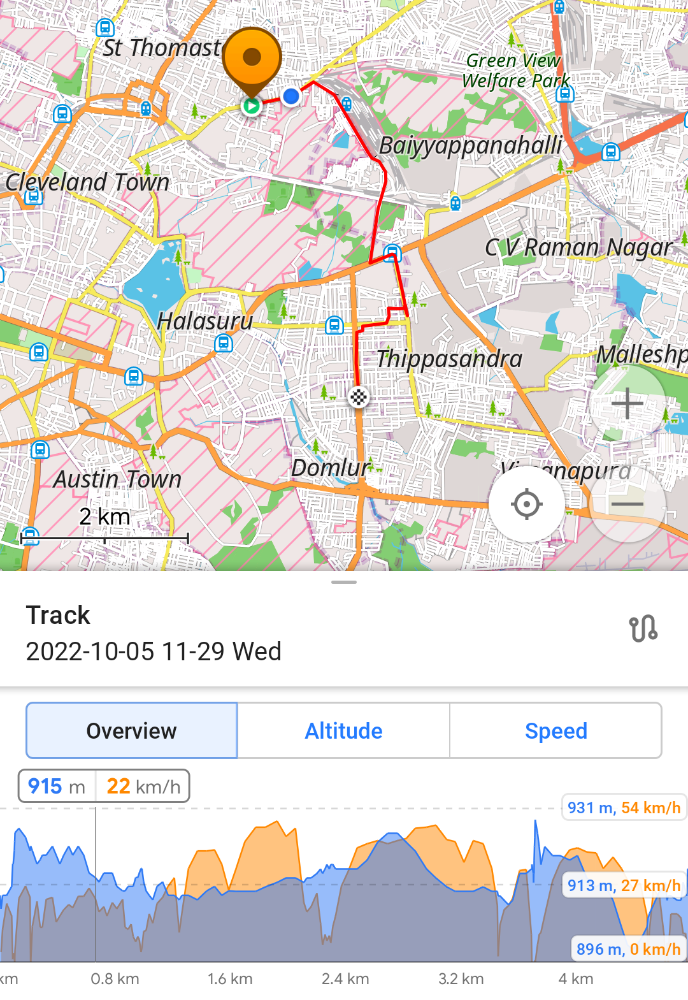
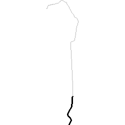
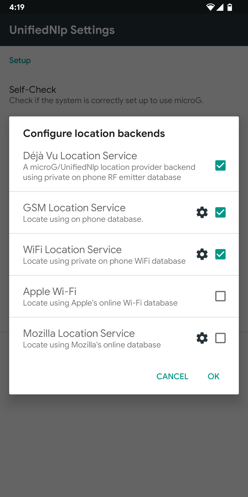
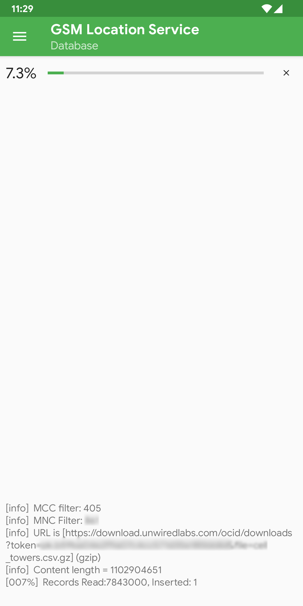
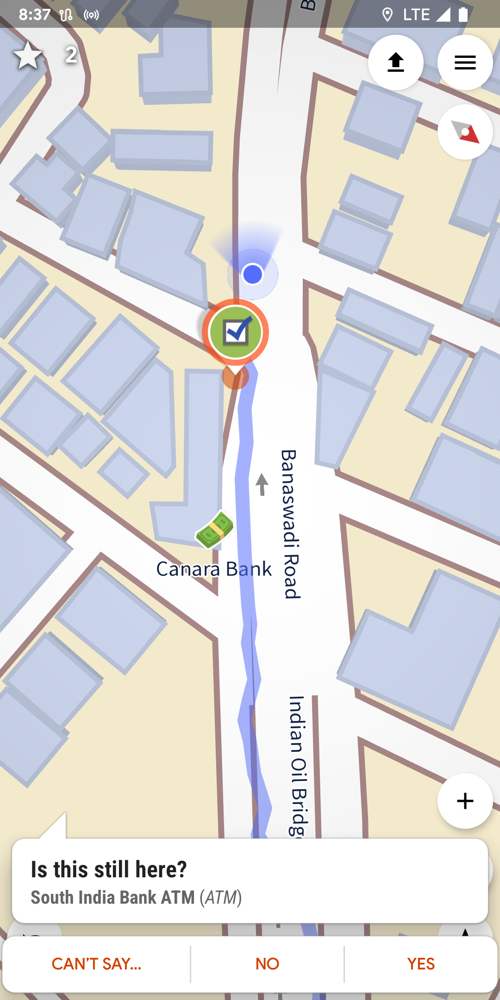
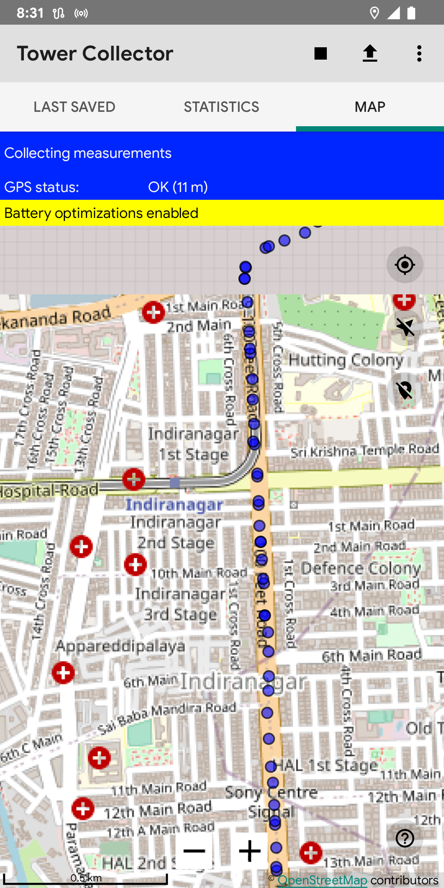

## This week, I've been contributing to OpenStreetMap — a collaborative free software project that aims to create a free, editable map of the world

Unfortunately, not many people have heard about OpenStreetMap & it's usecases.
It powers Snapchat's — [Snap Map](https://map.snapchat.com), DuckDuckGo, Brave
Search, Wikipedia & much much-[more](https://blog.sahilister.in/2022/08/openstreetmap-and-snapchat/).
I have blogged about making the switch to [FLOSS](/blog/free-libre-software) software,
[degoogling](/blog/degoogle), [digital minimalism on my phone](/blog/digital-minimalism-on-my-phone-foss),
the importance of decentralizing & owning our digital-tools. This article builds on these principles.

## OpenStreetMap is the only real alternative to Google Maps

Let's not deny the fact that Google Maps is pretty good. Owing to it's huge
userbase & Google's nasty "location sharing settings". Many Android users don't
opt out of the automated "Wi-Fi & Bluetooth Scanning".

> [*"To improve Location services and estimate the location of a device, Google
> uses publicly broadcast Wi-Fi information from wireless access points and
> GPS, cell tower, and sensor
> data."*](https//support.google.com/maps/answer/1725632?hl=en)

They claim that you can opt out by appending ``_nomap`` to your Wi-Fi router's
name. But, that only makes it stand out even more.

Assuming 99% of people don't bother hiding their SSID after setting up their
router. Other Google users can pin (your) nearby WiFi Acess Points & associate
it with the GPS co-ordinates of that area. So that the next time a device
queries Google's servers for a location fix — it'd find that there's a certain
Wi-Fi AP nearby & doesn't have to wait for a GPS signal.

This can be extensively used inside of malls, shopping complexes & stadiums
where each shop has their own radio hotspot that can be used for indoor
mapping. This technology already exists, across certain 4G mobile carriers it's
called [MIMO](https://en.wikipedia.org/wiki/MIMO) & the upcoming hype around
5G. Indoor mapping, is going to get even more better.

---
## Compared to Google Maps or any other proprietary equivalent:

- Can you use the map data on your own terms?
- Are your map-searches manipulated by ads & advertiser goals?
- Can your map app work 100% offline?
- Can you opt-in to tracking rather than opt-out?
- Can you build on top of the platform & extend it according to your needs?

### With Google Maps, it's a definite no.

Google owns the copyright, even when you contribute to improving their map.
Google might reward your effort sending you a [monthly newsletter](https://tech.hindustantimes.com/tech/news/google-maps-is-emailing-2020-timeline-update-to-you-and-it-might-be-boring-this-time-71610270088201.html)
talking about how your contribution is changing the world, when we all know it
only enriches Google's ecosystem.

### I could not find any compelling alternative: something like Nitter for Google Maps?

I decided that it'd be better to improve a FOSS ecosystem rather than find
privacy-protecting frontends to non-free services. Apple Maps is the next best
proprietary platform to Google Maps, but it's still a proprietary platform.
That's even more locked down to iPhones because.. ahem Apple.

I signed up for OpenStreetMap, & had to use multiple interconnecting extensible
tools to contribute effectively. But it's worth the hack!

## Geolocation backend

I run a stock Android, a de-googled Android ROM. It was easy enough to get
things working, all I had to do was flash a Magisk
[module](https://github.com/FriendlyNeighborhoodShane/MinMicroG_releases/releases/download/2022.02.02/MinMicroG-UNLP-2.11.1-20220202153519.zip),
choose the required backends, enable the location permission & walk around a
bit for getting a location fix.

Unfortunately, it takes some time to get things working because all of it
happens locally, unless you choose to use Wi-Fi mapping with Apple or Mozilla's
location services, which again is only slightly better than Google's. But I
wanted to keep things offline.

> Go to Settings > Location > Location Services > UnifiedNLP Settings

This setup is purely based on a satellite GPS signal, I needed a clear view of
the sky. Cell tower positioning needed a bit more configuration. For that you
get an OpenCellID API key. Open the GSM location settings and paste it in
there, then hit sync and wait for a while. Once this is done, your phone gets
to track towers offline, and doesn't need to ping web services. But this would
be annoying if you're travelling and crossing borders frequently. But that's
not my case as of now.

## Mapping!

I downloaded [OSMAnd](https://osmand.net/) from F-Droid, it prompted me to
download a copy of a map of Karnataka, which I did. I went outside that evening
and noticed that some shops I visited weren't on the map. Little did I know
that map updates aren't instant on OSMAnd. They only have instant map updates
as a [pro feature](https://osmand.net/docs/user/purchases/android/#pro-features)
which is 'off' by default, so you need to re-sync the offline map should you choose to.

Since this was my first edit I didn't know about that. I added the place,
logged in, and uploaded it to the OSM database when I reached home.

> Keep in mind that `OSMAnd` is a FOSS map app for Android — that uses the
> public OpenStreetMap database, but is not endorsed by the OSM, `OSMAnd` hosts
> their own copy of maps.

I realized [someone](https://www.openstreetmap.org/node/10036567521) had
already submitted that [node](https://wiki.openstreetmap.org/wiki/Node) a few
days ago & my copy was a [duplicate](https://www.openstreetmap.org/changeset/126896475#map=19/12.94511/77.62015)
😅. Then I deciced to use the web editor exclusively for a few edits to earn
enough credit and eventually unlock OSMAnd's live update feature (It's a paid
feature otherwise). Turns out bandwidth is costly & unlike Google's servers not
everyone has the same kind of resources. But, hey I got it after a few edits!
Which totally makes sense. Or I could have solely relied on the web-front end
(but that would be a pain) 🤔

---
## I was confused at first. It doesn't have to be. I suggest you start your mapping journey with [StreetComplete](https://f-droid.org/packages/de.westnordost.streetcomplete/)

Go for a short walk, log into your account, and start answering questions. It's
sort of like catching [Pokémon](. "gotta map em' all"), but actually useful
rather than wasting time. It's one of the quickest-ways to make edits.
You can install all these apps from the PlayStore, should you want to.

> ### As [Sahil says](https://blog.sahilister.in/2022/08/openstreetmap-and-snapchat/): *"it gamifies the whole data addition part by asking questions on missing nodes in your local area".*

- Here are the [F-Droid](/videos/notes/f-droid-an-appstore-that-respects-your-privacy-and-freedom) links!

- https://f-droid.org/packages/de.westnordost.streetcomplete
- https://f-droid.org/packages/net.osmand.plus

---
# Upgrades people, upgrades!

### If you want something light, there's [Organic Maps](https://f-droid.org/en/packages/app.organicmaps/)

Best suited for Navigation rather than editing. The interface is buttery
smooth. I use this app when I'm going on walks or cycling in my neighbourhood.

## Track your workout

Whether you're going for a marathon, or strolling by, OSMAnd features a 'Trip
Recording' plugin that can be used to umm well — record your trips. Combine
this with a workout and if you're interested in analysing things you can figure
out how you're performing overtime. There's probably an app on
[F-Droid](https://f-droid.org/en/packages/de.dennisguse.opentracks/) for that.

Keep in mind all of this is offline, exportable & extensible!

## Cell Tower scanning

As I'd mentioned before, just like WiFi APs, Cell Phone Towers can help fix
your geolocation. You can associate cell towers with their geolocation
co-ordinates. Google, Mozilla, Apple already do this. Mozilla is fine, but
seems like these days they're too loyal to Google (IIRC they now use Google's
location services for Firefox). I suggest using —
[OpenCellID](https://www.opencellid.org/), or use all of them if you don't mind
going online!

### But how do you contribute back?

Mozilla had a project called [Stumbler](https://discourse.mozilla.org/t/retiring-mozilla-stumbler/75206).
But that's pretty much dead now. Instead use
[TowerCollector](https://f-droid.org/packages/info.zamojski.soft.towercollector/),
again available on F-Droid!

Just enable it & forget it. It'll populate the map with tiny blue dots, each
representing a cell tower your phone has made contact with. Don't forget to
upload your collected tower data, and there's no need to use your token, you
can submit data anonymously.

---
# Dystopia

After going through this process. I've been exposed to so many different ways
how cell phones can be used to track you, I mean just look at sheer number of
cell towers that can accurately track you, if not already!

> Also unfortunately after I turned [18](../eighteen), I can't always keep my
> phone on 'airplane mode' like [I used
> to](../why-i-dont-do-normal-phone-calls/). I need cellular access to receive
> normal unencrypted calls, OTP SMSs from banks & such.
I guess it's just the way it is.

P.S. I still prefer [VoIP calls](/call).

---
## Join me in contributing to OpenStreetMap, one node at a time!

If you have free time, map some places around your neighbourhood.
