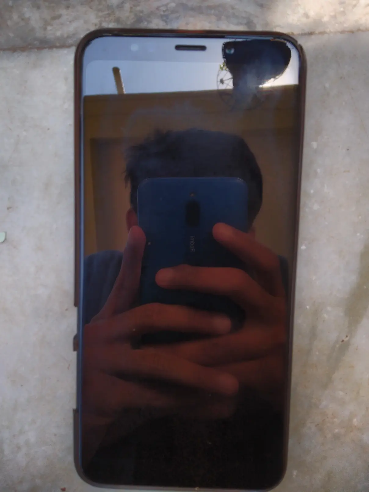
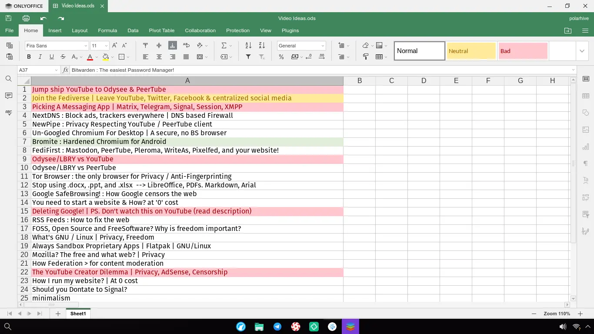
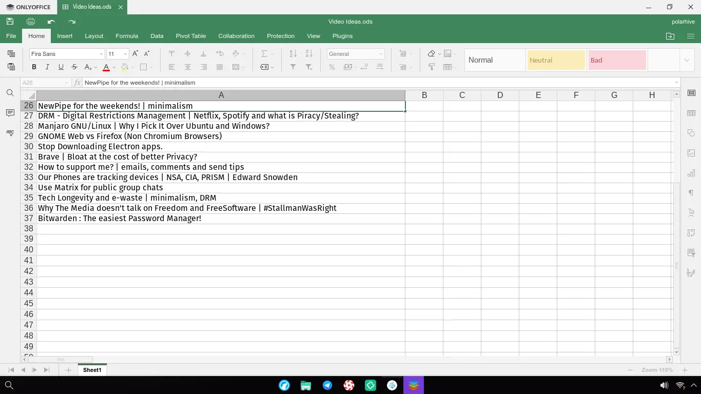
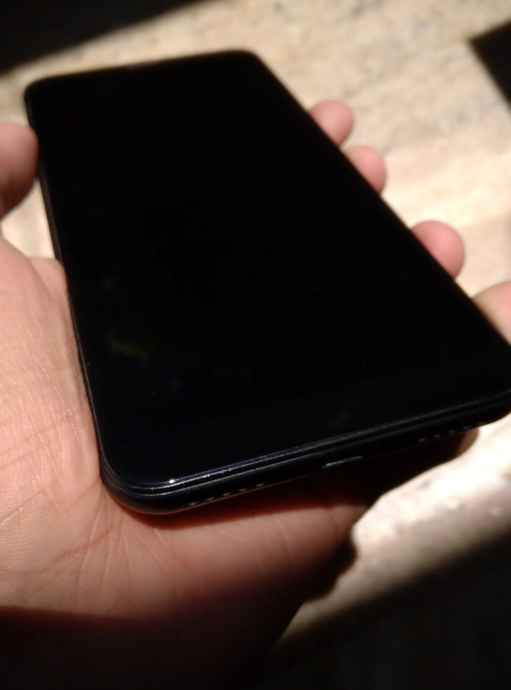
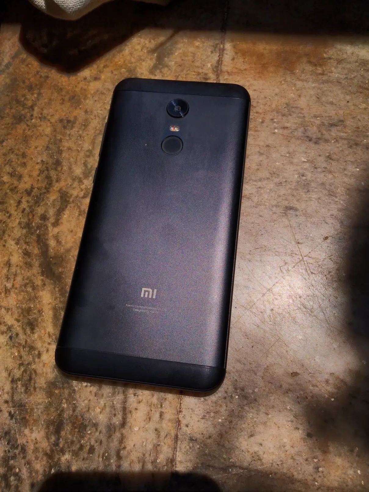
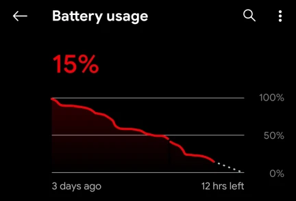

> # This post is a reflection on [Digital Minimalism on my Phone (FOSS)](/blog/digital-minimalism-on-my-phone-foss) I wrote exactly a year ago

A year ago I yeeted all my apps, disabled notifications, started using FOSS apps in the hope that I spend my time efficiently. After the initial few weeks the 'FOSS' and 'Ad Free' apps get just as much addictive as the mainstream ones. Although it's not as toxic / invasive of your privacy. All my chats and social apps are available from a desktop too, but I prefer them on my phone for some reason.

The problem is not about the apps or if I spend my time on them. It's the cognitive ease - just pick up the phone and start using it. Always ready, at your fingertips. A convenient screen size, always sleeping - no booting time, the battery lasts long and no clicky keyboard noises when you get into a heated debate online. If you use a phone exclusive app - that's probably a dangerous app in the first place. I would rather use its web app or run it in a VM.

> ## There are 3 reasons I could categorize how phone's are useful

- As an emergency device: (you have to [compromise on privacy](/blog/why-i-dont-do-normal-phone-calls/) but seems reasonable)
- To take photos. (Like the ones featured in this post and [here](https://polarhive.net/photos))
- To listen to music while you work on something else.



Phones are inherently addictive by design. At it's core it is a portable device that can talk to the internet 24/7. I guess after a year of literally the same monotonous routine, ahem - online classes, you get bored and try to think of something better to do.

> ## I started posting to [PeerTube](https://polarhive.net/peertube) and [Odysee](https://polarhive.net/odysee)

Do check it out. Which is where I usually spend my time on, editing videos, researching and jotting down stuff related to videos. When I was busy with this I didn't really bother / have the urge to check my phone. On the laptop I didn't 'miss' anything, whilst keeping up-to-date with my friends and simultaneously editing. I got a lot of things done that day.

> ## Here's a sneak peak of upcoming videos btw. 👀

---

# As the title suggests I think phones are counter productive

> ## Phones can ever replace full blown laptops / desktops

A keyboard, bigger screen is way easier to get work done. You also get a real functional web-browser with all your addons. Although the PinePhone / Librem Phone is a project with an interesting hybrid take on this. It's called "convergence" I believe - cross platform desktop apps that work on any screen.

I wish we could mod phones that easily, to swap out batteries DIY, at home. Replace the screen / processor like modular parts of a laptop / PC motherboard. I love the ideas of ThinkPads, [PineBook](https://www.pine64.org/pinebook-pro/), and [MNT Reform](https://mntre.com/) - a DIY portable laptop.

> ## Check [this out](https://lukesmith.xyz/articles/oldcomputer)



---


# So are you gonna throw away your phone?

> ## No, but it will certainly influence my decision of buying my next phone

I plan to extend the lifespan of this phone (currently 3 to around 5/6+) before the battery just fails. How? By not using it much. Charging it twice a week is my goal, instead of charging it daily. And when I have to buy my next phone in around 2023 - a huge battery and custom ROM support would be my main priorities.

---
*I assume that you already have a phone and a laptop. Don't buy a laptop & contribute to e-waste if you are fine with your phone.*
