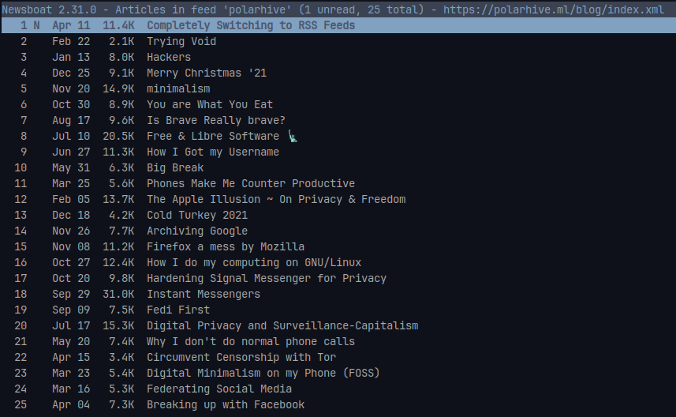
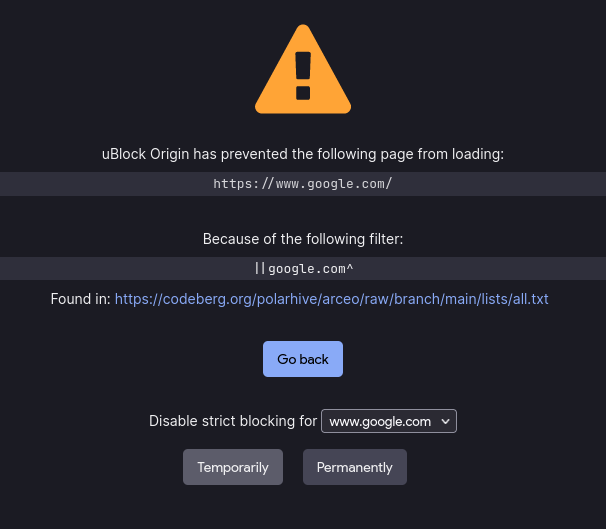
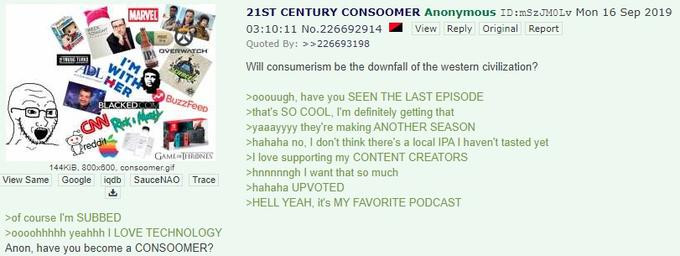

## The news you consume isn't going to affect you in any way. You've probably forgotten what you read last week.

I've blogged about it a few months ago ~ [You are What You Eat](/blog/you-are-what-you-eat/)

## [Today](/dots "it's been a few weeks actually"), the only way I get updates is via RSS feeds.

RSS stand for --- [Really Simple Syndication](https://en.m.wikipedia.org/wiki/Rss_feed).
RSS feeds are portable, extensible, light on network resources. I've also conveniently
blocked regular HTML+JS sites in my browser as an experiment; more on that later.

Currently my newsboat feed is populated with indie sites, blogs, wiki
pages, updates to documentation & new software releases, podcasts,
YouTube channels, WordPress sites, Telegram Channels, Odysee / LBRY
channels, SoundCloud , Bandcamp, Pixelfed, Mastodon & other Fediverse
feeds. Unlike most people I don't use email for newsletters or follow
people on social media just for the sake of it, or have notifications in
my browser.

The [phone?](/blog/digital-minimalism-on-my-phone-foss/) Nope. Most apps
depend on Google services for push notifications & that's something I'm
not willing to compromise on my [degoogled](/blog/degoogle) phone. I
don't use my phone much; read about it [here](/blog/phones-make-me-counter-productive/).

With RSS: things are much simpler, I have just one place to keep-up with fresh content.
I can use any client I wish to. Web-browsers used-to have native RSS integration a couple of
years ago, but unfortunately today: it's a thing of the past. Popular feedreaders include:
Thunderbird, Feedly, miniflux, NextCloud News and your local F-Droid app. I like to use `newsboat`
a TUI program with customizable vim-bindings.

> For sites that don't have an RSS feed? Honestly, they're probably not
> worth your time.
*Screw them (ﾉಥ_ಥ)ﾉ!*

P.S. Use proxies like [html2rss](https://html2rss.github.io/), [Kill
The Newsletter!](https://kill-the-newsletter.com/) &
[RSS-Bridge](https://rss-bridge.github.io/rss-bridge/)

---
## > [arceo](https://polarhive.net/arceo) ~ a blocklist against social media, news, entertainment & consumerism.

I took a step further by blocking these sites in my browser using
[uBlock Origin](https://polarhive.net/videos/notes/use-ublock-origin-for-a-bloat-free-web).

Why get distracted with blogspam which is recommended via your web browser: i.e. news, infotainment & entertainment.
Countless other websites that fight for your attention and mine your data.

> ### arceo is a Latin word meaning `keeping away` ~ `preventing`

But let's not limit ourselves to news or spam sites. I block [any news
site](https://codeberg.org/polarhive/arceo/#criteria), whether they're
publishing clickbaity articles or not. I read news in plain-text, I want
it to be separate from my browser. My browser is no longer a tool I use
for entertainment i.e. binging stuff. I quit like the key-binds & fine
grain tuning for every individual utility program I use. Like neovim,
zathura, lf, newsboat, sway, mpv, ncmpcpp & so on.

---
## 0. Workflow

Whenever I find something interesting, I add it to my local RSS feed,
then checkout the  articles, videos / photos using
[w3m](https://en.wikipedia.org/wiki/W3m), [mpv](https://mpv.io) &
[imv](https://sr.ht/~exec64/imv/). Using newsboat's
[macros](https://newsboat.org/releases/2.27/docs/newsboat.html#_macro_support).
After which I archive the entry by marking as read.

This way I'm keeping myself in check, sort of like inbox 0, for email. I
am intentional when I subscribe to new the feeds & keep tweaking the
ones I frequently read. Feeds that are once fetched are cached forever &
can be indexed or searched later. Hit the '/' to search from any article
that you vaguely remember or read even weeks or months later. It proves
to be a very powerful tool.

You can extend newsboat's functionality to the next level by fetching
feeds periodically by running on a VPS & emailing yourself a digest of
your pending reads. Or vice versa -> Emailing articles so it can be
piped into an RSS feed using some other scripts. I don't do this. But if
you're interested checkout [this](https://forlater.email/) tool.

---
## 1. Entertainment

I can download videos using `yt-dlp` for later offline use to watch it
at a convenient time. After I'm exhausted with my buffer of videos -
offline, with no more videos to watch - you'd stick to your allotted
time. Sure you can toggle WiFi back on but I assume you should have a
little self control by now.

> TIP: I append the poweroff command so it `mpv ~/Videos/yt-dl;
> poweroff` shuts down the computer after I'm done! ;)

Similarly for Music, I either stream songs with an mpv [function](https://wiki.archlinux.org/title/mpv).
Or scrobble songs to [LastFM](/lastfm) when I'm busy doing some work. I run `mpdscribble` ,
`mpd` &  `ncmpcpp` --- the latter has a horrible name, just like every
other software in the GNU/Linux realm. Anyhow these are similar to
newsboat as in they're minimal, lightweight & adhere to the UNIX
philosophy.

I don't wander on Twitch or play video games. Not to mention - Reddit,
TikTok, Instagram Reels, YouTube Shorts & the million other TikTok
clones that rob you of your time for a shot of dopamine, I don't use any
of that. If you do - please email me their domains so I can add them to
my blocklist.

---
## 2. Web-Browser

I'm using a [Firefox based browser](/blog/firefox) - for it's top notch
content blocking extension support. Things that I've blocked don't load.
uBlock Origin [works really well](https://github.com/gorhill/uBlock/wiki/Does-uBlock-Origin-block-ads-or-just-hide-them%3F).
Beware, you'd feel overwhelmed, especially - if you're heavily dependent
on popular $BigTech conglomerates like Google, Amazon, Facebook & other
mainstream social media & other news sites. I block these sites as I
want to avoid them. If the page you visit like drive.google.com? fetches
content from [these domains](https://codeberg.org/polarhive/arceo/raw/branch/main/lists/all.txt)
-- your page might not render properly.

Should I need to do a Google search - I'd temporarily disable the
filter, but the goal is to reduce your dependency on these platforms.
Use better frontends like Nitter, Invidious or Teddit which have RSS
support

As I mentioned before, I'm transitioning from the browser -> extensible
GNU/Linux desktop apps. Stop running everything in the browser.. ahem
*electron apps*

---
## 3. MSM

We all know that the Mainstream Media pushes propaganda, some are paid
to disseminate fake news, they have people trained to engage-readers into
unnecessary political debate, make people believe in absurd theories,
even the most trivial things can't be apolitical anymore. With the rise
of cheap accessible mobile-phones, yellow-journalism spreads like wildfire, the
narrative keeps changing, lost in the daily wave of propaganda. This
includes the other forms of media in the form of TVs, internet consoles
& Smart Home Assistants err.. I mean ~~AI powered wiretaps~~. Cut the
cable!

If you feel the daily news is worth your time, read a physical newspaper
like me. Keep-up with the latest world news via your family, friends,
neighbors ~ take it in with a pinch of salt of course. By solely
consuming a narrative --- you're not making any difference in the real
world.

---
## 4. ~~consoom product~~!

### arceo: blocks the following types of sites but is not limited to ~

"Fastfood chains, retail stores, makeup, merch, fandom wikis,
subreddits, fanclubs, celeb news, gossip sites, product reviews, games,
internet events, digital concerts, comics, movie reviews, over-hyped
packaged goodies" fed to web lurking consumers. A daily dose of - web
junk & recycled memes, for people who live in their own bubble.
Homepages tailored by an algorithm to fulfill an advertiser's target.
I'm a [minimalist](/blog/minimalism), if you're not I suppose this list
wouldn't work well for you. Fork the git repo & suit your needs.

> ### You know the meme, you're a part of it

There are far too many to list. As of today there are  ≈ [1400](https://codeberg.org/polarhive/arceo/raw/branch/main/lists/all.txt
"$ curl -s 'https://codeberg.org/polarhive/arceo/raw/branch/main/lists/all.txt' | wc -l")
domains from the most popular sites. I probably missed something: please
[email me your entries](https://codeberg.org/polarhive/arceo/#want-to-add-a-site).

---
## Finally, this leaves me with good articles to read

No distractions, completely offline. Another thing I ticked off my
[bucketlist](/bucketlist) this year :^) ~~Completely Switch to RSS
feeds~~ ✅

If you're feeling brave try blocking sites forever: on your local
router / computer. Append the list to the `/etc/hosts` file. But that
implies - you won't be able to resolve google.com, youtube.com & the
other domains which are blocked. Maybe use the Tor Browser for these?
For MPV? run it through a proxy? IDK. I'll probably figure it out some
some day!

## Here are my RSS feeds

~/[blog](https://polarhive.net/blog/index.xml)
~/[mastodon](https://mastodon.social/@polarhive.rss)
~/[odysee](https://odysee.com/$/rss/@polarhive:e)
~/[peertube](https://tilvids.com/feeds/videos.xml?videoChannelId=1269)

---
## Now what?

Enough spending time on your screen. I've started with my browser. Feel
free to [add](#you-know-the-meme-youre-a-part-of-it) more sites. Let's
fight consumerism, $BIGTECH & internet-addiction together. Take back the
web!
