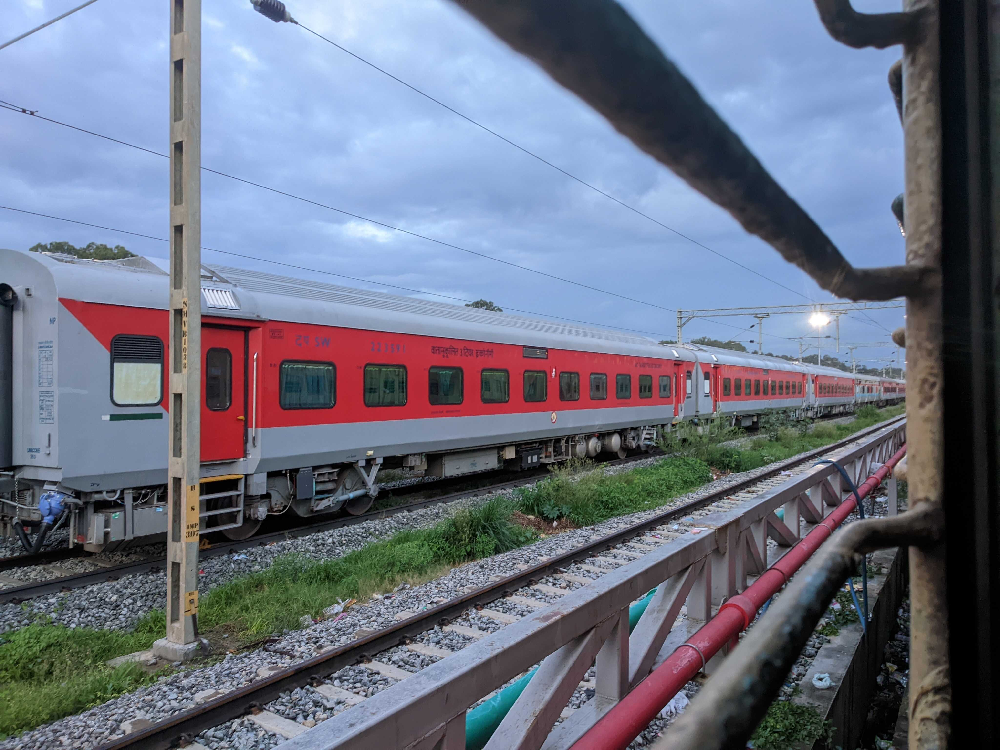
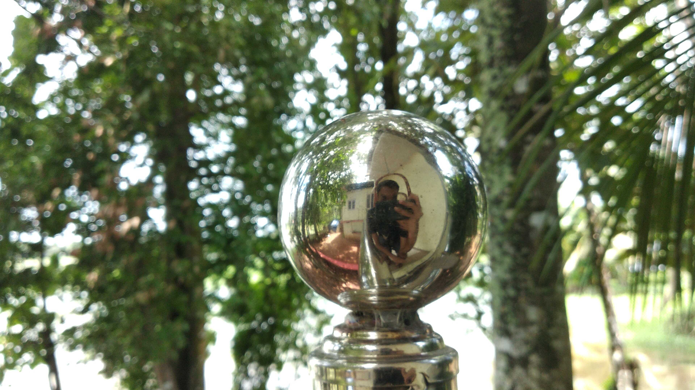
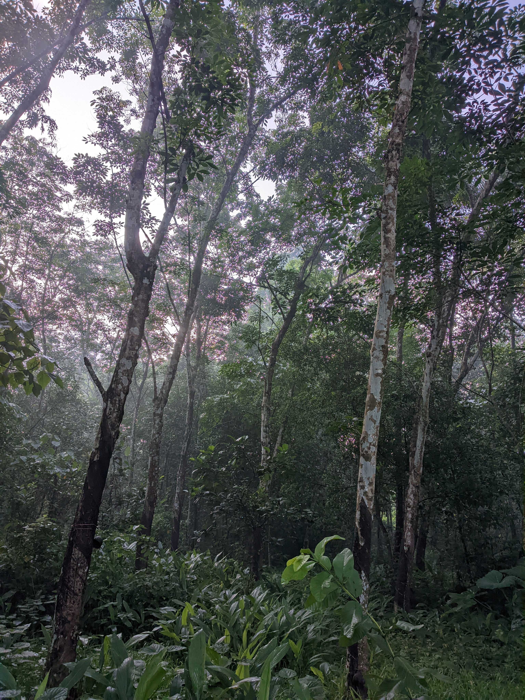
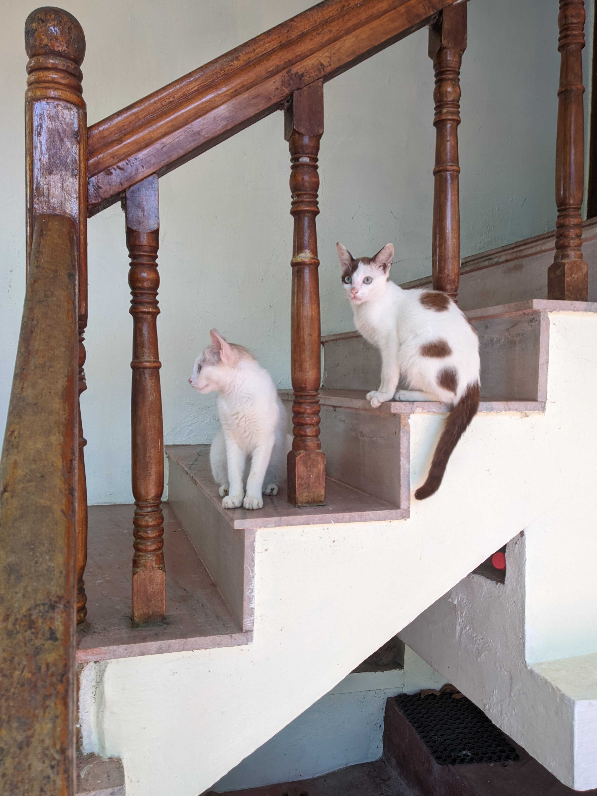
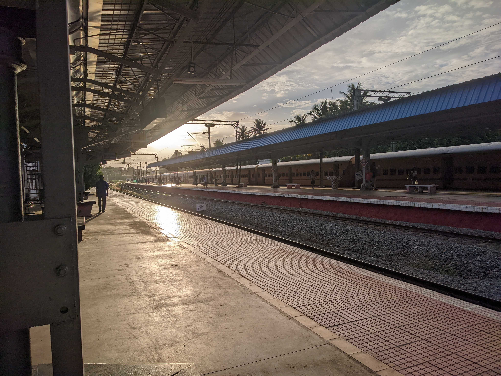
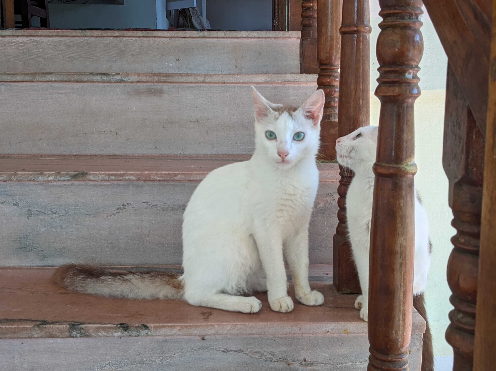

### This site is now on: polarhive.net

PSA: I got a new domain name. A new email address and setup a small
[VPS](https://x.polarhive.net) this week. I am done with my
[exams](/blog/big-break) and will be pursuing a Bachelor's in CS this
August. Here's my new [/PGP](/pgp) key: `0x78DBFBE8B325A5A9`

## A short vacation

I went on a short 2 day trip to my hometown in Kerala. Here are some pictures:











---
## I logged the whole journey on OpenStreetMap and contributed to Towercollector


<video width=50% autoplay> <source src="gps.mp4" type="video/mp4"></video>
<br>
<br>



A couple of posts ago I had blogged about [OSM](/blog/openstreetmap/), de-googling
my phone, exclusively using FOSS apps on my phone. This week I tried logging a
600KM train journey---on my [phone](https://www.openstreetmap.org/user/polarhive/traces/8371848
). The map was pre-downloaded as I didn't expect a stable connection while travelling.
Just like the fediverse, GNU/Linux and other such ecosystems I like to use
OSM over Google Maps whenever I can.



Once you set it up, you don't need to check your phone. It just works.
(Assuming you're running Lineage) or a similar stock AOSP ROM which
doesn't kill apps in the background, or just disable battery
optimization to let it log while you go to sleep.

Surpisingly offline GPS logging doesn't drain your battery that much. If you turn
your screen on, it drains more power. Try reading a book or use another device.

---
## migration/meta

If you were subscribed to my RSS feed, I'm sorry for the trouble, please
swap my old feed with the [new one](https://polarhive.net/rss) or expect
duplicates like so:


Any polarhive.ml link magically redirects to the new domain. If anything is broken: please let me know.
`s/.ml/.net`

```
5650 67BE 4933 5DF5 B2DD 811C 78DB FBE8 B325 A5A9
mail@polarhive.net
```
---
## What did I miss?

I've missed a lot of things. Facebook, Tumblr joining the fediverse?
Twitter DDoSing itself? YouTube, Reddit blocking ads and 3rd party
clients. Invidious shutting down? The inconsistent Windows 11
design-changes, RedHat shooting themselves in the foot. Ah how could I
miss AI: *coughs* 🤡 *coughs* ChatGPT and the sentient AI BS. This too
will pass, just like web3, and it's crypto-shitcoins.

I've seen the growth of ad-blockers even non-technically folks are using
uBO in my friend circle: uBlock origin, Brave, PiHole/NextDNS and other
such tools. Including tools used on this site: like Nitter, JS free
embedded YouTube videos using invidious's backend to fetch the raw HTML5
video-url.



As Reddit, Twitter and YouTube slowly-sink with millions of users trying
to free-load and get away using FOSS front-ends, ad-blockers, and opting
out of tracking. Expect more curfews, rate-limits, scalability and
censorship issues; the usual baggage --- centralized social-media
brings. And no: web3 will only make it worse.

> #### I remember [saying](/blog/fedi-first/#the-fediverse-is-an-actual-social-network):
> *"My Prediction -> And any non-federating social network will inevitably fail in a free market."*

As long as we have a free-market: I mean an open-internet where people
are allowed to pick the platforms they want to use, and net-neutrality
is the default (unlike some countries). We would see more people
choosing the fediverse, over the next centralized Reddit, YouTube or
Twitter clone.

The past two years I've made a `todo.txt` list of links, articles and
bookmarks that I need to read later. Whenever there's a new entry in my
RSS reader, usually; a new YouTube video I
[pipe](https://codeberg.org/polarhive/dots/src/commit/50cdaa4988c2e2764326898ca9952771ff72d75f/.config/newsboat/config#L12)
it into the .txt file, for later. This file is now 350kB. Or
approximately 7218 entries as of today. I segregated a lot of links and
started downloading songs, videos that I'll slowly consume over the
next-few weeks. Timeshifting: as they call it --- recall the DVR and
set-top-box days.

## projects/ideas?

I'll be toying around in my new VPS, tailscale is pretty cool. I'll
probably configure a file-server/pastebin and maybe serve photos from
there? Pixelfed required JS to load photos and seems too complicated.
Oh! I should probably get back to making videos. I'm done for today, I
will see you soon.



